# 交互式知识图谱

<cite>
**本文档引用的文件**
- [knowledge_graph.py](file://code/visualization/knowledge_graph.py)
- [build_kg_dashboard.py](file://code/visualization/build_kg_dashboard.py)
- [kg_paper_viz.py](file://code/visualization/kg_paper_viz.py)
- [llm_kg_neo4j_direct.py](file://code/visualization/llm_kg_neo4j_direct.py)
- [llm_kg_neo4j_edges_only.py](file://code/visualization/llm_kg_neo4j_edges_only.py)
- [check_relation_semantics.py](file://code/visualization/check_relation_semantics.py)
- [llm_kg_to_neo4j.py](file://code/visualization/llm_kg_to_neoo4j.py)
- [knowledge_graph.html](file://output/figures/knowledge_graph.html)
- [knowledge_graph_interactive.html](file://output/figures/knowledge_graph_interactive.html)
- [kg_statistics.json](file://output/knowledge_graph/kg_statistics.json)
- [cultural_anchors.json](file://data/database/cultural_anchors.json)
</cite>

## 目录
1. [简介](#简介)
2. [项目结构](#项目结构)
3. [核心组件](#核心组件)
4. [架构概览](#架构概览)
5. [详细组件分析](#详细组件分析)
6. [依赖分析](#依赖分析)
7. [性能考虑](#性能考虑)
8. [故障排除指南](#故障排除指南)
9. [结论](#结论)
10. [附录](#附录)

## 简介
本项目围绕"南海区文旅知识图谱"构建了两套完整的交互式可视化方案：
- 基于 ECharts 的力引导布局方案：提供响应式布局、节点样式配置、关系边绘制与交互功能
- 基于 pyvis 的网络图方案：提供物理仿真、多重关系处理、边标签显示与搜索功能

两大方案均实现了节点颜色编码、大小映射、图例生成与统计信息展示，并针对不同使用场景提供了最佳实践指导。

## 项目结构
项目采用模块化设计，主要包含以下核心模块：

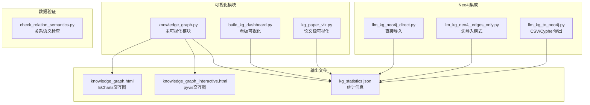

**图表来源**
- [knowledge_graph.py:1-903](file://code/visualization/knowledge_graph.py#L1-L903)
- [build_kg_dashboard.py:1-269](file://code/visualization/build_kg_dashboard.py#L1-L269)
- [kg_paper_viz.py:1-365](file://code/visualization/kg_paper_viz.py#L1-L365)

**章节来源**
- [knowledge_graph.py:1-903](file://code/visualization/knowledge_graph.py#L1-L903)
- [build_kg_dashboard.py:1-269](file://code/visualization/build_kg_dashboard.py#L1-L269)
- [kg_paper_viz.py:1-365](file://code/visualization/kg_paper_viz.py#L1-L365)

## 核心组件
项目的核心组件包括数据处理、可视化渲染、交互控制和统计分析四个层面：

### 数据处理层
- **实体数据管理**：处理文化实体、非遗项目、POI景点等多源数据
- **关系构建算法**：实现10类语义关系的自动构建逻辑
- **数据质量控制**：提供关系语义检查与异常处理机制

### 可视化渲染层
- **ECharts集成**：实现力引导布局、节点样式配置、边样式控制
- **pyvis集成**：提供物理仿真、边标签、搜索功能
- **响应式设计**：适配不同屏幕尺寸和设备

### 交互控制层
- **节点选择与高亮**：实现邻域高亮、节点过滤等功能
- **搜索与定位**：支持节点名称搜索与自动定位
- **统计面板**：实时显示图谱统计信息

### 统计分析层
- **节点类型统计**：按类型分类统计节点数量
- **关系分布分析**：分析不同类型关系的分布情况
- **性能指标监控**：跟踪渲染性能与交互响应时间

**章节来源**
- [knowledge_graph.py:75-384](file://code/visualization/knowledge_graph.py#L75-L384)
- [check_relation_semantics.py:1-95](file://code/visualization/check_relation_semantics.py#L1-L95)

## 架构概览
系统采用分层架构设计，确保各组件间的松耦合和高内聚：

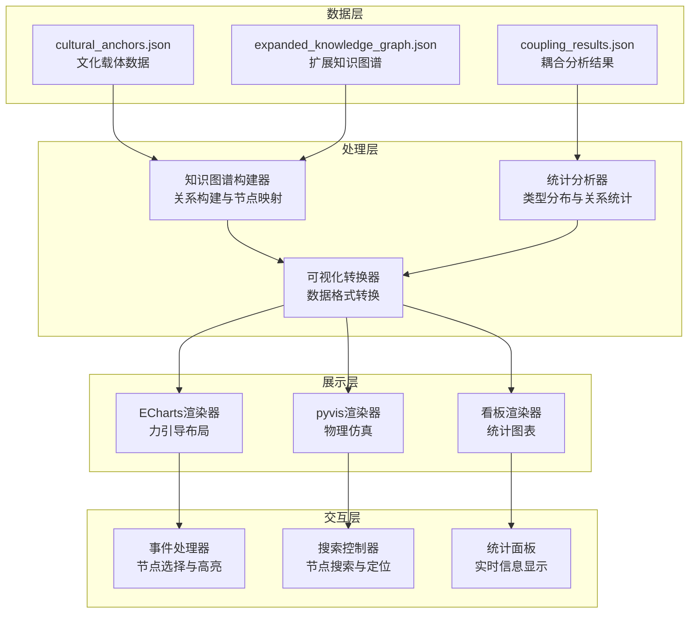

**图表来源**
- [knowledge_graph.py:104-337](file://code/visualization/knowledge_graph.py#L104-L337)
- [build_kg_dashboard.py:28-105](file://code/visualization/build_kg_dashboard.py#L28-L105)

## 详细组件分析

### ECharts力引导布局实现

#### 力学参数配置
ECharts提供了丰富的力学参数配置选项，用于控制图谱的布局效果：

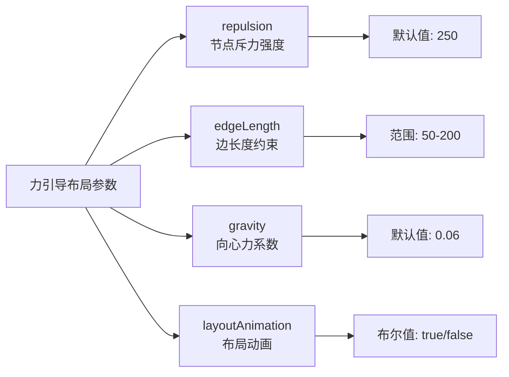

**图表来源**
- [knowledge_graph.py:489-494](file://code/visualization/knowledge_graph.py#L489-L494)

#### 节点样式配置
节点样式通过统一的颜色映射和大小计算实现：

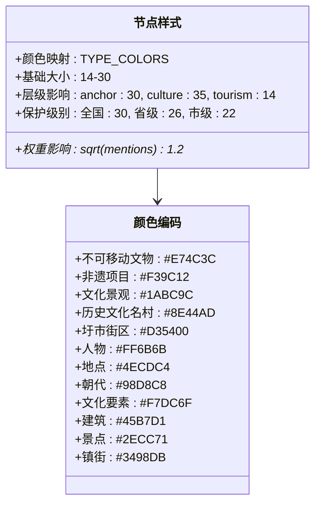

**图表来源**
- [knowledge_graph.py:58-72](file://code/visualization/knowledge_graph.py#L58-L72)
- [knowledge_graph.py:129-145](file://code/visualization/knowledge_graph.py#L129-L145)

#### 边样式与关系类型
关系边的样式配置体现了不同类型关系的视觉差异：

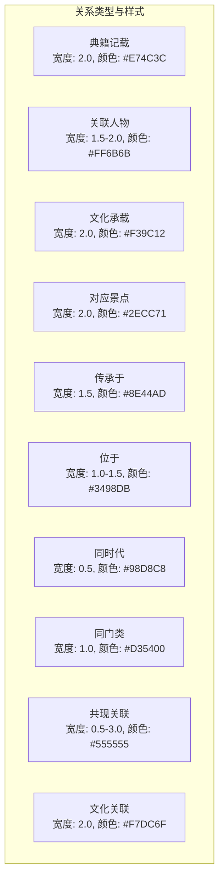

**图表来源**
- [knowledge_graph.py:518-529](file://code/visualization/knowledge_graph.py#L518-L529)
- [knowledge_graph.py:227-336](file://code/visualization/knowledge_graph.py#L227-L336)

**章节来源**
- [knowledge_graph.py:475-501](file://code/visualization/knowledge_graph.py#L475-L501)

### pyvis网络图实现

#### 物理仿真配置
pyvis提供了强大的物理仿真引擎，支持多种仿真算法：

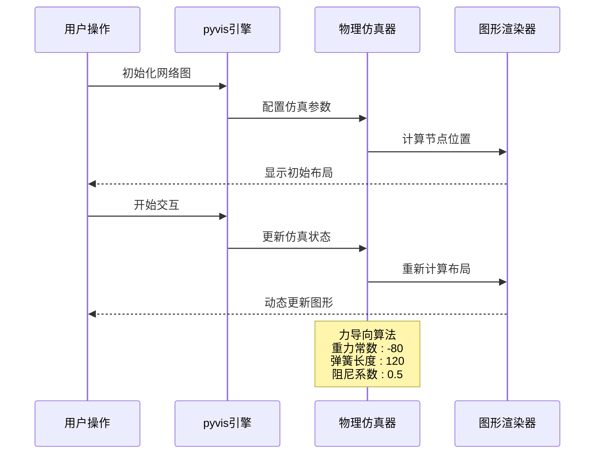

**图表来源**
- [knowledge_graph.py:574-602](file://code/visualization/knowledge_graph.py#L574-L602)

#### 多重关系处理
系统支持同一节点对存在多种关系的情况，通过边标签和颜色区分不同关系类型：

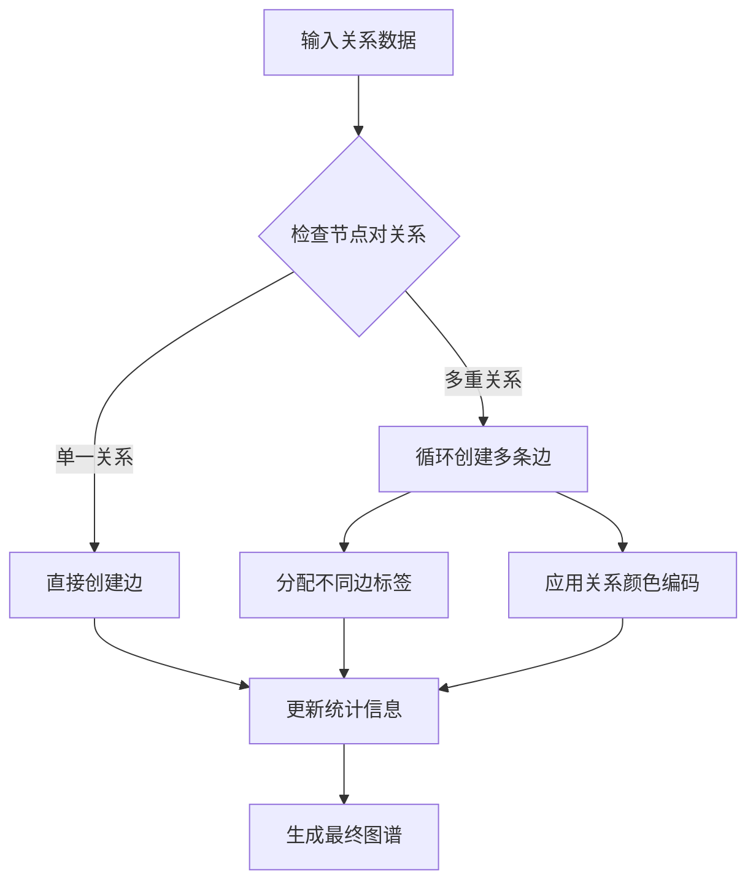

**图表来源**
- [knowledge_graph.py:749-755](file://code/visualization/knowledge_graph.py#L749-L755)

#### 搜索功能实现
搜索功能提供了快速定位节点的能力：

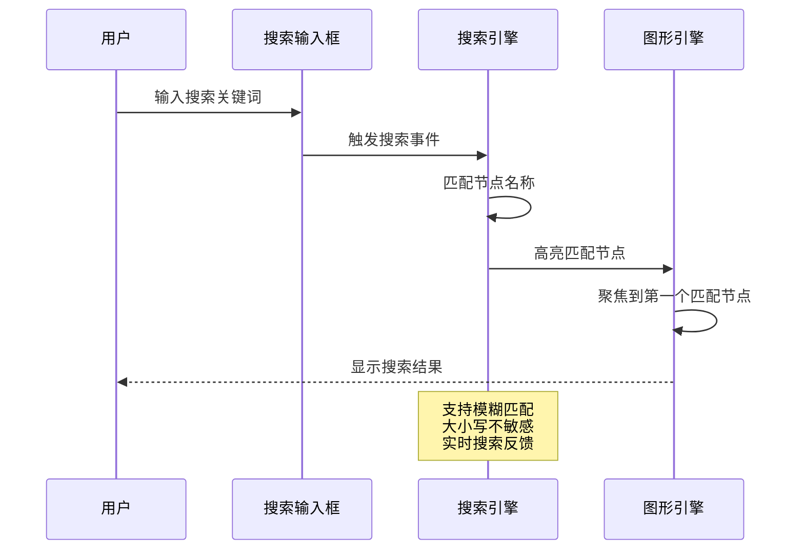

**图表来源**
- [knowledge_graph.py:634-672](file://code/visualization/knowledge_graph.py#L634-L672)

**章节来源**
- [knowledge_graph.py:504-714](file://code/visualization/knowledge_graph.py#L504-L714)

### 统计信息与图例生成

#### 节点类型分布统计
系统自动生成详细的节点类型分布统计信息：

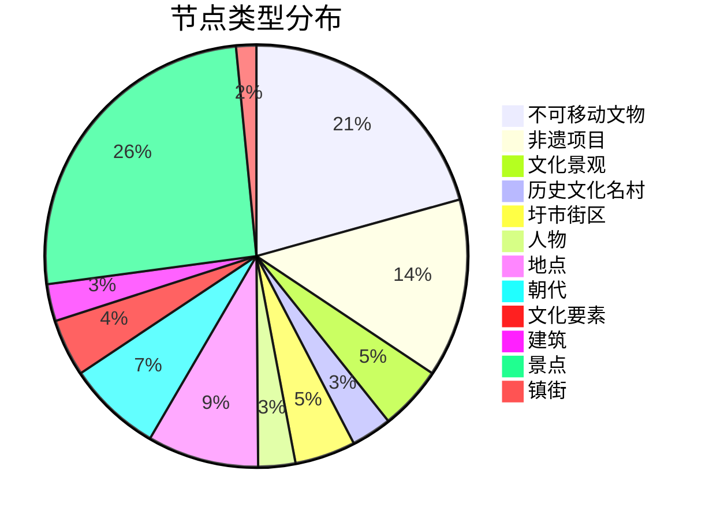

**图表来源**
- [knowledge_graph.py:364-367](file://code/visualization/knowledge_graph.py#L364-L367)

#### 关系类型统计
关系类型的统计信息帮助理解图谱的连接特性：

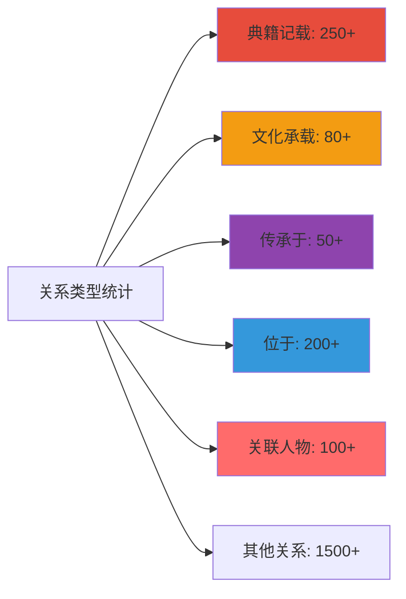

**图表来源**
- [knowledge_graph.py:367-378](file://code/visualization/knowledge_graph.py#L367-L378)

**章节来源**
- [knowledge_graph.py:340-384](file://code/visualization/knowledge_graph.py#L340-L384)
- [kg_statistics.json:1-119](file://output/knowledge_graph/kg_statistics.json#L1-L119)

## 依赖分析

### 外部依赖关系
项目依赖的主要外部库和工具：

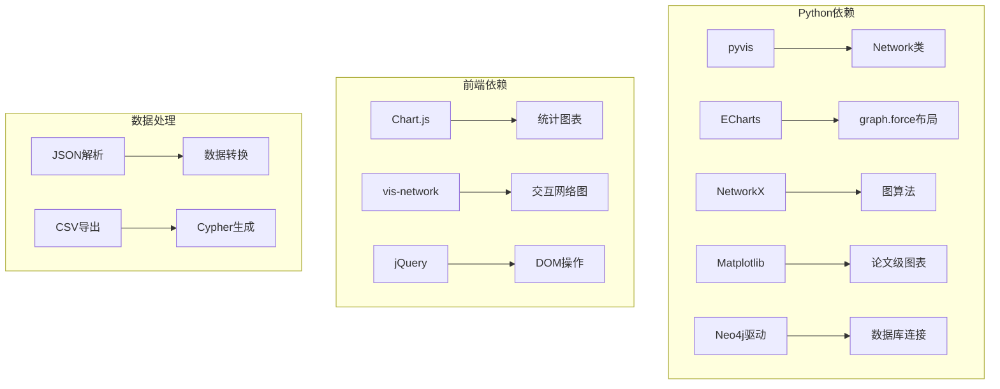

**图表来源**
- [kg_paper_viz.py:16-25](file://code/visualization/kg_paper_viz.py#L16-L25)
- [build_kg_dashboard.py:13-20](file://code/visualization/build_kg_dashboard.py#L13-L20)

### 内部模块依赖
各模块间的依赖关系确保了系统的模块化设计：

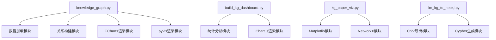

**图表来源**
- [knowledge_graph.py:48-101](file://code/visualization/knowledge_graph.py#L48-L101)
- [build_kg_dashboard.py:23-36](file://code/visualization/build_kg_dashboard.py#L23-L36)

**章节来源**
- [knowledge_graph.py:48-101](file://code/visualization/knowledge_graph.py#L48-L101)
- [build_kg_dashboard.py:13-26](file://code/visualization/build_kg_dashboard.py#L13-L26)

## 性能考虑

### 渲染性能优化
针对大规模图谱的渲染性能，系统采用了多项优化策略：

#### ECharts优化策略
- **布局参数调优**：通过调整斥力、引力和弹簧长度参数平衡布局质量和性能
- **节点标签控制**：根据节点大小动态控制标签显示，减少渲染负担
- **边样式简化**：使用统一的边样式配置，避免复杂的CSS计算

#### pyvis优化策略
- **物理仿真参数**：合理设置仿真参数，在保证视觉效果的同时控制计算复杂度
- **边标签延迟加载**：默认隐藏边标签，仅在需要时显示
- **搜索性能优化**：使用高效的字符串匹配算法，支持实时搜索

### 内存管理
- **数据分页加载**：对于大型图谱，采用分页加载策略减少内存占用
- **缓存机制**：对计算结果进行缓存，避免重复计算
- **垃圾回收**：及时释放不再使用的对象和事件监听器

### 网络传输优化
- **数据压缩**：对传输的数据进行压缩，减少网络带宽占用
- **增量更新**：支持增量更新机制，仅传输变化的部分
- **CDN加速**：使用CDN加速静态资源的加载

## 故障排除指南

### 常见问题诊断

#### ECharts渲染问题
- **症状**：图谱无法正常显示或布局异常
- **原因**：JavaScript错误、数据格式不正确、浏览器兼容性问题
- **解决方案**：检查控制台错误信息、验证数据格式、测试不同浏览器

#### pyvis交互问题
- **症状**：节点无法选择、边标签不显示、搜索功能失效
- **原因**：事件绑定失败、DOM元素未就绪、JavaScript冲突
- **解决方案**：检查事件监听器注册、确保DOM加载完成、排查JavaScript冲突

#### 数据加载问题
- **症状**：节点或边数据缺失、颜色编码错误
- **原因**：数据文件损坏、路径配置错误、编码问题
- **解决方案**：验证数据文件完整性、检查文件路径配置、确认字符编码

### 性能问题排查
- **CPU占用过高**：检查是否有过多的实时更新、优化布局参数
- **内存泄漏**：确认事件监听器正确移除、及时清理定时器
- **渲染卡顿**：减少同时渲染的节点数量、简化样式配置

**章节来源**
- [check_relation_semantics.py:39-91](file://code/visualization/check_relation_semantics.py#L39-L91)

## 结论
本项目成功实现了两个完整的交互式知识图谱可视化方案，每个方案都有其独特的优势：

### ECharts方案优势
- **成熟的生态系统**：丰富的配置选项和插件支持
- **高性能渲染**：适合大规模数据的高效渲染
- **响应式设计**：良好的移动端适配能力
- **丰富的交互**：支持多种交互模式和事件处理

### pyvis方案优势
- **物理仿真**：真实的物理模拟效果，增强用户体验
- **多重关系支持**：天然支持同一节点对的多重关系
- **搜索功能**：内置的搜索和过滤功能
- **易于集成**：简单的API接口，快速集成到现有项目

### 技术创新点
- **三层结构设计**：文化载体锚定的三层知识图谱架构
- **智能节点映射**：基于实体权重和提及次数的节点大小计算
- **关系语义检查**：自动检测和报告关系语义异常
- **统计信息集成**：实时生成和展示图谱统计信息

### 最佳实践建议
- **数据质量**：确保输入数据的准确性和完整性
- **性能监控**：定期监控渲染性能和用户体验
- **用户培训**：为用户提供交互操作指导
- **持续优化**：根据用户反馈持续改进功能

## 附录

### 配置参数参考
- **节点大小范围**：14-30像素
- **边宽度范围**：0.5-3.0像素
- **布局参数**：斥力250，引力0.06，弹簧长度[50,200]
- **颜色编码**：12种实体类型的专用颜色

### API接口说明
- **数据导入接口**：支持JSON和CSV格式
- **渲染接口**：提供多种渲染模式选择
- **交互接口**：支持节点选择、搜索、过滤等操作
- **导出接口**：支持HTML、PNG、SVG等多种格式导出

### 扩展开发指南
- **自定义样式**：通过修改颜色映射和样式配置实现个性化定制
- **新增关系类型**：按照现有模式添加新的关系类型和处理逻辑
- **第三方集成**：支持与其他数据源和可视化库的集成
- **插件开发**：提供插件接口，支持功能扩展和定制