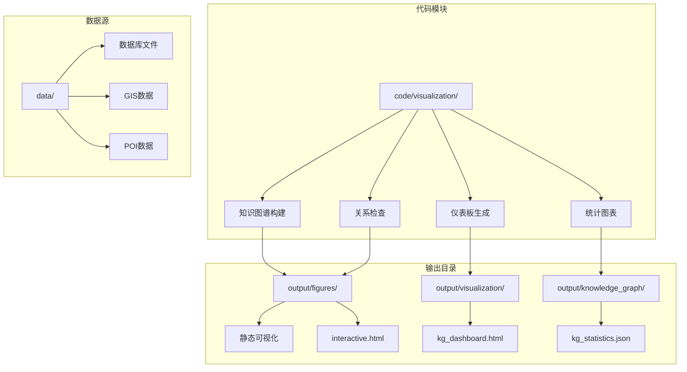
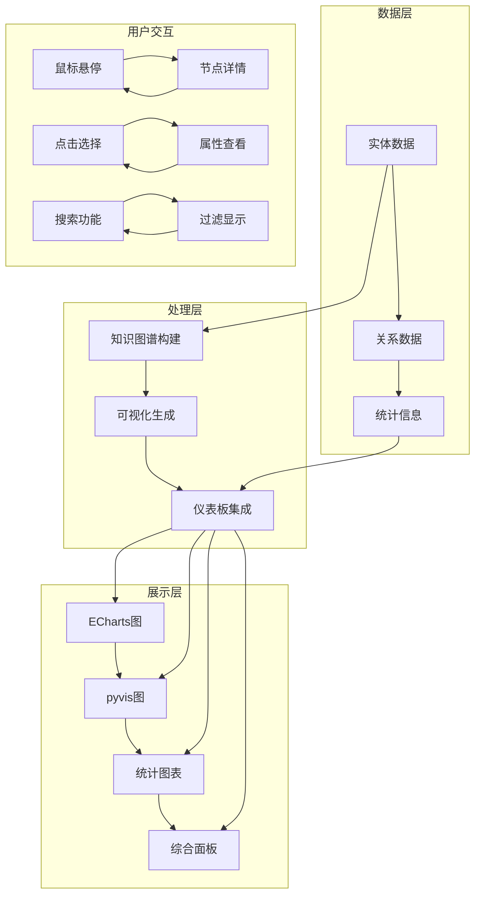
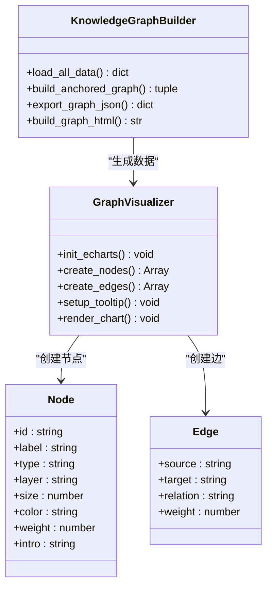
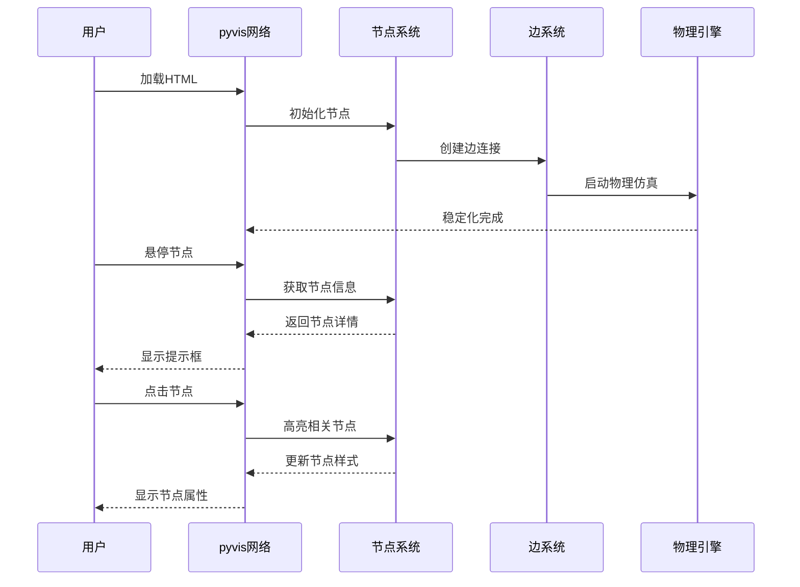
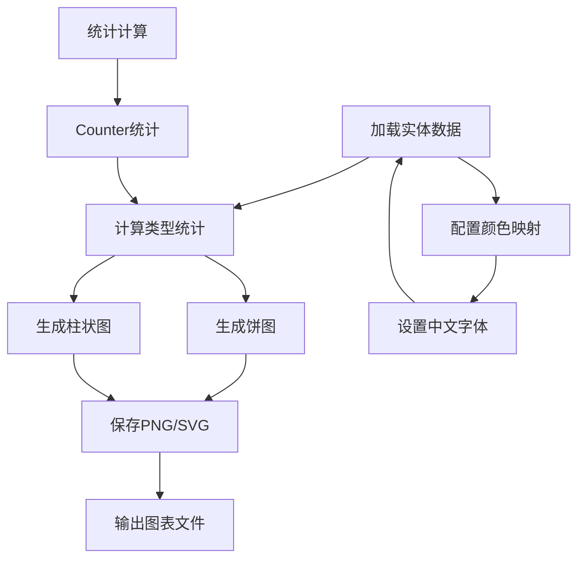
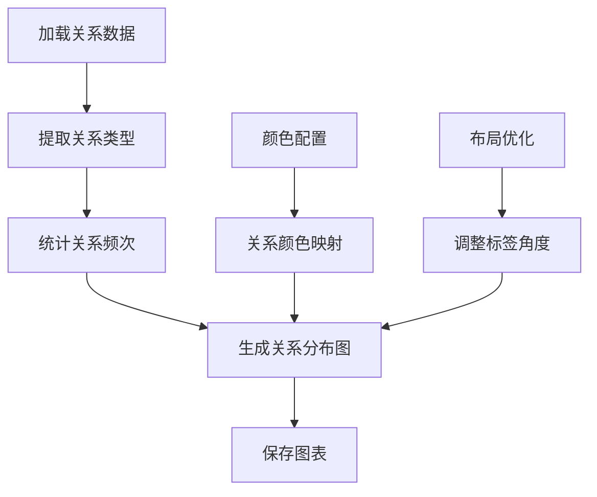
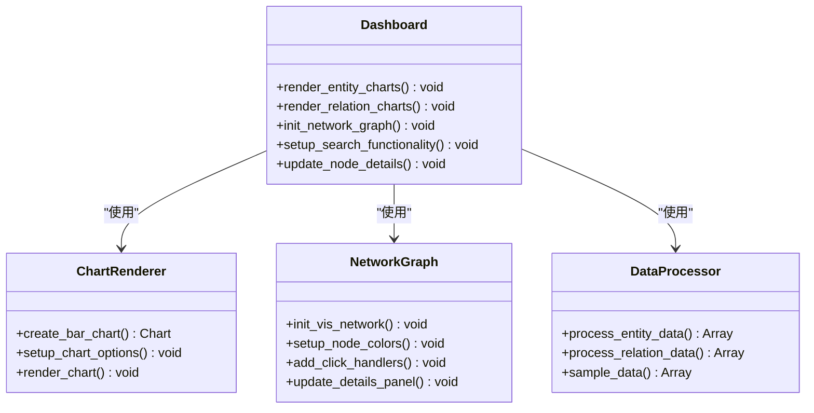
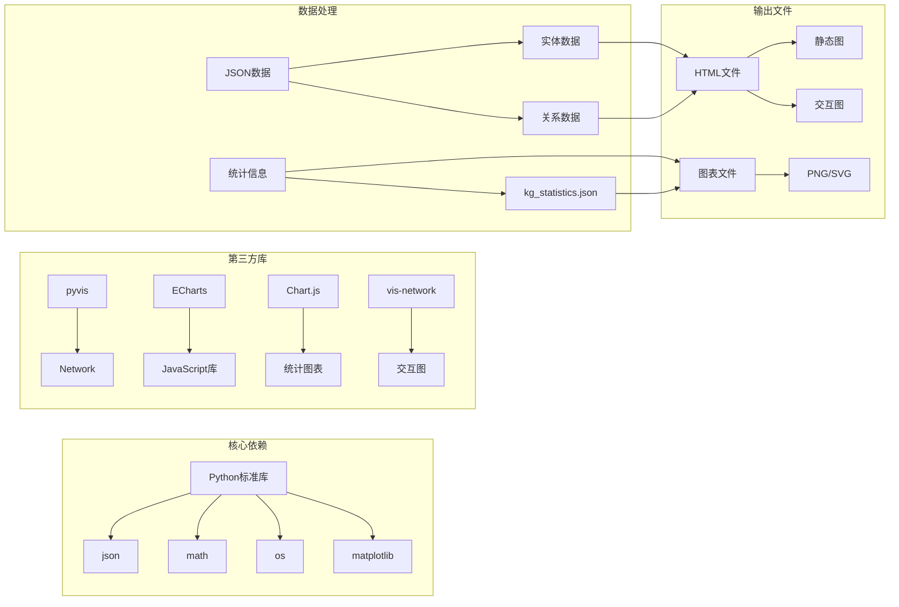
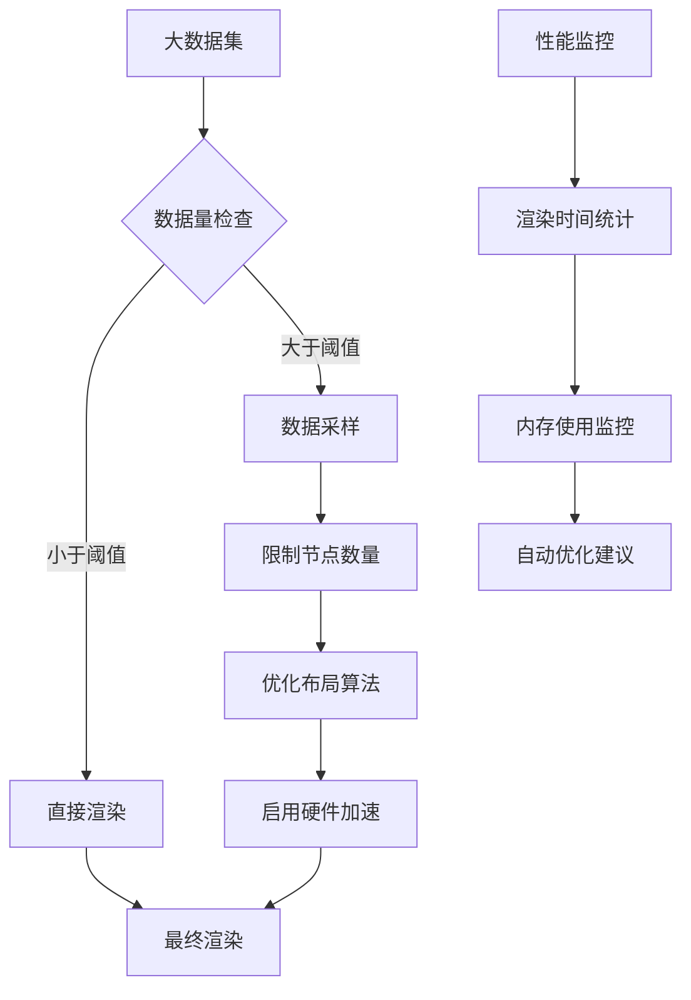

# 可视化与仪表板

<cite>
**本文档引用的文件**
- [build_kg_dashboard.py](file://code/visualization/build_kg_dashboard.py)
- [knowledge_graph.py](file://code/visualization/knowledge_graph.py)
- [kg_paper_viz.py](file://code/visualization/kg_paper_viz.py)
- [check_relation_semantics.py](file://code/visualization/check_relation_semantics.py)
- [kg_dashboard.html](file://output/visualization/kg_dashboard.html)
- [knowledge_graph.html](file://output/figures/knowledge_graph.html)
- [knowledge_graph_interactive.html](file://output/figures/knowledge_graph_interactive.html)
- [kg_statistics.json](file://output/knowledge_graph/kg_statistics.json)
</cite>

## 目录
1. [简介](#简介)
2. [项目结构](#项目结构)
3. [核心组件](#核心组件)
4. [架构概览](#架构概览)
5. [详细组件分析](#详细组件分析)
6. [依赖关系分析](#依赖关系分析)
7. [性能考虑](#性能考虑)
8. [故障排除指南](#故障排除指南)
9. [结论](#结论)
10. [附录](#附录)

## 简介

本项目是一个基于Python的知识图谱可视化系统，专注于南海区文化旅游资源的数据可视化展示。系统实现了三种核心可视化组件：知识图谱交互图、统计图表集合、综合数据面板，采用响应式设计和丰富的用户交互功能。

该项目的核心目标是通过数据驱动的方式，为用户提供直观、交互式的知识图谱浏览体验，支持实体类型频次统计、关系类型分布、属性详情查看等功能。系统采用模块化设计，便于扩展和定制。

## 项目结构

项目采用清晰的模块化组织结构，主要包含以下核心目录：

**图表来源**
- [build_kg_dashboard.py:1-269](file://code/visualization/build_kg_dashboard.py#L1-L269)
- [knowledge_graph.py:1-903](file://code/visualization/knowledge_graph.py#L1-L903)

**章节来源**
- [build_kg_dashboard.py:1-269](file://code/visualization/build_kg_dashboard.py#L1-L269)
- [knowledge_graph.py:1-903](file://code/visualization/knowledge_graph.py#L1-L903)

## 核心组件

### 知识图谱交互图组件

知识图谱交互图是系统的核心组件，采用ECharts和pyvis两种技术实现：

- **ECharts版本**：提供静态的、高性能的力导向图展示
- **pyvis版本**：提供完全交互式的网络图，支持物理仿真和搜索功能
- **三层结构**：文化载体锚定层、典籍文化层、旅游产品层

### 统计图表集合组件

系统提供多种统计图表来展示知识图谱的统计数据：

- **实体类型分布图**：展示各类实体的数量分布
- **关系类型分布图**：展示各种关系类型的统计信息
- **全景图**：展示知识图谱的整体结构
- **子图**：以特定节点为中心的局部网络展示

### 综合数据面板组件

kg_dashboard.html提供了一个集成的数据面板，包含：

- **实体/关系频次统计**
- **实体样本表格**
- **交互式子图预览**
- **属性详情查看**

**章节来源**
- [knowledge_graph.py:387-501](file://code/visualization/knowledge_graph.py#L387-L501)
- [kg_paper_viz.py:106-171](file://code/visualization/kg_paper_viz.py#L106-L171)
- [build_kg_dashboard.py:176-265](file://code/visualization/build_kg_dashboard.py#L176-L265)

## 架构概览

系统采用分层架构设计，各组件协同工作：

**图表来源**
- [knowledge_graph.py:104-337](file://code/visualization/knowledge_graph.py#L104-L337)
- [build_kg_dashboard.py:28-74](file://code/visualization/build_kg_dashboard.py#L28-L74)

## 详细组件分析

### 知识图谱交互图分析

#### ECharts实现方案

ECharts版本提供了高性能的静态图展示：

**图表来源**
- [knowledge_graph.py:340-384](file://code/visualization/knowledge_graph.py#L340-L384)
- [knowledge_graph.py:431-499](file://code/visualization/knowledge_graph.py#L431-L499)

#### pyvis实现方案

pyvis版本提供了完整的交互式体验：

**图表来源**
- [knowledge_graph.py:504-714](file://code/visualization/knowledge_graph.py#L504-L714)

**章节来源**
- [knowledge_graph.py:387-501](file://code/visualization/knowledge_graph.py#L387-L501)
- [knowledge_graph.py:504-714](file://code/visualization/knowledge_graph.py#L504-L714)

### 统计图表集合分析

#### 实体类型分布图

统计图表采用Matplotlib实现，提供多种图表格式：

**图表来源**
- [kg_paper_viz.py:106-141](file://code/visualization/kg_paper_viz.py#L106-L141)

#### 关系类型分布图

关系分布图提供更详细的语义关系分析：

**图表来源**
- [kg_paper_viz.py:143-171](file://code/visualization/kg_paper_viz.py#L143-L171)

**章节来源**
- [kg_paper_viz.py:106-171](file://code/visualization/kg_paper_viz.py#L106-L171)

### 综合数据面板分析

kg_dashboard.html提供了一体化的数据展示界面：

**图表来源**
- [build_kg_dashboard.py:176-265](file://code/visualization/build_kg_dashboard.py#L176-L265)

**章节来源**
- [build_kg_dashboard.py:176-265](file://code/visualization/build_kg_dashboard.py#L176-L265)

## 依赖关系分析

系统采用模块化设计，各组件之间的依赖关系清晰：

**图表来源**
- [knowledge_graph.py:48-51](file://code/visualization/knowledge_graph.py#L48-L51)
- [build_kg_dashboard.py:13-20](file://code/visualization/build_kg_dashboard.py#L13-L20)

**章节来源**
- [knowledge_graph.py:48-51](file://code/visualization/knowledge_graph.py#L48-L51)
- [build_kg_dashboard.py:13-20](file://code/visualization/build_kg_dashboard.py#L13-L20)

## 性能考虑

### 数据处理优化

系统在数据处理方面采用了多项优化策略：

- **数据采样**：对大规模数据集进行采样，减少渲染压力
- **内存管理**：及时释放不需要的数据结构
- **增量更新**：支持部分数据更新而非全量重绘

### 渲染性能优化

### 交互性能优化

- **事件节流**：对频繁触发的事件进行节流处理
- **虚拟滚动**：对大型表格使用虚拟滚动技术
- **延迟加载**：按需加载非关键资源

## 故障排除指南

### 常见问题及解决方案

#### 数据加载问题

**问题**：找不到合并的实体或关系文件
**解决方案**：
1. 确认LLM抽取流程已完成
2. 检查文件路径是否正确
3. 验证JSON文件格式有效性

#### 可视化渲染问题

**问题**：图表无法正常显示
**解决方案**：
1. 检查JavaScript库的CDN连接
2. 验证CSS样式文件加载
3. 确认浏览器兼容性

#### 性能问题

**问题**：页面加载缓慢
**解决方案**：
1. 减少一次性渲染的节点数量
2. 启用数据采样功能
3. 优化CSS和JavaScript文件

**章节来源**
- [check_relation_semantics.py:39-95](file://code/visualization/check_relation_semantics.py#L39-L95)

## 结论

本可视化系统成功实现了知识图谱的多维度展示，通过三种核心组件提供了完整的数据可视化解决方案。系统采用模块化设计，具有良好的扩展性和维护性。

主要优势包括：
- **多技术栈支持**：同时支持ECharts和pyvis两种可视化方案
- **响应式设计**：适配不同设备和屏幕尺寸
- **丰富的交互功能**：提供搜索、过滤、高亮等交互能力
- **性能优化**：针对大数据集进行了专门的优化处理

未来可以进一步扩展的方向包括：
- 增加更多的可视化主题和样式选项
- 实现更复杂的交互功能，如图编辑器
- 集成实时数据更新机制
- 提供移动端专用的优化版本

## 附录

### 配置参数说明

系统支持多种配置参数来定制可视化效果：

- **颜色配置**：实体类型颜色映射
- **尺寸配置**：节点大小和边宽度设置
- **布局配置**：物理仿真参数调优
- **交互配置**：用户交互行为设置

### 扩展指南

开发者可以通过以下方式扩展系统功能：

1. **添加新的可视化类型**：继承基础类并实现特定渲染逻辑
2. **自定义样式主题**：修改CSS变量和颜色配置
3. **集成新的数据源**：扩展数据加载器以支持新格式
4. **添加交互功能**：扩展JavaScript代码以实现新交互

### API参考

系统提供简洁的API接口供外部调用：

- `build_kg_dashboard.py`: 主要的仪表板生成函数
- `knowledge_graph.py`: 知识图谱构建和可视化函数
- `kg_paper_viz.py`: 论文级可视化生成函数
- `check_relation_semantics.py`: 关系语义验证函数