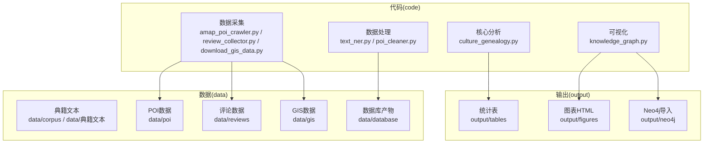
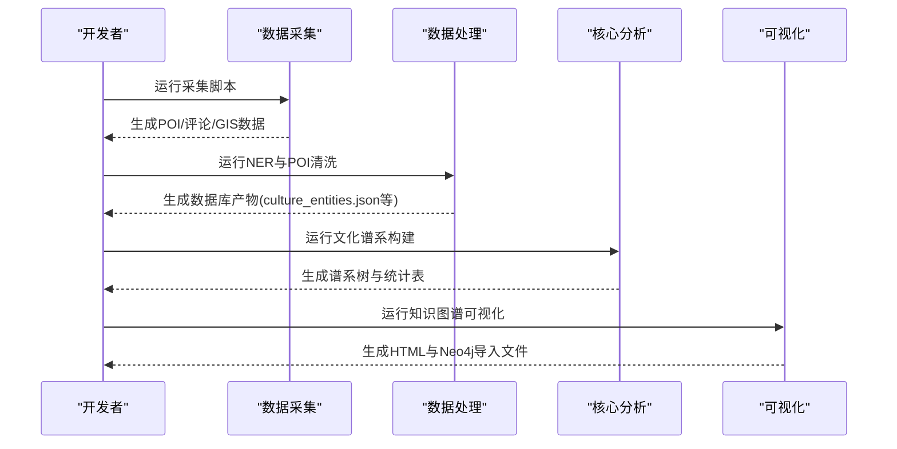
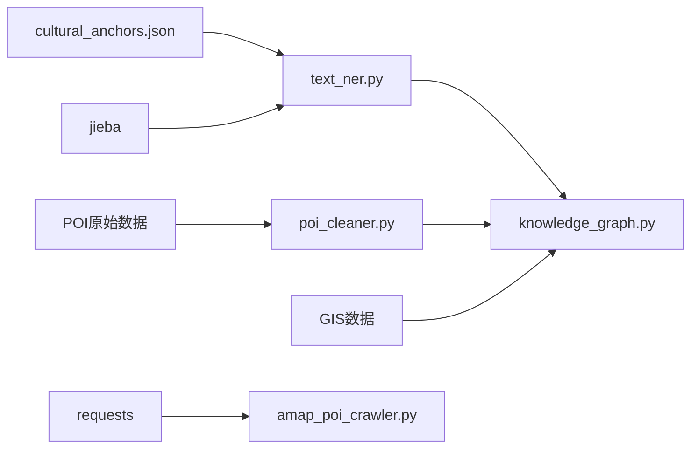

# 快速开始

<cite>
**本文引用的文件**
- [README.md](file://README.md)
- [需求文档_数据补充清单.md](file://需求文档_数据补充清单.md)
- [code/data_collection/amap_poi_crawler.py](file://code/data_collection/amap_poi_crawler.py)
- [code/data_collection/review_collector.py](file://code/data_collection/review_collector.py)
- [code/data_collection/download_gis_data.py](file://code/data_collection/download_gis_data.py)
- [code/data_processing/poi_cleaner.py](file://code/data_processing/poi_cleaner.py)
- [code/data_processing/text_ner.py](file://code/data_processing/text_ner.py)
- [code/analysis/culture_genealogy.py](file://code/analysis/culture_genealogy.py)
- [code/visualization/knowledge_graph.py](file://code/visualization/knowledge_graph.py)
- [data/database/cultural_anchors.json](file://data/database/cultural_anchors.json)
</cite>

## 目录
1. [简介](#简介)
2. [项目结构](#项目结构)
3. [核心组件](#核心组件)
4. [架构总览](#架构总览)
5. [详细组件解析](#详细组件解析)
6. [依赖关系分析](#依赖关系分析)
7. [性能与并发建议](#性能与并发建议)
8. [故障排查指南](#故障排查指南)
9. [结论](#结论)
10. [附录：命令与预期输出](#附录命令与预期输出)

## 简介
本指南面向首次接触本项目的开发者，帮助你在30分钟内完成环境准备、数据采集与处理、核心分析与可视化，并验证流程正确性。项目围绕“佛山市南海区文旅融合”主题，采用Python生态（jieba、requests等）与多源数据（典籍、POI、评论、GIS）构建文化谱系与知识图谱。

## 项目结构
项目采用“代码-数据-输出”的清晰分层：
- 代码层：按功能拆分为数据采集、数据处理、核心分析、可视化四个子包
- 数据层：data/下存放典籍文本、POI、评论、GIS、数据库产物等
- 输出层：output/下生成可视化HTML、统计表、Neo4j导入文件等

图表来源
- [README.md: 项目结构与运行说明:3-79](file://README.md#L3-L79)
- [code/data_collection/amap_poi_crawler.py: POI采集入口:1-343](file://code/data_collection/amap_poi_crawler.py#L1-L343)
- [code/data_collection/review_collector.py: 评论采集入口:1-246](file://code/data_collection/review_collector.py#L1-L246)
- [code/data_collection/download_gis_data.py: GIS数据生成:1-186](file://code/data_collection/download_gis_data.py#L1-L186)
- [code/data_processing/poi_cleaner.py: POI清洗与标准化:1-402](file://code/data_processing/poi_cleaner.py#L1-L402)
- [code/data_processing/text_ner.py: 典籍实体抽取:1-549](file://code/data_processing/text_ner.py#L1-L549)
- [code/analysis/culture_genealogy.py: 文化谱系构建:1-395](file://code/analysis/culture_genealogy.py#L1-L395)
- [code/visualization/knowledge_graph.py: 知识图谱可视化:1-903](file://code/visualization/knowledge_graph.py#L1-L903)

章节来源
- [README.md: 项目结构与运行说明:3-79](file://README.md#L3-L79)

## 核心组件
- 数据采集：POI（高德）、评论（示例）、GIS（南海区边界/镇街/非遗点位）
- 数据处理：典籍文本NER抽取、POI清洗与标准化
- 核心分析：文化谱系树构建
- 可视化：三层知识图谱（文化载体锚点/典籍文化层/旅游产品层）

章节来源
- [README.md: 运行说明与技术栈:81-122](file://README.md#L81-L122)

## 架构总览
整体流程从“数据采集”到“数据处理”，再到“分析与可视化”，最终产出交互式图表与统计表。

图表来源
- [README.md: 执行顺序:89-110](file://README.md#L89-L110)
- [code/data_processing/text_ner.py: NER主流程:496-549](file://code/data_processing/text_ner.py#L496-L549)
- [code/data_processing/poi_cleaner.py: POI清洗主流程:382-402](file://code/data_processing/poi_cleaner.py#L382-L402)
- [code/analysis/culture_genealogy.py: 谱系构建主流程:354-395](file://code/analysis/culture_genealogy.py#L354-L395)
- [code/visualization/knowledge_graph.py: 可视化主流程:1-903](file://code/visualization/knowledge_graph.py#L1-L903)

## 详细组件解析

### 环境与依赖准备
- Python 3.x
- 安装依赖：jieba、requests
- 高德API Key（用于POI采集，非必需，示例数据也可运行）

章节来源
- [README.md: 环境依赖与安装:83-87](file://README.md#L83-L87)
- [code/data_collection/amap_poi_crawler.py: 配置说明与示例数据生成:7-23](file://code/data_collection/amap_poi_crawler.py#L7-L23)

### 数据采集
- POI采集（高德）：按类型与关键词检索，去重并保存JSON/CSV
- 评论采集：生成示例评论数据，便于体验度分析
- GIS数据：生成南海区边界、镇街点位、非遗点位（GeoJSON/JSON）

章节来源
- [code/data_collection/amap_poi_crawler.py: 采集与保存:229-267](file://code/data_collection/amap_poi_crawler.py#L229-L267)
- [code/data_collection/review_collector.py: 示例评论生成:175-242](file://code/data_collection/review_collector.py#L175-L242)
- [code/data_collection/download_gis_data.py: 边界/镇街/非遗数据生成:151-182](file://code/data_collection/download_gis_data.py#L151-L182)

### 数据处理
- 典籍NER：加载典籍文本，注入文化锚点词典，分词抽取实体，合并多源实体，提取共现关系，输出结构化数据库
- POI清洗：融合高德/Shapefile/百度数据，按名称去重，自动分类，匹配非遗与文化锚点，确定所属镇街，输出清洗后POI

章节来源
- [code/data_processing/text_ner.py: 主流程与输出:496-549](file://code/data_processing/text_ner.py#L496-L549)
- [code/data_processing/poi_cleaner.py: 清洗与标准化主流程:382-402](file://code/data_processing/poi_cleaner.py#L382-L402)

### 核心分析
- 文化谱系树：基于非遗分类、典籍主题、实体频次，构建ECharts树形图，输出HTML与统计表

章节来源
- [code/analysis/culture_genealogy.py: 树形图构建与输出:354-395](file://code/analysis/culture_genealogy.py#L354-L395)

### 可视化
- 知识图谱：以文化载体锚点为核心，连接典籍文化层与旅游产品层，生成交互式HTML与Neo4j导入文件

章节来源
- [code/visualization/knowledge_graph.py: 三层图谱构建与导出:104-337](file://code/visualization/knowledge_graph.py#L104-L337)
- [code/visualization/knowledge_graph.py: HTML与Neo4j导出:340-800](file://code/visualization/knowledge_graph.py#L340-L800)

## 依赖关系分析
- 数据依赖：text_ner.py依赖cultural_anchors.json；poi_cleaner.py依赖清洗后的POI与锚点；knowledge_graph.py依赖数据库产物与GIS数据
- 外部依赖：requests（网络请求）、jieba（中文分词）、ECharts（前端可视化）

图表来源
- [data/database/cultural_anchors.json: 锚点数据:1-2009](file://data/database/cultural_anchors.json#L1-L2009)
- [code/data_processing/text_ner.py: 依赖锚点:48-74](file://code/data_processing/text_ner.py#L48-L74)
- [code/data_processing/poi_cleaner.py: 依赖锚点与POI:76-83](file://code/data_processing/poi_cleaner.py#L76-L83)
- [code/visualization/knowledge_graph.py: 依赖数据库与GIS:75-101](file://code/visualization/knowledge_graph.py#L75-L101)
- [code/data_collection/amap_poi_crawler.py: 使用requests:11-16](file://code/data_collection/amap_poi_crawler.py#L11-L16)

章节来源
- [README.md: 技术栈:116-122](file://README.md#L116-L122)

## 性能与并发建议
- NER与POI清洗涉及大规模文本与数据融合，建议：
  - 使用多核CPU与SSD存储
  - 合理设置请求间隔（高德接口已内置间隔）
  - 分批处理大文本，避免内存峰值过高
- 可视化导出（尤其是Neo4j导入）建议在空闲时段执行

[本节为通用建议，无需特定文件引用]

## 故障排查指南
- 缺少依赖
  - 现象：ImportError或运行报错
  - 处理：安装依赖（见“环境与依赖准备”）
- 高德API Key未配置
  - 现象：POI采集提示未配置Key，生成示例数据
  - 处理：前往高德控制台申请Key并填入配置
- 评论数据为空
  - 现象：体验度分析缺少数据
  - 处理：使用review_collector.py生成示例数据，或替换为真实采集数据
- GIS数据不准确
  - 现象：边界/非遗点位与实际不符
  - 处理：替换download_gis_data.py生成的简化数据为权威数据源
- 数据路径不存在
  - 现象：找不到cultural_anchors.json或POI数据
  - 处理：先运行text_ner.py与poi_cleaner.py生成数据库产物

章节来源
- [code/data_collection/amap_poi_crawler.py: Key配置与示例数据:235-241](file://code/data_collection/amap_poi_crawler.py#L235-L241)
- [code/data_collection/review_collector.py: 示例数据生成:175-242](file://code/data_collection/review_collector.py#L175-L242)
- [code/data_collection/download_gis_data.py: 简化数据说明:180-182](file://code/data_collection/download_gis_data.py#L180-L182)
- [data/database/cultural_anchors.json: 锚点数据存在性:1-2009](file://data/database/cultural_anchors.json#L1-L2009)

## 结论
通过本指南，你可以在30分钟内完成Python环境准备、依赖安装、数据采集与处理、核心分析与可视化，并验证流程正确性。建议在具备真实高德Key与权威GIS数据后，进一步完善POI与评论数据，以获得更高质量的分析结果。

[本节为总结，无需特定文件引用]

## 附录：命令与预期输出

### 1) 环境与依赖
- 安装依赖
  - 命令：pip install jieba requests
  - 预期：无报错，安装成功
- 验证Python版本
  - 命令：python --version
  - 预期：Python 3.x

章节来源
- [README.md: 环境依赖:83-87](file://README.md#L83-L87)

### 2) 数据采集
- POI采集（高德）
  - 命令：python code/data_collection/amap_poi_crawler.py
  - 预期：生成data/poi下的JSON/CSV文件；若未配置Key，生成示例数据
- 评论采集
  - 命令：python code/data_collection/review_collector.py
  - 预期：生成data/reviews下的JSON/CSV与汇总文件
- GIS数据准备
  - 命令：python code/data_collection/download_gis_data.py
  - 预期：生成data/gis下的边界/镇街/非遗数据

章节来源
- [README.md: 执行顺序（采集）:89-96](file://README.md#L89-L96)
- [code/data_collection/amap_poi_crawler.py: 采集与保存:229-267](file://code/data_collection/amap_poi_crawler.py#L229-L267)
- [code/data_collection/review_collector.py: 生成评论:175-242](file://code/data_collection/review_collector.py#L175-L242)
- [code/data_collection/download_gis_data.py: 生成GIS数据:151-182](file://code/data_collection/download_gis_data.py#L151-L182)

### 3) 数据处理
- 典籍NER
  - 命令：python code/data_processing/text_ner.py
  - 预期：生成data/database下的culture_entities.json、culture_relations.json等
- POI清洗与标准化
  - 命令：python code/data_processing/poi_cleaner.py
  - 预期：生成data/database/poi_cleaned.json，输出分类/镇街统计

章节来源
- [README.md: 执行顺序（处理）:98-100](file://README.md#L98-L100)
- [code/data_processing/text_ner.py: 主流程:496-549](file://code/data_processing/text_ner.py#L496-L549)
- [code/data_processing/poi_cleaner.py: 主流程:382-402](file://code/data_processing/poi_cleaner.py#L382-L402)

### 4) 核心分析
- 文化谱系树
  - 命令：python code/analysis/culture_genealogy.py
  - 预期：生成data/database下的谱系树与分类原始数据，输出output/tables下的统计表

章节来源
- [README.md: 执行顺序（分析）:102-106](file://README.md#L102-L106)
- [code/analysis/culture_genealogy.py: 主流程:354-395](file://code/analysis/culture_genealogy.py#L354-L395)

### 5) 可视化
- 知识图谱
  - 命令：python code/visualization/knowledge_graph.py
  - 预期：生成output/figures下的HTML，以及output/neo4j下的Neo4j导入文件

章节来源
- [README.md: 执行顺序（可视化）:108-110](file://README.md#L108-L110)
- [code/visualization/knowledge_graph.py: 主流程:1-903](file://code/visualization/knowledge_graph.py#L1-L903)

### 6) 查看可视化
- 打开浏览器访问 output/figures/ 下的HTML文件，即可查看交互式可视化

章节来源
- [README.md: 查看可视化:112-114](file://README.md#L112-L114)

### 7) 高德API密钥配置
- 修改 amap_poi_crawler.py 中的 CONFIG["amap_key"] 为你的Key
- 注意：若未配置，脚本将生成示例数据，不影响后续流程

章节来源
- [code/data_collection/amap_poi_crawler.py: Key配置与示例数据:21-23](file://code/data_collection/amap_poi_crawler.py#L21-L23)
- [需求文档_数据补充清单.md: 需要配置高德Key:125-126](file://需求文档_数据补充清单.md#L125-L126)