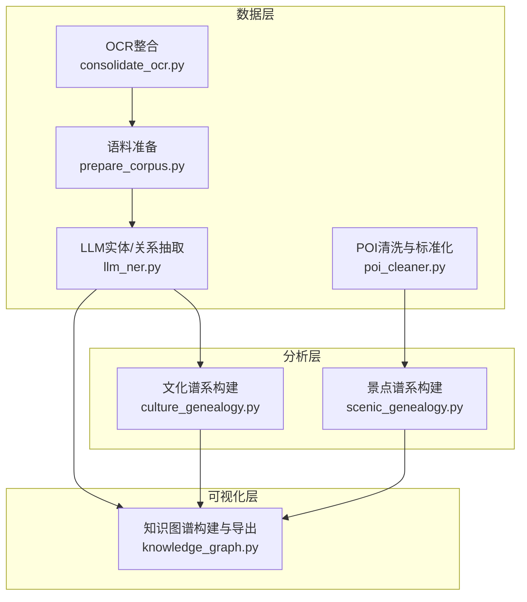
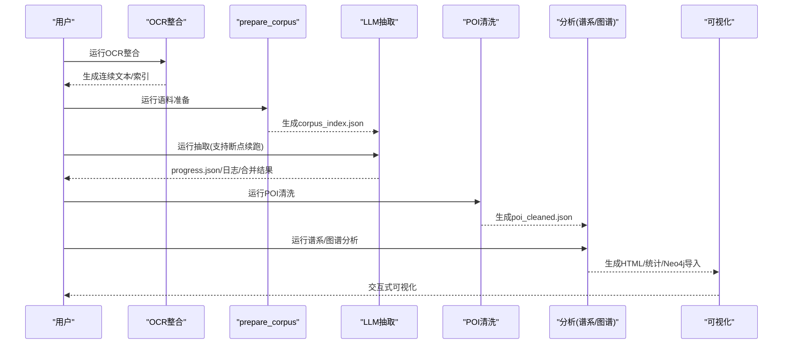
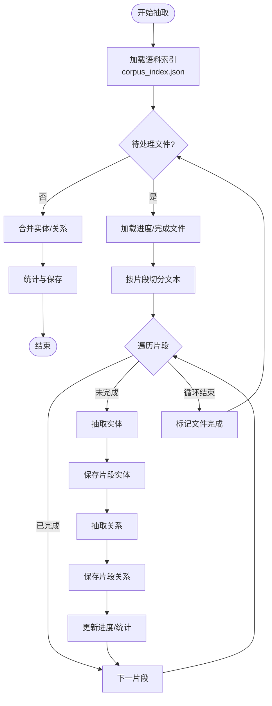
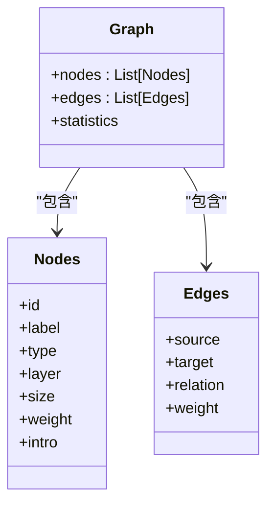
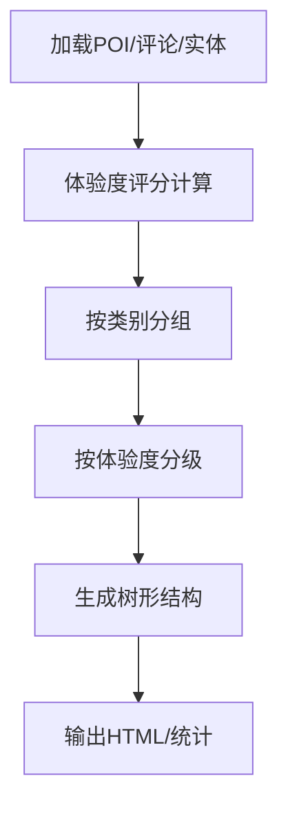
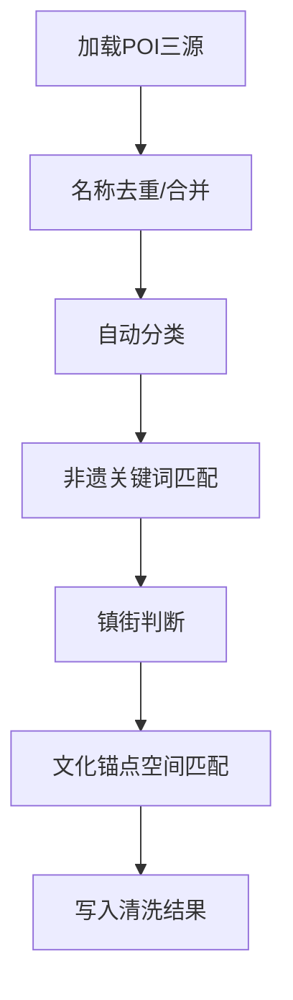
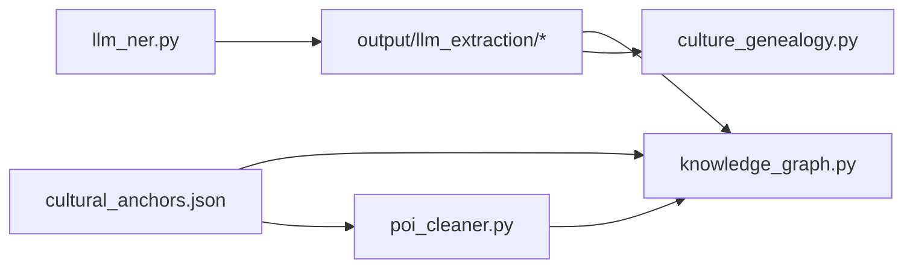

# 扩展与维护

<cite>
**本文档引用的文件**   
- [README.md](file://README.md)
- [需求文档_数据补充清单.md](file://需求文档_数据补充清单.md)
- [consolidate_ocr.py](file://code/data_collection/consolidate_ocr.py)
- [prepare_corpus.py](file://code/data_processing/prepare_corpus.py)
- [llm_ner.py](file://code/data_processing/llm_ner.py)
- [poi_cleaner.py](file://code/data_processing/poi_cleaner.py)
- [culture_genealogy.py](file://code/analysis/culture_genealogy.py)
- [scenic_genealogy.py](file://code/analysis/scenic_genealogy.py)
- [knowledge_graph.py](file://code/visualization/knowledge_graph.py)
- [cultural_anchors.json](file://data/database/cultural_anchors.json)
- [progress.json](file://output/llm_extraction/progress.json)
</cite>

## 目录
1. [简介](#简介)
2. [项目结构](#项目结构)
3. [核心组件](#核心组件)
4. [架构总览](#架构总览)
5. [详细组件分析](#详细组件分析)
6. [依赖分析](#依赖分析)
7. [性能考虑](#性能考虑)
8. [故障排查指南](#故障排查指南)
9. [结论](#结论)
10. [附录](#附录)

## 简介
本指导文档面向项目扩展与长期维护，围绕以下目标展开：  
- 如何添加新的实体类型与关系类型  
- 如何扩展知识图谱与分析模块  
- 断点续跑机制的原理与使用  
- 数据更新流程与版本升级策略  
- 向后兼容性保障  
- 代码重构与性能优化建议  
- 故障诊断方法  
- 社区贡献流程与代码评审标准  
- 项目维护最佳实践与长期发展规划  

## 项目结构
项目采用“数据采集 → 数据处理 → 核心分析 → 可视化”的流水线式组织，核心模块如下：  
- 数据采集：OCR整合、POI采集、评论采集、GIS数据准备  
- 数据处理：语料统一、实体/关系抽取（LLM）、POI清洗与标准化  
- 核心分析：文化谱系、景点谱系、耦合分析、空间分析  
- 可视化：知识图谱、谱系树、统计图表

**图表来源**
- [consolidate_ocr.py:1-225](file://code/data_collection/consolidate_ocr.py#L1-L225)
- [prepare_corpus.py:1-155](file://code/data_processing/prepare_corpus.py#L1-L155)
- [llm_ner.py:1-902](file://code/data_processing/llm_ner.py#L1-L902)
- [poi_cleaner.py:1-402](file://code/data_processing/poi_cleaner.py#L1-L402)
- [culture_genealogy.py:1-395](file://code/analysis/culture_genealogy.py#L1-L395)
- [scenic_genealogy.py:1-375](file://code/analysis/scenic_genealogy.py#L1-L375)
- [knowledge_graph.py:1-903](file://code/visualization/knowledge_graph.py#L1-L903)

**章节来源**
- [README.md:1-130](file://README.md#L1-L130)

## 核心组件
- 数据采集与预处理：负责将多源异构数据统一为结构化输入，支撑后续抽取与分析。  
- LLM实体/关系抽取：支持断点续跑、进度持久化、日志记录与结果合并。  
- POI清洗与标准化：三源融合、分类与非遗匹配、文化锚点空间关联。  
- 谱系与图谱：文化谱系树、景点谱系树、三层知识图谱（文化载体锚定版）。  
- 可视化：ECharts与pyvis双通道输出，支持Neo4j导入。

**章节来源**
- [consolidate_ocr.py:1-225](file://code/data_collection/consolidate_ocr.py#L1-L225)
- [prepare_corpus.py:1-155](file://code/data_processing/prepare_corpus.py#L1-L155)
- [llm_ner.py:1-902](file://code/data_processing/llm_ner.py#L1-L902)
- [poi_cleaner.py:1-402](file://code/data_processing/poi_cleaner.py#L1-L402)
- [culture_genealogy.py:1-395](file://code/analysis/culture_genealogy.py#L1-L395)
- [scenic_genealogy.py:1-375](file://code/analysis/scenic_genealogy.py#L1-L375)
- [knowledge_graph.py:1-903](file://code/visualization/knowledge_graph.py#L1-L903)

## 架构总览
整体流程从“文本与POI数据”出发，经“抽取与清洗”，到“谱系与图谱”，最终“可视化呈现”。断点续跑贯穿抽取阶段，保证大规模任务的稳定性与可恢复性。

**图表来源**
- [consolidate_ocr.py:1-225](file://code/data_collection/consolidate_ocr.py#L1-L225)
- [prepare_corpus.py:1-155](file://code/data_processing/prepare_corpus.py#L1-L155)
- [llm_ner.py:1-902](file://code/data_processing/llm_ner.py#L1-L902)
- [poi_cleaner.py:1-402](file://code/data_processing/poi_cleaner.py#L1-L402)
- [culture_genealogy.py:1-395](file://code/analysis/culture_genealogy.py#L1-L395)
- [scenic_genealogy.py:1-375](file://code/analysis/scenic_genealogy.py#L1-L375)
- [knowledge_graph.py:1-903](file://code/visualization/knowledge_graph.py#L1-L903)

## 详细组件分析

### 组件A：LLM实体/关系抽取（断点续跑与进度管理）
- 断点续跑机制：以“文件级+片段级”进度持久化，支持重启后跳过已完成片段；提供重置选项清空旧结果。  
- 进度与日志：独立的progress.json与extraction_log.log，线程安全写入，便于监控与排障。  
- 结果合并：实体按名称聚合去重，关系保留多重关系并去重，输出合并文件供下游使用。  
- 使用建议：首次运行建议--reset清理历史；大规模任务建议--demo预跑验证；并发线程NUM_THREADS可调。

**图表来源**
- [llm_ner.py:423-694](file://code/data_processing/llm_ner.py#L423-L694)
- [progress.json:1-105](file://output/llm_extraction/progress.json#L1-L105)

**章节来源**
- [llm_ner.py:1-902](file://code/data_processing/llm_ner.py#L1-L902)
- [progress.json:1-105](file://output/llm_extraction/progress.json#L1-L105)

### 组件B：知识图谱构建（三层结构与关系扩展）
- 三层结构：文化载体锚点层（中间层）、典籍文化层（上层）、旅游产品层（下层）。  
- 关系类型：典籍记载、关联人物、文化承载、对应景点、传承于、位于、同时代、同门类、共现关联、文化关联等。  
- 可视化：ECharts与pyvis双通道，支持交互、搜索、边标签切换、物理仿真稳定后关闭。  
- 导出：支持Neo4j导入的节点/关系CSV与Cypher脚本。

**图表来源**
- [knowledge_graph.py:340-384](file://code/visualization/knowledge_graph.py#L340-L384)

**章节来源**
- [knowledge_graph.py:1-903](file://code/visualization/knowledge_graph.py#L1-L903)

### 组件C：谱系构建（文化谱系与景点谱系）
- 文化谱系：基于非遗分类、典籍内容与NER实体频次构建树形结构，输出ECharts可视化与统计。  
- 景点谱系：基于POI与评论数据，构建体验度评分（六维加权）与按镇街分布的树形结构。

**图表来源**
- [scenic_genealogy.py:126-179](file://code/analysis/scenic_genealogy.py#L126-L179)

**章节来源**
- [culture_genealogy.py:1-395](file://code/analysis/culture_genealogy.py#L1-L395)
- [scenic_genealogy.py:1-375](file://code/analysis/scenic_genealogy.py#L1-L375)

### 组件D：POI清洗与标准化（三源融合与文化锚点匹配）
- 三源融合：高德API、Shapefile、百度API，按名称去重，保留更完整记录。  
- 自动分类：关键词匹配优先，其次高德类型编码。  
- 非遗匹配：基于关键词匹配POI与非遗项目。  
- 文化锚点匹配：500米范围内匹配文化载体锚点，支持经纬度与关键字双重判断。

**图表来源**
- [poi_cleaner.py:86-155](file://code/data_processing/poi_cleaner.py#L86-L155)
- [poi_cleaner.py:292-348](file://code/data_processing/poi_cleaner.py#L292-L348)

**章节来源**
- [poi_cleaner.py:1-402](file://code/data_processing/poi_cleaner.py#L1-L402)

## 依赖分析
- 模块内聚与耦合：抽取模块与可视化模块通过统一的JSON接口耦合；分析模块与可视化模块通过树形/图谱JSON耦合。  
- 外部依赖：jieba（中文分词）、requests（HTTP调用）、tqdm（进度条）、pyvis（交互图谱）、ECharts（可视化）。  
- 数据依赖：抽取结果依赖语料索引；图谱依赖实体/关系合并结果与文化锚点；分析依赖清洗后的POI与评论。

**图表来源**
- [llm_ner.py:696-799](file://code/data_processing/llm_ner.py#L696-L799)
- [knowledge_graph.py:75-101](file://code/visualization/knowledge_graph.py#L75-L101)
- [cultural_anchors.json:1-2009](file://data/database/cultural_anchors.json#L1-L2009)

**章节来源**
- [llm_ner.py:1-902](file://code/data_processing/llm_ner.py#L1-L902)
- [knowledge_graph.py:1-903](file://code/visualization/knowledge_graph.py#L1-L903)
- [cultural_anchors.json:1-2009](file://data/database/cultural_anchors.json#L1-L2009)

## 性能考虑
- 抽取性能：合理设置CHUNK_SIZE与NUM_THREADS，避免超时与内存压力；对大文本进行分片处理并缓存中间结果。  
- I/O优化：进度与日志采用原子写（.tmp替换），减少锁竞争；批量写入合并结果。  
- 可视化性能：图谱节点/边数量增长时，优先使用ECharts；pyvis适合交互探索，生产展示建议ECharts。  
- 空间匹配：POI与锚点匹配使用Haversine距离，建议在大规模数据时引入空间索引或分块批处理。

[本节为通用性能建议，无需特定文件引用]

## 故障排查指南
- LLM调用失败：检查Ollama服务端口与模型可用性；关注超时与连接错误重试逻辑。  
- 进度异常：progress.json损坏或被意外修改时，程序会重置进度；可通过--reset清理后重跑。  
- 抽取结果为空：确认corpus_index.json存在且文件列表非空；检查文本分片与正则过滤逻辑。  
- 可视化空白：确认输出HTML路径与静态资源可用；浏览器控制台查看网络请求与JS错误。  
- POI清洗异常：检查地址/坐标字段合法性；关注跨区过滤逻辑与关键字匹配阈值。

**章节来源**
- [llm_ner.py:224-257](file://code/data_processing/llm_ner.py#L224-L257)
- [llm_ner.py:425-453](file://code/data_processing/llm_ner.py#L425-L453)
- [knowledge_graph.py:387-501](file://code/visualization/knowledge_graph.py#L387-L501)
- [poi_cleaner.py:292-348](file://code/data_processing/poi_cleaner.py#L292-L348)

## 结论
本项目提供了完整的文旅知识图谱构建流水线，具备断点续跑、多源数据融合、谱系与图谱分析、可视化导出等能力。通过本文档的扩展与维护指南，团队可在保持向后兼容的前提下持续迭代实体/关系类型、优化算法性能、完善数据更新与版本升级策略，并建立规范的社区贡献与评审流程。

[本节为总结性内容，无需特定文件引用]

## 附录

### A. 添加新的实体类型与关系类型的步骤
- 实体类型扩展  
  1) 在抽取模块的实体类型定义中新增类型与层级；  
  2) 更新Prompt模板中的类型定义与分类优先级；  
  3) 在合并阶段保留锚点实体优先策略；  
  4) 在谱系/图谱模块中新增类型对应的统计与展示逻辑。  

- 关系类型扩展  
  1) 在抽取模块的关系类型集合中新增关系类型；  
  2) 更新关系抽取Prompt，明确方向与证据要求；  
  3) 在图谱构建中新增关系构建分支与可视化颜色；  
  4) 在统计与导出中纳入新关系类型分布。  

- 向后兼容性  
  - 保持现有类型不变，新增类型不影响历史抽取结果；  
  - 合并阶段按名称聚合，新增类型不影响既有实体/关系的去重与统计。  

**章节来源**
- [llm_ner.py:90-111](file://code/data_processing/llm_ner.py#L90-L111)
- [llm_ner.py:174-220](file://code/data_processing/llm_ner.py#L174-L220)
- [knowledge_graph.py:104-337](file://code/visualization/knowledge_graph.py#L104-L337)

### B. 断点续跑机制详解与使用
- 原理：以文件为单位记录已完成片段，重启后跳过已处理片段；进度与日志分别持久化，线程安全写入。  
- 使用：  
  - 首次运行：python llm_ner.py --reset 清空旧结果  
  - 正常续跑：python llm_ner.py  
  - 预览：python llm_ner.py --demo  
  - 仅合并：python llm_ner.py --merge-only  
- 监控：查看progress.json与extraction_log.log，定位异常与耗时片段。

**章节来源**
- [llm_ner.py:423-694](file://code/data_processing/llm_ner.py#L423-L694)
- [progress.json:1-105](file://output/llm_extraction/progress.json#L1-L105)

### C. 数据更新流程与版本升级策略
- 数据更新流程  
  1) 新增文本源：将新文本放入data/典籍文本/并运行OCR整合与语料准备；  
  2) 新增POI源：将新POI数据接入清洗流程，确保字段一致；  
  3) 重新抽取：运行LLM抽取（断点续跑），合并并更新实体/关系；  
  4) 重新分析：运行谱系与图谱分析，更新可视化；  
  5) 验收与发布：对比前后版本统计差异，发布新版本。  

- 版本升级策略  
  - 语义版本：小版本用于新增实体/关系类型，不破坏既有结构；  
  - 向后兼容：新增类型不影响历史抽取结果；  
  - 配置迁移：如Prompt或分类规则变更，提供迁移脚本与默认回退策略。  

**章节来源**
- [consolidate_ocr.py:1-225](file://code/data_collection/consolidate_ocr.py#L1-L225)
- [prepare_corpus.py:1-155](file://code/data_processing/prepare_corpus.py#L1-L155)
- [llm_ner.py:696-799](file://code/data_processing/llm_ner.py#L696-L799)

### D. 代码重构指南与最佳实践
- 模块化与职责分离：抽取、清洗、分析、可视化各司其职，通过JSON接口解耦。  
- 配置外置：模型名、分片大小、线程数等参数集中管理，便于快速调整。  
- 日志与监控：统一的日志格式与进度文件，便于CI/CD集成与自动化监控。  
- 测试与回归：针对关键函数（如分片、匹配、统计）编写单元测试，确保重构稳定性。  

**章节来源**
- [llm_ner.py:68-76](file://code/data_processing/llm_ner.py#L68-L76)
- [poi_cleaner.py:172-205](file://code/data_processing/poi_cleaner.py#L172-L205)

### E. 社区贡献流程与代码评审标准
- 贡献流程  
  1) Fork仓库并创建功能分支；  
  2) 编写最小可验证改动，附带测试或演示；  
  3) 提交PR并填写变更说明；  
  4) 评审通过后合并主分支。  

- 评审标准  
  - 功能正确性：覆盖边界条件与异常场景；  
  - 性能与稳定性：避免阻塞I/O与内存泄漏；  
  - 可读性：命名规范、注释清晰、模块职责单一；  
  - 兼容性：不破坏既有接口与数据格式；  
  - 文档：更新README或内部文档，说明变更与影响。  

[本节为通用流程与标准，无需特定文件引用]

### F. 长期发展规划
- 数据层：扩展更多文本源与POI源，完善质量控制与去噪机制；  
- 模型层：引入多模型融合、增量微调与在线学习；  
- 分析层：引入主题模型、图神经网络与推荐算法；  
- 可视化层：增强交互能力与移动端适配；  
- 运维层：CI/CD自动化、监控告警与A/B实验框架。  

[本节为发展规划建议，无需特定文件引用]