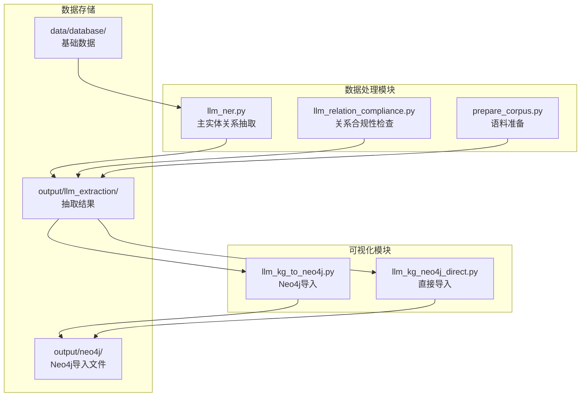
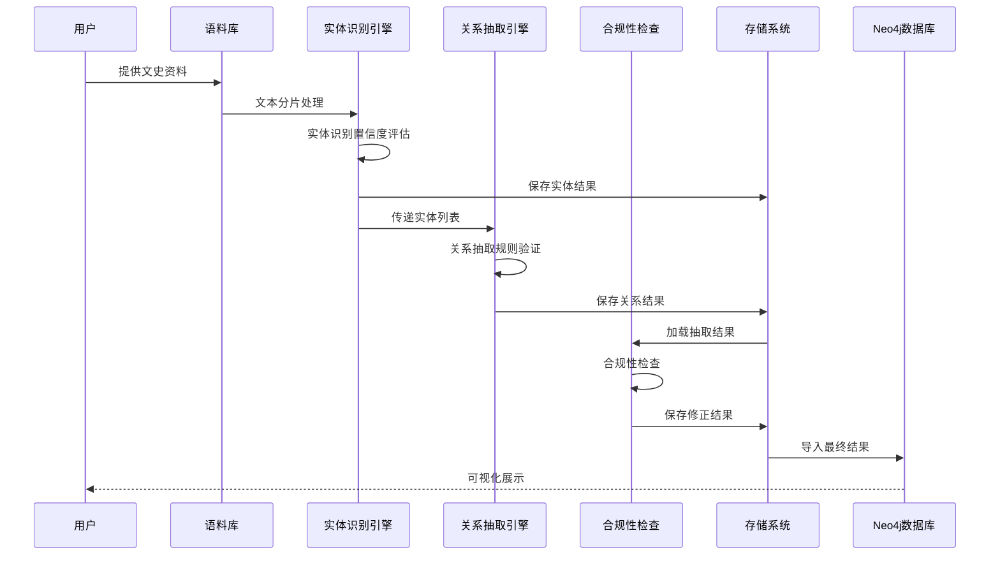
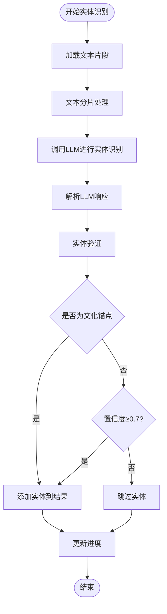
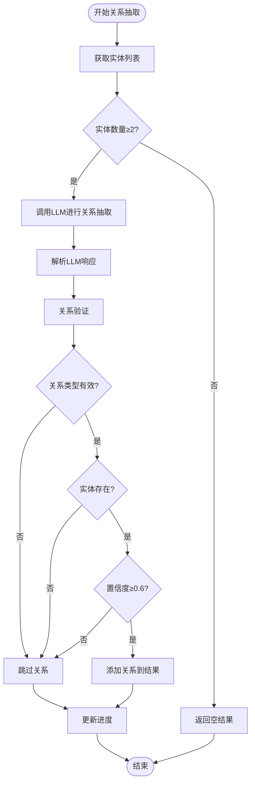
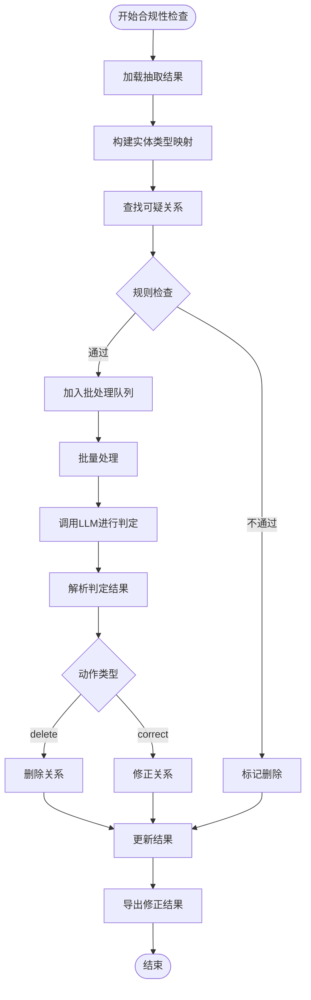
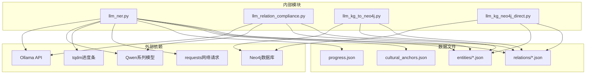

# 实体关系抽取

<cite>
**本文档引用的文件**
- [llm_ner.py](file://code/data_processing/llm_ner.py)
- [llm_relation_compliance.py](file://code/data_processing/llm_relation_compliance.py)
- [llm_ner.md](file://code/data_processing/llm_ner.md)
- [prepare_corpus.py](file://code/data_processing/prepare_corpus.py)
- [llm_kg_to_neo4j.py](file://code/visualization/llm_kg_to_neo4j.py)
- [llm_kg_neo4j_direct.py](file://code/visualization/llm_kg_neo4j_direct.py)
- [progress.json](file://output/llm_extraction/progress.json)
- [cultural_anchors.json](file://data/database/cultural_anchors.json)
- [001_南海县志_OCR连续文本.json](file://output/llm_extraction/entities/001_南海县志_OCR连续文本.json)
- [001_南海县志_OCR连续文本.json](file://output/llm_extraction/relations/001_南海县志_OCR连续文本.json)
</cite>

## 目录
1. [简介](#简介)
2. [项目结构](#项目结构)
3. [核心组件](#核心组件)
4. [架构概览](#架构概览)
5. [详细组件分析](#详细组件分析)
6. [依赖关系分析](#依赖关系分析)
7. [性能考虑](#性能考虑)
8. [故障排除指南](#故障排除指南)
9. [结论](#结论)
10. [附录](#附录)

## 简介

本项目是一个基于大语言模型的智能实体关系抽取系统，专门用于从南海区文史资料中抽取文化遗产相关的实体和语义关系。系统采用Ollama + Qwen系列本地大模型，实现了完整的实体识别、关系抽取、质量控制和可视化展示功能。

系统的主要特点包括：
- 基于6大文化体系的实体分类（非遗体系、文物体系、传承主体、空间载体、文献记忆、历史时序）
- 支持15类关系的语义关系抽取
- 断点续跑机制，确保大规模数据处理的可靠性
- 双层进度条显示，提供良好的用户体验
- 与Neo4j数据库的无缝集成

## 项目结构

项目采用模块化设计，主要分为以下几个核心模块：

**图表来源**
- [llm_ner.py:1-50](file://code/data_processing/llm_ner.py#L1-L50)
- [llm_relation_compliance.py:1-35](file://code/data_processing/llm_relation_compliance.py#L1-L35)
- [llm_kg_to_neo4j.py:1-25](file://code/visualization/llm_kg_to_neo4j.py#L1-L25)

**章节来源**
- [llm_ner.py:1-100](file://code/data_processing/llm_ner.py#L1-L100)
- [llm_relation_compliance.py:1-50](file://code/data_processing/llm_relation_compliance.py#L1-L50)
- [llm_kg_to_neo4j.py:1-50](file://code/visualization/llm_kg_to_neo4j.py#L1-L50)

## 核心组件

### 实体识别引擎

实体识别引擎是系统的核心组件，负责从文本中识别和抽取文化相关的实体。它基于以下关键要素：

**实体类型体系**
系统采用6大文化体系，共11类实体：
- 非遗体系：非遗项目、民俗礼仪、物产饮食
- 文物体系：文物建筑、文物遗址  
- 传承主体：人物、宗族姓氏
- 空间载体：地名空间
- 文献记忆：典籍文献
- 历史时序：朝代年号、历史事件

**置信度评估机制**
实体置信度评估采用多层次标准：
- 基础置信度阈值：≥0.5
- 文化锚点实体：无阈值限制，直接认定有效
- 高质量实体：≥0.7
- 最终有效性：锚点实体或高质量实体

**章节来源**
- [llm_ner.py:90-111](file://code/data_processing/llm_ner.py#L90-L111)
- [llm_ner.py:322-341](file://code/data_processing/llm_ner.py#L322-L341)

### 关系抽取引擎

关系抽取引擎负责识别实体之间的语义关系，支持多重关系的存在。

**关系类型体系**
系统定义15类关系，每类关系都有明确的方向性和类型要求：
- 创建修建、出生于、活动于、著有、位于
- 始建于、承载文化、传承于、记载于、属于时期
- 发生于、盛产、关联人物、同族、同类

**关系验证规则**
关系验证采用严格的规则检查：
- 源实体和目标实体必须存在于已识别实体列表中
- 关系类型必须在有效关系类型范围内
- 每条关系必须包含证据（evidence）字段
- 置信度阈值：≥0.6
- 源实体和目标实体不能相同

**章节来源**
- [llm_ner.py:106-110](file://code/data_processing/llm_ner.py#L106-L110)
- [llm_ner.py:367-388](file://code/data_processing/llm_ner.py#L367-L388)

### 关系合规性检查

关系合规性检查模块提供了额外的质量控制层，确保抽取关系的合理性。

**合规性检查机制**
- 基于关系类型的目标实体类型映射
- 自动检测不合规的关系
- 结合大模型进行人工审核和修正
- 支持批量处理和逐步修正

**章节来源**
- [llm_relation_compliance.py:33-50](file://code/data_processing/llm_relation_compliance.py#L33-L50)
- [llm_relation_compliance.py:96-108](file://code/data_processing/llm_relation_compliance.py#L96-L108)

## 架构概览

系统采用分层架构设计，实现了数据处理、质量控制和可视化展示的完整流程。

**图表来源**
- [llm_ner.py:517-693](file://code/data_processing/llm_ner.py#L517-L693)
- [llm_relation_compliance.py:195-286](file://code/data_processing/llm_relation_compliance.py#L195-L286)

**章节来源**
- [llm_ner.py:517-693](file://code/data_processing/llm_ner.py#L517-L693)
- [llm_relation_compliance.py:195-286](file://code/data_processing/llm_relation_compliance.py#L195-L286)

## 详细组件分析

### 实体识别算法

实体识别算法采用多阶段处理流程，确保高精度和高召回率。

**图表来源**
- [llm_ner.py:344-362](file://code/data_processing/llm_ner.py#L344-L362)
- [llm_ner.py:322-341](file://code/data_processing/llm_ner.py#L322-L341)

**章节来源**
- [llm_ner.py:322-362](file://code/data_processing/llm_ner.py#L322-L362)

### 关系抽取算法

关系抽取算法在实体识别的基础上，进一步挖掘实体间的语义关系。

**图表来源**
- [llm_ner.py:391-420](file://code/data_processing/llm_ner.py#L391-L420)
- [llm_ner.py:367-388](file://code/data_processing/llm_ner.py#L367-L388)

**章节来源**
- [llm_ner.py:367-420](file://code/data_processing/llm_ner.py#L367-L420)

### 关系合规性检查流程

关系合规性检查提供了额外的质量保障机制。

**图表来源**
- [llm_relation_compliance.py:157-192](file://code/data_processing/llm_relation_compliance.py#L157-L192)
- [llm_relation_compliance.py:237-251](file://code/data_processing/llm_relation_compliance.py#L237-L251)

**章节来源**
- [llm_relation_compliance.py:157-251](file://code/data_processing/llm_relation_compliance.py#L157-L251)

### 配置参数详解

系统提供了丰富的配置参数，支持灵活的定制化需求。

**核心配置参数**

| 参数名称 | 默认值 | 描述 | 影响范围 |
|---------|--------|------|----------|
| MODEL_NAME | qwen2.5:7b | LLM模型名称 | 所有LLM调用 |
| CHUNK_SIZE | 500 | 文本分片大小（字） | 实体识别性能 |
| CHUNK_OVERLAP | 50 | 分片重叠大小（字） | 实体完整性 |
| NUM_THREADS | 1 | 并发线程数 | 处理速度 |
| TEMPERATURE | 0.3 | LLM温度参数 | 生成稳定性 |

**章节来源**
- [llm_ner.py:68-76](file://code/data_processing/llm_ner.py#L68-L76)
- [llm_ner.py:224-257](file://code/data_processing/llm_ner.py#L224-L257)

## 依赖关系分析

系统各组件之间的依赖关系清晰明确，形成了完整的数据处理链路。

**图表来源**
- [llm_ner.py:23-41](file://code/data_processing/llm_ner.py#L23-L41)
- [llm_relation_compliance.py:14-31](file://code/data_processing/llm_relation_compliance.py#L14-L31)

**章节来源**
- [llm_ner.py:23-41](file://code/data_processing/llm_ner.py#L23-L41)
- [llm_relation_compliance.py:14-31](file://code/data_processing/llm_relation_compliance.py#L14-L31)

## 性能考虑

系统在设计时充分考虑了性能优化，采用了多种策略来提升处理效率。

### 并发处理策略

系统支持多线程并发处理，通过以下机制实现高效的数据处理：

**线程池管理**
- 动态线程池大小调整
- 线程安全的进度更新
- 异常处理和恢复机制

**内存优化**
- 分片处理避免大文本内存占用
- 实体去重和合并减少重复计算
- 进度文件断点续跑

### 处理流程优化

**批量处理机制**
- 实体识别和关系抽取的批量处理
- 合并阶段的去重和统计
- 进度文件的原子性写入

**缓存策略**
- 文化锚点的全局缓存
- 实体类型映射的快速查找
- 进度状态的增量更新

**章节来源**
- [llm_ner.py:673-683](file://code/data_processing/llm_ner.py#L673-L683)
- [llm_ner.py:446-453](file://code/data_processing/llm_ner.py#L446-L453)

## 故障排除指南

系统提供了完善的错误处理和故障排除机制。

### 常见问题及解决方案

**LLM连接问题**
- 检查Ollama服务是否正常运行
- 验证端口11434的连通性
- 确认模型已正确加载

**实体识别异常**
- 检查文本编码格式（UTF-8）
- 验证实体类型定义的完整性
- 确认置信度阈值设置合理

**关系抽取失败**
- 检查实体列表的有效性
- 验证关系类型映射的正确性
- 确认证据字段的完整性

### 调试技巧

**日志分析**
- 查看extraction_log.log获取详细处理信息
- 监控progress.json了解处理进度
- 使用--demo模式进行快速验证

**数据验证**
- 检查entities/*.json文件的完整性
- 验证relations/*.json的格式正确性
- 确认合并后的merged_entities.json和merged_relations.json

**章节来源**
- [llm_ner.py:456-462](file://code/data_processing/llm_ner.py#L456-L462)
- [llm_ner.py:425-443](file://code/data_processing/llm_ner.py#L425-L443)

## 结论

本实体关系抽取系统成功实现了从大规模文史资料中智能抽取文化遗产相关信息的目标。系统通过精心设计的实体识别算法、严格的关系验证机制和全面的质量控制流程，为南海区文化遗产数字化建设提供了强有力的技术支撑。

系统的创新之处在于：
1. 基于文化体系的专业化实体分类
2. 多层次的置信度评估机制
3. 完善的关系合规性检查
4. 与Neo4j数据库的无缝集成
5. 断点续跑和批量处理能力

未来可以考虑的改进方向包括：
- 支持更多类型的实体和关系
- 优化LLM提示词模板
- 增强跨模态的信息融合
- 提供更丰富的可视化功能

## 附录

### Neo4j集成使用指南

系统提供了两种Neo4j集成方式，满足不同的使用场景需求。

**CSV导入方式**
适用于大规模数据导入场景，通过生成CSV文件和Cypher脚本实现数据导入。

**直接驱动方式**
适用于实时数据同步场景，通过Neo4j Python驱动直接连接数据库。

**章节来源**
- [llm_kg_to_neo4j.py:54-93](file://code/visualization/llm_kg_to_neo4j.py#L54-L93)
- [llm_kg_neo4j_direct.py:33-97](file://code/visualization/llm_kg_neo4j_direct.py#L33-L97)

### 数据结构说明

系统输出的数据结构清晰规范，便于后续处理和分析。

**实体数据结构**
- name: 实体名称
- type: 实体类型
- description: 实体描述
- confidence: 置信度
- is_anchor: 是否为文化锚点
- source_file: 来源文件

**关系数据结构**
- source: 源实体
- target: 目标实体
- relation: 关系类型
- evidence: 证据文本
- confidence: 置信度
- source_file: 来源文件

**章节来源**
- [001_南海县志_OCR连续文本.json:4-200](file://output/llm_extraction/entities/001_南海县志_OCR连续文本.json#L4-L200)
- [001_南海县志_OCR连续文本.json:28-200](file://output/llm_extraction/relations/001_南海县志_OCR连续文本.json#L28-L200)