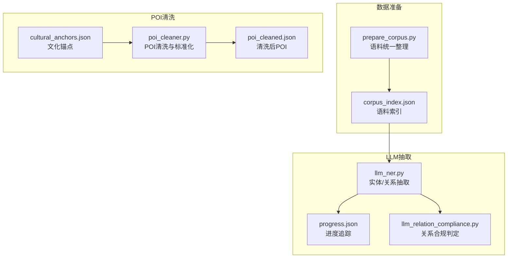
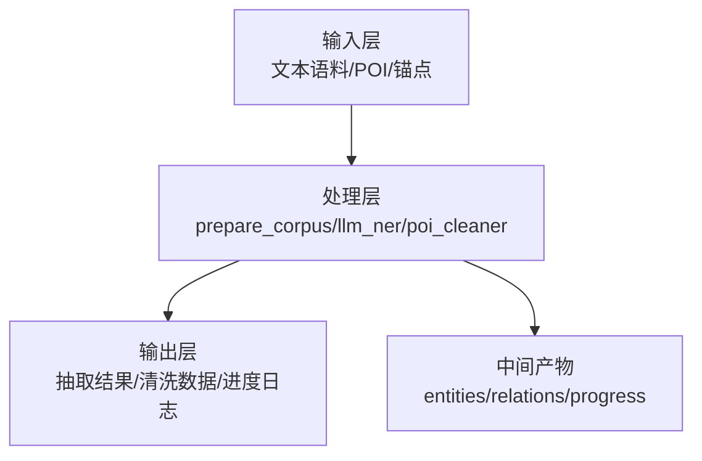
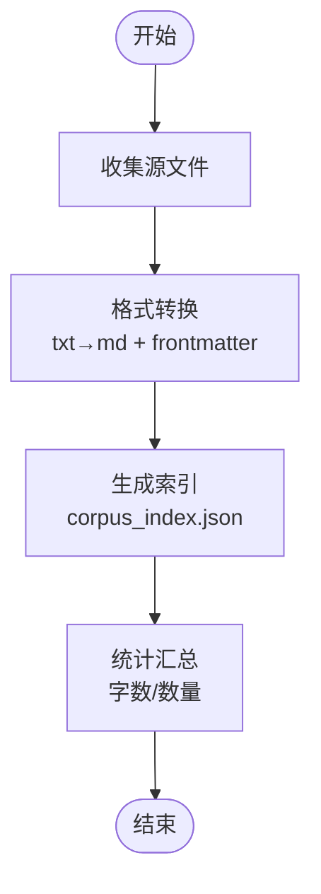
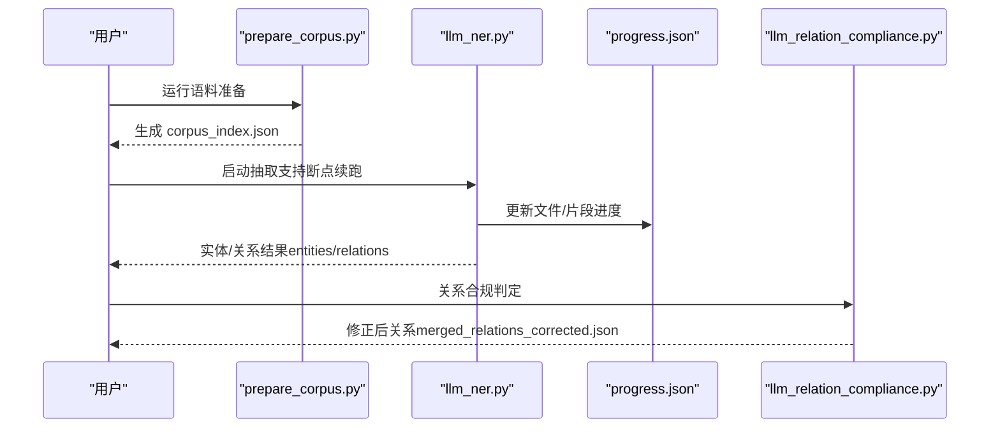
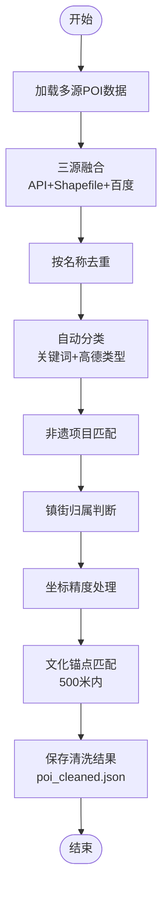
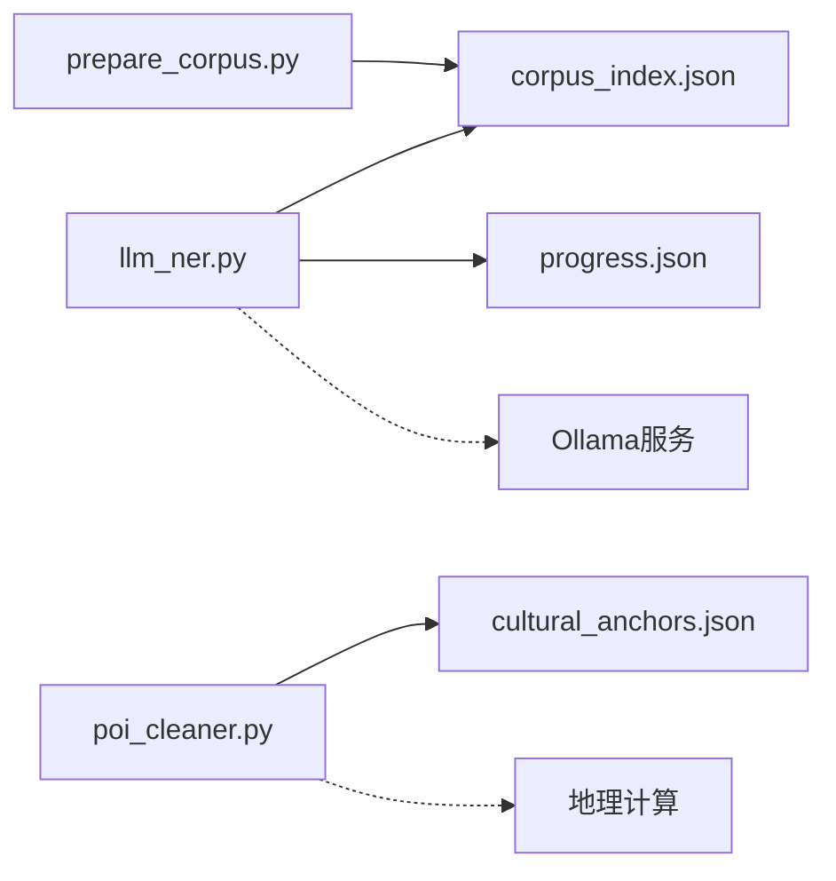

# 数据处理模块

<cite>
**本文档引用的文件**
- [poi_cleaner.py](file://code/data_processing/poi_cleaner.py)
- [llm_ner.py](file://code/data_processing/llm_ner.py)
- [prepare_corpus.py](file://code/data_processing/prepare_corpus.py)
- [llm_ner.md](file://code/data_processing/llm_ner.md)
- [llm_relation_compliance.py](file://code/data_processing/llm_relation_compliance.py)
- [cultural_anchors.json](file://data/database/cultural_anchors.json)
- [poi_cleaned.json](file://data/database/poi_cleaned.json)
- [corpus_index.json](file://data/corpus/corpus_index.json)
- [progress.json](file://output/llm_extraction/progress.json)
</cite>

## 目录
1. [简介](#简介)
2. [项目结构](#项目结构)
3. [核心组件](#核心组件)
4. [架构概览](#架构概览)
5. [详细组件分析](#详细组件分析)
6. [依赖关系分析](#依赖关系分析)
7. [性能考虑](#性能考虑)
8. [故障排除指南](#故障排除指南)
9. [结论](#结论)
10. [附录](#附录)

## 简介
本文件系统性梳理数据处理模块的技术实现，涵盖文本预处理、实体识别（NER）、POI数据清洗与标准化、断点续跑机制以及数据质量评估方法。通过对代码结构、算法原理、数据流和错误处理的深入分析，帮助开发者和研究人员快速理解并高效使用该模块。

## 项目结构
数据处理模块位于 `code/data_processing/` 目录，围绕三大核心任务组织：
- 文本语料准备：统一格式、生成索引
- LLM智能抽取：实体与关系抽取，断点续跑与进度追踪
- POI数据清洗：多源融合、标准化与文化锚点关联

图表来源
- [prepare_corpus.py:1-155](file://code/data_processing/prepare_corpus.py#L1-L155)
- [corpus_index.json:1-536](file://data/corpus/corpus_index.json#L1-L536)
- [llm_ner.py:1-800](file://code/data_processing/llm_ner.py#L1-L800)
- [progress.json:1-105](file://output/llm_extraction/progress.json#L1-L105)
- [llm_relation_compliance.py:1-290](file://code/data_processing/llm_relation_compliance.py#L1-L290)
- [cultural_anchors.json:1-800](file://data/database/cultural_anchors.json#L1-L800)
- [poi_cleaner.py:1-402](file://code/data_processing/poi_cleaner.py#L1-L402)
- [poi_cleaned.json:1-200](file://data/database/poi_cleaned.json#L1-L200)

章节来源
- [prepare_corpus.py:1-155](file://code/data_processing/prepare_corpus.py#L1-L155)
- [corpus_index.json:1-536](file://data/corpus/corpus_index.json#L1-L536)
- [llm_ner.py:1-800](file://code/data_processing/llm_ner.py#L1-L800)
- [progress.json:1-105](file://output/llm_extraction/progress.json#L1-L105)
- [llm_relation_compliance.py:1-290](file://code/data_processing/llm_relation_compliance.py#L1-L290)
- [cultural_anchors.json:1-800](file://data/database/cultural_anchors.json#L1-L800)
- [poi_cleaner.py:1-402](file://code/data_processing/poi_cleaner.py#L1-L402)
- [poi_cleaned.json:1-200](file://data/database/poi_cleaned.json#L1-L200)

## 核心组件
- 文本预处理与语料准备：统一文本格式、生成索引，确保抽取流程稳定可控
- LLM智能抽取：基于提示工程的实体与关系抽取，支持断点续跑与并发控制
- POI数据清洗：多源融合、去重、标准化、坐标精度处理与文化锚点关联
- 数据质量评估：统计指标、分布分析与合规判定

章节来源
- [prepare_corpus.py:1-155](file://code/data_processing/prepare_corpus.py#L1-L155)
- [llm_ner.py:1-800](file://code/data_processing/llm_ner.py#L1-L800)
- [poi_cleaner.py:1-402](file://code/data_processing/poi_cleaner.py#L1-L402)

## 架构概览
整体架构分为三层：
- 输入层：文本语料、POI数据、文化锚点
- 处理层：语料准备、LLM抽取、POI清洗
- 输出层：抽取结果、清洗后数据、进度与日志

图表来源
- [prepare_corpus.py:1-155](file://code/data_processing/prepare_corpus.py#L1-L155)
- [llm_ner.py:1-800](file://code/data_processing/llm_ner.py#L1-L800)
- [poi_cleaner.py:1-402](file://code/data_processing/poi_cleaner.py#L1-L402)

## 详细组件分析

### 文本预处理与语料准备
- 功能概述：统一收集、转换格式、生成索引，确保抽取流程的稳定性与可追溯性
- 关键流程：
  - 收集来源：按固定顺序扫描多个子目录，支持 txt 与 md
  - 格式转换：为 txt 添加 YAML frontmatter，统一为 md
  - 索引生成：输出 corpus_index.json，包含文件元信息与状态
- 质量保障：过滤过短文本、记录字符数、生成编号前缀

图表来源
- [prepare_corpus.py:24-155](file://code/data_processing/prepare_corpus.py#L24-L155)

章节来源
- [prepare_corpus.py:1-155](file://code/data_processing/prepare_corpus.py#L1-L155)
- [corpus_index.json:1-536](file://data/corpus/corpus_index.json#L1-L536)

### LLM智能实体与关系抽取
- 功能概述：基于本地大模型进行文化实体与关系抽取，支持断点续跑、并发与进度追踪
- 核心能力：
  - 实体抽取：定义6大文化体系与11类实体，严格约束实体类型与长度
  - 关系抽取：定义15类关系，要求双向验证与证据支撑
  - 断点续跑：按文件与片段粒度保存进度，支持多工作进程协同
  - 并发控制：可配置线程数，避免资源争用
- 置信度评估：
  - 实体置信度：基础阈值与锚点优先策略
  - 关系置信度：严格阈值与证据长度约束
- 合并策略：实体去重聚合、关系去重保留多重关系

图表来源
- [llm_ner.py:517-694](file://code/data_processing/llm_ner.py#L517-L694)
- [progress.json:1-105](file://output/llm_extraction/progress.json#L1-L105)
- [llm_relation_compliance.py:195-290](file://code/data_processing/llm_relation_compliance.py#L195-L290)

章节来源
- [llm_ner.py:1-800](file://code/data_processing/llm_ner.py#L1-L800)
- [llm_ner.md:1-24](file://code/data_processing/llm_ner.md#L1-L24)
- [progress.json:1-105](file://output/llm_extraction/progress.json#L1-L105)
- [llm_relation_compliance.py:1-290](file://code/data_processing/llm_relation_compliance.py#L1-L290)

### POI数据清洗与标准化
- 功能概述：融合多源POI数据，执行去重、标准化、分类与文化锚点关联
- 数据源融合：
  - 高德API：补充评分字段
  - Shapefile：覆盖面广的基础数据
  - 百度API：补充新增POI与评分/评论数
- 标准化流程：
  - 去重策略：按名称去重，保留更完整记录
  - 分类体系：基于关键词与高德类型编码的两级分类
  - 非遗关联：关键词匹配南海非遗项目
  - 地址/坐标处理：经纬度清洗与地理匹配
  - 文化锚点关联：500米范围内匹配文化载体锚点
- 质量评估：统计分类分布、镇街分布、非遗关联与锚点关联数量

图表来源
- [poi_cleaner.py:86-380](file://code/data_processing/poi_cleaner.py#L86-L380)

章节来源
- [poi_cleaner.py:1-402](file://code/data_processing/poi_cleaner.py#L1-L402)
- [cultural_anchors.json:1-800](file://data/database/cultural_anchors.json#L1-L800)
- [poi_cleaned.json:1-200](file://data/database/poi_cleaned.json#L1-L200)

## 依赖关系分析
- 模块内依赖：
  - prepare_corpus.py 生成 corpus_index.json，供 llm_ner.py 使用
  - llm_ner.py 依赖 progress.json 进行断点续跑
  - poi_cleaner.py 依赖 cultural_anchors.json 进行锚点匹配
- 外部依赖：
  - Ollama 本地大模型服务
  - requests 库用于模型调用
  - tqdm 用于进度可视化

图表来源
- [prepare_corpus.py:1-155](file://code/data_processing/prepare_corpus.py#L1-L155)
- [corpus_index.json:1-536](file://data/corpus/corpus_index.json#L1-L536)
- [llm_ner.py:1-800](file://code/data_processing/llm_ner.py#L1-L800)
- [progress.json:1-105](file://output/llm_extraction/progress.json#L1-L105)
- [poi_cleaner.py:1-402](file://code/data_processing/poi_cleaner.py#L1-L402)
- [cultural_anchors.json:1-800](file://data/database/cultural_anchors.json#L1-L800)

章节来源
- [prepare_corpus.py:1-155](file://code/data_processing/prepare_corpus.py#L1-L155)
- [llm_ner.py:1-800](file://code/data_processing/llm_ner.py#L1-L800)
- [poi_cleaner.py:1-402](file://code/data_processing/poi_cleaner.py#L1-L402)

## 性能考虑
- 文本分片参数调优：
  - 片段大小（CHUNK_SIZE）：平衡稳定性与吞吐量，建议在 500~600 字之间
  - 重叠（CHUNK_OVERLAP）：避免跨片段语义断裂，建议 50 字
- 并发与资源：
  - 线程数（NUM_THREADS）：根据 CPU 与内存配置，避免过度并发导致超时
  - 模型选择：不同模型在速度与准确性间权衡，需结合硬件条件选择
- I/O 优化：
  - 断点续跑减少重复计算
  - 临时文件（.tmp）原子替换，降低数据损坏风险
- 地理计算：
  - Haversine 距离计算在批量匹配时可考虑缓存或索引优化

[本节为通用指导，无需特定文件来源]

## 故障排除指南
- LLM 抽取问题：
  - Ollama 连接失败：检查本地服务端口与网络连通性
  - 超时重试：适当增加超时时间或降低并发
  - JSON 解析异常：检查模型输出格式，必要时调整提示模板
- 断点续跑异常：
  - progress.json 损坏：程序会自动重置，可手动清理后重新开始
  - 片段进度不一致：确认 entities/relations 文件完整性
- POI 清洗问题：
  - 坐标缺失或异常：清洗阶段会进行数值校验与默认值处理
  - 锚点匹配为空：检查文化锚点数据与坐标精度
- 依赖缺失：
  - tqdm：安装依赖库以启用进度条
  - requests：确保网络访问正常

章节来源
- [llm_ner.py:224-258](file://code/data_processing/llm_ner.py#L224-L258)
- [llm_ner.py:425-454](file://code/data_processing/llm_ner.py#L425-L454)
- [poi_cleaner.py:255-287](file://code/data_processing/poi_cleaner.py#L255-L287)

## 结论
数据处理模块通过规范化的文本预处理、稳健的LLM抽取流程与严格的POI清洗策略，实现了从原始文本到高质量知识图谱数据的完整链路。断点续跑与进度追踪机制显著提升了大规模数据处理的可靠性与效率；而实体与关系的置信度评估与合规判定进一步保障了数据质量。建议在实际部署中结合硬件条件与业务需求，持续优化参数配置与处理策略。

[本节为总结性内容，无需特定文件来源]

## 附录

### 文本清洗最佳实践
- 分词与去噪：
  - 使用统一的文本清理规则，去除多余空白与特殊字符
  - 保持段落边界，避免破坏上下文语义
- 标准化：
  - 统一编码与格式，确保跨平台一致性
  - 对长文本进行分片处理，兼顾准确性与性能
- 参数调优建议：
  - 片段大小：500~600 字
  - 重叠比例：10%
  - 置信度阈值：实体≥0.7，关系≥0.6

[本节为通用指导，无需特定文件来源]

### 数据质量评估方法
- 实体与关系：
  - 统计类型分布、提及次数与来源数量
  - 多重关系比例与证据长度
- POI：
  - 分类与镇街分布统计
  - 非遗与文化锚点关联率
  - 坐标精度与覆盖范围

章节来源
- [llm_ner.py:698-799](file://code/data_processing/llm_ner.py#L698-L799)
- [poi_cleaner.py:351-380](file://code/data_processing/poi_cleaner.py#L351-L380)