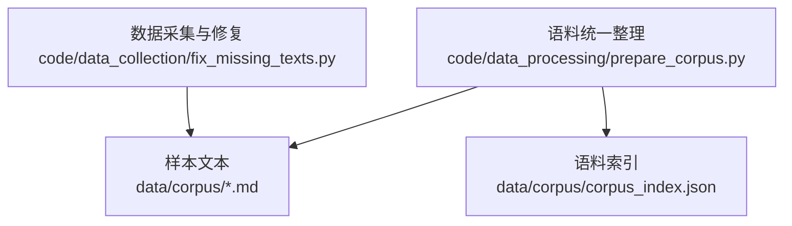
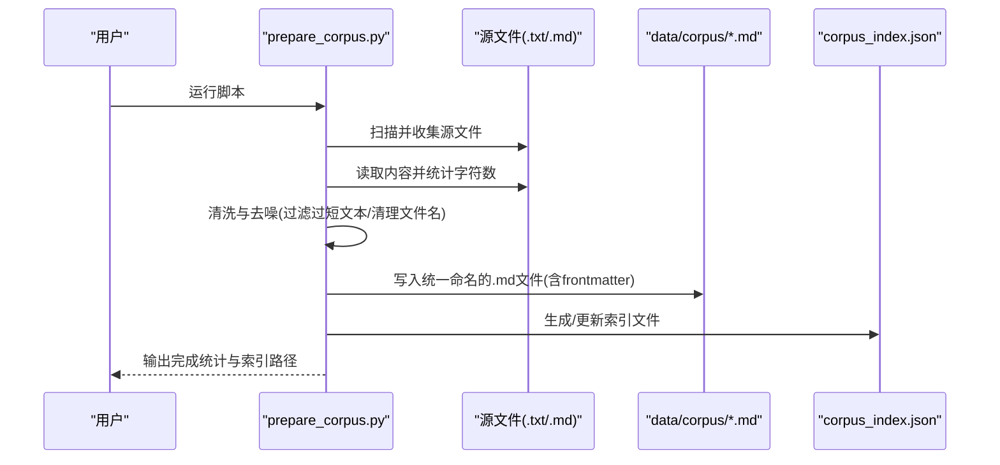
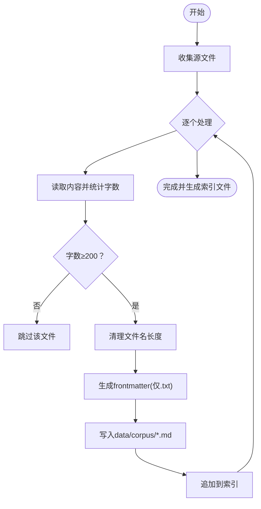
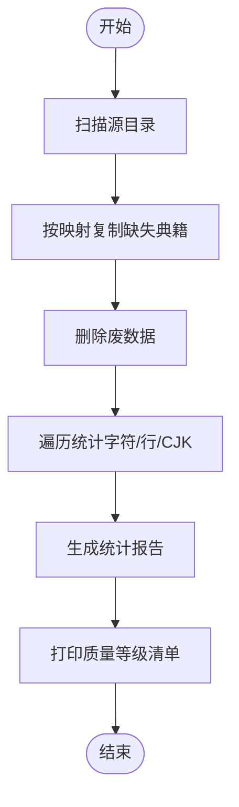
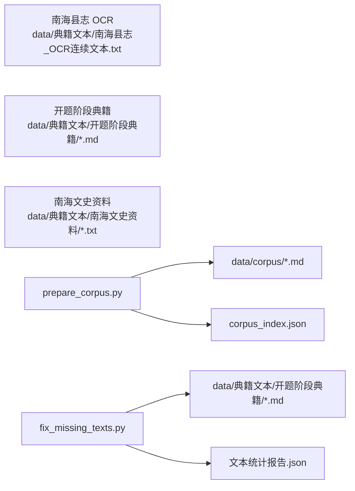

# 文本预处理

<cite>
**本文引用的文件**
- [prepare_corpus.py](file://code/data_processing/prepare_corpus.py)
- [fix_missing_texts.py](file://code/data_collection/fix_missing_texts.py)
- [corpus_index.json](file://data/corpus/corpus_index.json)
- [README.md](file://README.md)
- [001_南海县志_OCR连续文本.md](file://data/corpus/001_南海县志_OCR连续文本.md)
- [002_中国旅行_广州佛山.md](file://data/corpus/002_中国旅行_广州佛山.md)
</cite>

## 目录
1. [简介](#简介)
2. [项目结构](#项目结构)
3. [核心组件](#核心组件)
4. [架构总览](#架构总览)
5. [详细组件分析](#详细组件分析)
6. [依赖分析](#依赖分析)
7. [性能考虑](#性能考虑)
8. [故障排查指南](#故障排查指南)
9. [结论](#结论)
10. [附录](#附录)

## 简介
本文件面向“文本预处理”功能，系统化梳理 prepare_corpus.py 的语料统一整理流程与 fix_missing_texts.py 的缺失文本修复机制。内容涵盖：
- 多源文件收集与统一命名
- 格式转换与元数据添加（YAML frontmatter）
- 文本清洗与去噪策略
- 字符统计与质量评估
- 数据完整性检查与修复
- 最佳实践、参数调优与断点续跑建议

## 项目结构
文本预处理相关代码与产物分布于以下路径：
- 数据采集与修复：code/data_collection/fix_missing_texts.py
- 语料统一整理：code/data_processing/prepare_corpus.py
- 语料索引与样本：data/corpus/corpus_index.json、data/corpus/*.md
- 项目说明：README.md

图表来源
- [fix_missing_texts.py:1-102](file://code/data_collection/fix_missing_texts.py#L1-L102)
- [prepare_corpus.py:1-155](file://code/data_processing/prepare_corpus.py#L1-L155)
- [corpus_index.json:1-536](file://data/corpus/corpus_index.json#L1-L536)

章节来源
- [README.md:1-130](file://README.md#L1-L130)

## 核心组件
- prepare_corpus.py：负责多源文本的收集、格式统一、元数据注入与索引生成。
- fix_missing_texts.py：负责补充缺失典籍、清理无效数据、更新文本统计。

章节来源
- [prepare_corpus.py:1-155](file://code/data_processing/prepare_corpus.py#L1-L155)
- [fix_missing_texts.py:1-102](file://code/data_collection/fix_missing_texts.py#L1-L102)

## 架构总览
prepare_corpus.py 的处理流程分为“收集源文件 → 读取内容 → 清洗与去噪 → 添加元数据 → 写入目标目录 → 生成索引”。fix_missing_texts.py 则在数据产出后进行完整性检查与统计更新。

图表来源
- [prepare_corpus.py:24-150](file://code/data_processing/prepare_corpus.py#L24-L150)

## 详细组件分析

### prepare_corpus.py：语料统一整理
- 多源文件收集
  - 南海县志 OCR 文本
  - 开题阶段典籍（.md）
  - 南海文史资料（.txt）
- 统一命名与格式
  - 输出为 .md，编号前缀（001_, 002_, …）
  - 对 .txt 文件自动添加 YAML frontmatter（标题、来源、类别、原始格式、字数、corpus_id、时间戳）
  - 对已有 frontmatter 的 .md 文件保持原样
- 清洗与去噪
  - 过滤字数过少的文本（阈值：200 字）
  - 清理文件名长度（超过 60 字截断）
- 索引生成
  - 生成 corpus_index.json，记录总数、生成时间、每个条目的字段（corpus_id、filename、title、source、category、char_count、original_path、status）

图表来源
- [prepare_corpus.py:24-150](file://code/data_processing/prepare_corpus.py#L24-L150)

章节来源
- [prepare_corpus.py:24-150](file://code/data_processing/prepare_corpus.py#L24-L150)
- [corpus_index.json:1-536](file://data/corpus/corpus_index.json#L1-L536)
- [001_南海县志_OCR连续文本.md:1-200](file://data/corpus/001_南海县志_OCR连续文本.md#L1-L200)
- [002_中国旅行_广州佛山.md:1-200](file://data/corpus/002_中国旅行_广州佛山.md#L1-L200)

### fix_missing_texts.py：缺失文本修复与完整性检查
- 补充缺失典籍
  - 基于关键词映射，从“开题阶段文化典籍”目录复制缺失的 .md 文件到“开题阶段典籍”
  - 若目标已存在则跳过
- 清理无效数据
  - 删除已知的废文件
- 更新统计
  - 遍历文本目录，统计每个文件的字符数、行数、CJK 字符数
  - 生成文本统计报告 JSON，并按 CJK 字符数降序展示质量等级

图表来源
- [fix_missing_texts.py:31-98](file://code/data_collection/fix_missing_texts.py#L31-L98)

章节来源
- [fix_missing_texts.py:17-98](file://code/data_collection/fix_missing_texts.py#L17-L98)

## 依赖分析
- prepare_corpus.py
  - 输入：data/典籍文本/（南海县志 OCR、开题阶段典籍、南海文史资料）
  - 输出：data/corpus/（统一命名的 .md 文件）、corpus_index.json
  - 依赖：标准库（os、json、shutil、datetime）
- fix_missing_texts.py
  - 输入：开题阶段文化典籍目录、开题阶段典籍目录
  - 输出：补充后的典籍、文本统计报告
  - 依赖：标准库（os、re、shutil、json）

图表来源
- [prepare_corpus.py:18-22](file://code/data_processing/prepare_corpus.py#L18-L22)
- [fix_missing_texts.py:12-16](file://code/data_collection/fix_missing_texts.py#L12-L16)

章节来源
- [prepare_corpus.py:18-22](file://code/data_processing/prepare_corpus.py#L18-L22)
- [fix_missing_texts.py:12-16](file://code/data_collection/fix_missing_texts.py#L12-L16)

## 性能考虑
- I/O 优化
  - 使用批量读取与写入，避免频繁打开/关闭文件
  - 统一编码（UTF-8）减少转码开销
- 字符统计
  - 使用字符串内置方法（len、count）进行快速统计
  - CJK 字符统计采用正则匹配，复杂度与文本长度线性相关
- 索引生成
  - 一次性写入 JSON，避免多次 IO
- 可扩展性
  - 可通过配置文件管理源目录与映射规则，便于维护

## 故障排查指南
- 源文件缺失
  - 现象：collect_source_files 无法找到指定路径
  - 处理：确认 data/典籍文本/ 下对应子目录是否存在
- 编码错误
  - 现象：读取文件时报错
  - 处理：确保源文件为 UTF-8 编码；必要时在读取时显式指定编码
- 文件名冲突
  - 现象：目标目录已存在同名文件
  - 处理：修改命名规则或清理重复文件
- 字数过少被跳过
  - 现象：某些文件未出现在索引中
  - 处理：调整阈值或检查原文是否为空/噪声过多
- 统计异常
  - 现象：文本统计报告缺失或数值异常
  - 处理：确认 fix_missing_texts.py 是否正确运行；检查文件权限与路径

章节来源
- [prepare_corpus.py:98-100](file://code/data_processing/prepare_corpus.py#L98-L100)
- [fix_missing_texts.py:63-98](file://code/data_collection/fix_missing_texts.py#L63-L98)

## 结论
prepare_corpus.py 与 fix_missing_texts.py 共同构成了完整的文本预处理流水线：前者负责统一格式与元数据，后者负责补齐缺失与质量评估。二者配合可显著提升后续知识抽取与分析的质量与稳定性。

## 附录

### 文本清洗与去噪策略
- 过滤阈值：字数低于 200 的文本直接跳过
- 文件名清理：超过 60 字的标题截断，避免路径过长
- 前言元数据：仅对 .txt 添加 YAML frontmatter，.md 若已有则保留

章节来源
- [prepare_corpus.py:98-118](file://code/data_processing/prepare_corpus.py#L98-L118)

### 字符统计与质量评估
- 统计维度：字符数、行数、CJK 字符数
- 质量等级：依据 CJK 字符数划分（优/良/中/差）
- 报告输出：文本统计报告.json

章节来源
- [fix_missing_texts.py:63-98](file://code/data_collection/fix_missing_texts.py#L63-L98)

### 文件命名规范
- 统一为 .md 格式
- 命名规则：001_标题.md、002_标题.md、…
- 标题长度限制：超过 60 字截断
- corpus_id：C001、C002、…

章节来源
- [prepare_corpus.py:80-91](file://code/data_processing/prepare_corpus.py#L80-L91)
- [corpus_index.json:1-536](file://data/corpus/corpus_index.json#L1-L536)

### 最佳实践与参数调优
- 参数调优
  - 字数阈值：根据下游任务需求调整（如实体抽取、主题建模）
  - 文件名长度：结合操作系统路径限制设定
  - frontmatter 字段：按需扩展（如来源链接、标签、分类）
- 断点续跑机制
  - 建议：在索引文件中记录已处理条目，运行时跳过已完成项
  - 进度追踪：在日志中输出当前处理序号与剩余数量
- 数据完整性检查
  - 定期运行 fix_missing_texts.py，确保缺失典籍补齐
  - 对异常文件（空文件、编码错误、超短文本）进行标注与人工复核

章节来源
- [prepare_corpus.py:72-150](file://code/data_processing/prepare_corpus.py#L72-L150)
- [fix_missing_texts.py:31-98](file://code/data_collection/fix_missing_texts.py#L31-L98)