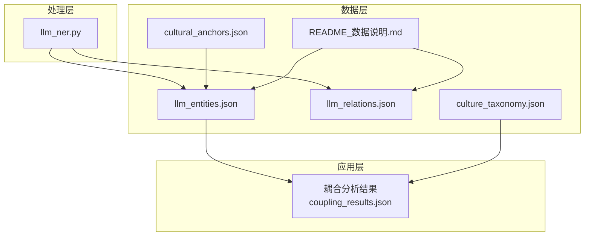
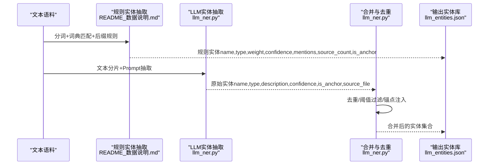
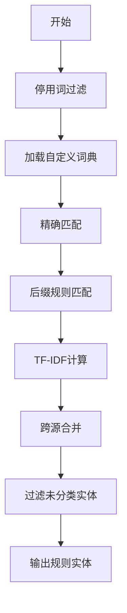
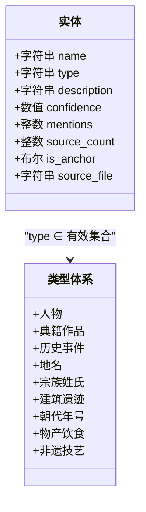
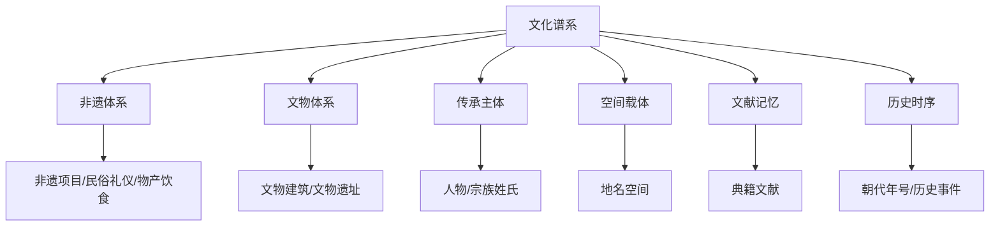
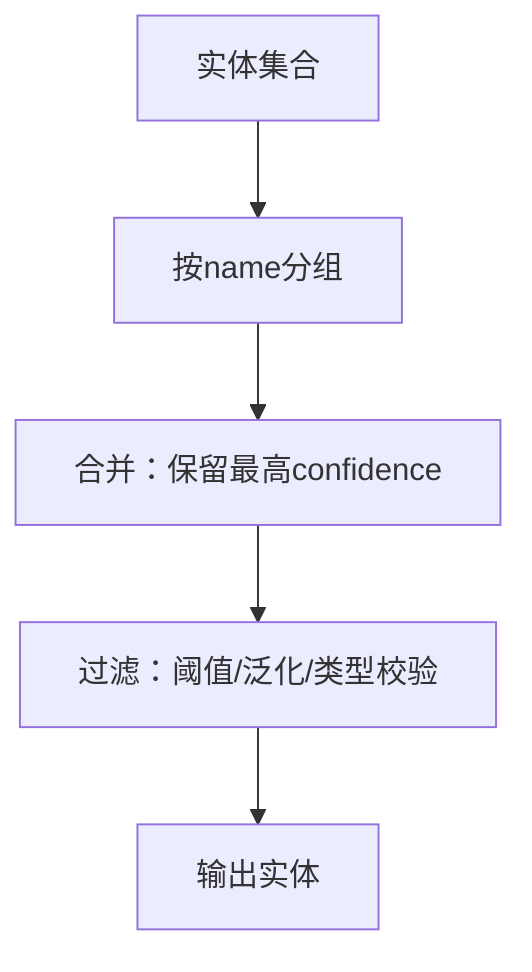
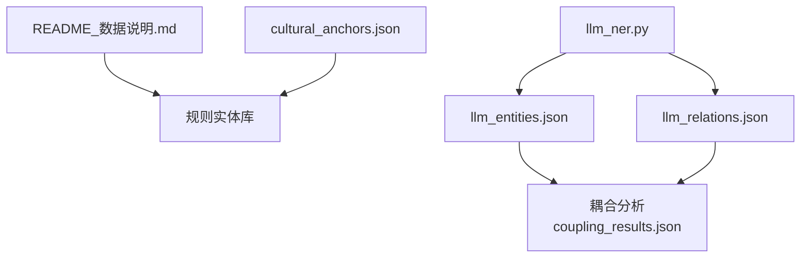

# 实体模型

<cite>
**本文引用的文件**
- [README_数据说明.md](file://data/database/README_数据说明.md)
- [culture_taxonomy.json](file://data/database/culture_taxonomy.json)
- [cultural_anchors.json](file://data/database/cultural_anchors.json)
- [llm_entities.json](file://data/database/llm_entities.json)
- [llm_relations.json](file://data/database/llm_relations.json)
- [llm_ner.py](file://code/data_processing/llm_ner.py)
- [coupling_results.json](file://data/database/coupling_results.json)
- [001_南海县志_OCR连续文本.json](file://output/llm_extraction/entities/001_南海县志_OCR连续文本.json)
</cite>

## 目录
1. [简介](#简介)
2. [项目结构](#项目结构)
3. [核心组件](#核心组件)
4. [架构概览](#架构概览)
5. [详细组件分析](#详细组件分析)
6. [依赖分析](#依赖分析)
7. [性能考虑](#性能考虑)
8. [故障排查指南](#故障排查指南)
9. [结论](#结论)
10. [附录](#附录)

## 简介
本文件系统化梳理知识图谱项目中的实体模型，聚焦两类文化实体库：基于规则的 NER 实体库与基于 LLM 的实体库。文档全面定义九类文化实体的定义规则、属性字段与业务含义，解释实体权重与置信度计算机制，给出实体分类体系与层级关系，并提供数据字典、示例与质量控制策略。

## 项目结构
围绕实体模型的关键数据与代码文件如下：
- 数据库层
  - README_数据说明.md：统一说明实体字段、处理流程与产出
  - llm_entities.json：LLM 抽取的实体集合（含字段与统计）
  - llm_relations.json：实体间关系集合（含统计）
  - cultural_anchors.json：文化载体锚点（用于实体标注与去重）
  - culture_taxonomy.json：文化谱系分类（8大类/24子类/97条目）
  - coupling_results.json：文化与旅游耦合分析结果（含实体/景点映射）
- 处理层
  - llm_ner.py：LLM 实体/关系抽取流水线（类型体系、字段校验、合并策略）

**图表来源**
- [llm_entities.json:1-27](file://data/database/llm_entities.json#L1-L27)
- [llm_relations.json:1-40](file://data/database/llm_relations.json#L1-L40)
- [cultural_anchors.json:1-27](file://data/database/cultural_anchors.json#L1-L27)
- [culture_taxonomy.json:1-40](file://data/database/culture_taxonomy.json#L1-L40)
- [README_数据说明.md:1-40](file://data/database/README_数据说明.md#L1-L40)
- [llm_ner.py:90-110](file://code/data_processing/llm_ner.py#L90-L110)

**章节来源**
- [README_数据说明.md:1-40](file://data/database/README_数据说明.md#L1-L40)

## 核心组件
- 实体字段与业务含义
  - name：实体名称（字符串，2-15字，唯一标识）
  - type：实体类型（字符串，见“实体类型体系”）
  - confidence：置信度（数值，0.0-1.0，规则/LLM不同阈值）
  - mentions：提及次数（整数，跨文本源累计）
  - source_count：来源文本数量（整数，至少1）
  - is_anchor：是否为文化载体锚点（布尔，来源于锚点词典匹配）
  - description：类型定义与示例（字符串，LLM实体含此字段）
  - 其他字段：如 weight（规则实体库中存在）、tfidf_scores（规则实体库中存在）、mentions（LLM实体库中存在）
- 实体类型体系
  - 规则实体库（基于 jieba + 自定义词典 + 后缀规则）：地点、建筑、朝代、人物、文化要素、事件等
  - LLM 实体库（基于 LLM 抽取）：人物、典籍作品、历史事件、地名、宗族姓氏、建筑遗迹、朝代年号、物产饮食、非遗技艺等
- 权重与置信度
  - 规则实体库：TF-IDF 计算 + 跨源合并权重（频次×(1+0.3×(源数-1))）
  - LLM 实体库：字段 confidence ≥ 阈值（规则实体库 ≥0.5，LLM ≥0.6/0.7）
- 质量控制与去重
  - 去重：同名实体跨源合并，保留最高置信度信息
  - 锚点注入：将锚点名称注入词典，提升识别召回
  - 阈值过滤：剔除低置信度与泛化实体

**章节来源**
- [README_数据说明.md:38-39](file://data/database/README_数据说明.md#L38-L39)
- [README_数据说明.md:17-29](file://data/database/README_数据说明.md#L17-L29)
- [llm_ner.py:322-341](file://code/data_processing/llm_ner.py#L322-L341)
- [llm_ner.py:698-749](file://code/data_processing/llm_ner.py#L698-L749)

## 架构概览
实体模型的生成与融合流程如下：

**图表来源**
- [README_数据说明.md:17-29](file://data/database/README_数据说明.md#L17-L29)
- [llm_ner.py:322-341](file://code/data_processing/llm_ner.py#L322-L341)
- [llm_ner.py:698-749](file://code/data_processing/llm_ner.py#L698-L749)

## 详细组件分析

### 组件A：规则实体库（基于 jieba 的 NER）
- 处理流程
  - 停用词过滤、自定义词典加载、精确匹配、后缀规则、TF-IDF、跨源合并
- 关键字段
  - name、type、weight（TF-IDF加权）、confidence（0.7-0.95）、mentions、source_count、is_anchor
- 权重与置信度
  - TF-IDF：衡量实体在文本中的重要性
  - 跨源合并：mentions 增加，source_count 增加，is_anchor 由锚点注入决定
- 质量控制
  - 过滤未分类实体（不保留“其他”类）
  - 置信度阈值：词典命中0.95，后缀规则0.7-0.8

**图表来源**
- [README_数据说明.md:17-29](file://data/database/README_数据说明.md#L17-L29)

**章节来源**
- [README_数据说明.md:17-29](file://data/database/README_数据说明.md#L17-L29)

### 组件B：LLM 实体库（基于 LLM 的抽取）
- 类型体系
  - 人物、典籍作品、历史事件、地名、宗族姓氏、建筑遗迹、朝代年号、物产饮食、非遗技艺
- 字段与校验
  - name、type、description、confidence（≥0.6/0.7）、mentions、source_count、is_anchor、source_file
  - 校验规则：类型必须在有效集合内、长度2-15字、置信度阈值、锚点名称强制 is_anchor=true
- 合并与去重
  - 同名实体合并，保留最高置信度信息
  - 多重关系去重（同一对实体+同一关系类型视为同一条）

**图表来源**
- [llm_ner.py:101-110](file://code/data_processing/llm_ner.py#L101-L110)
- [llm_ner.py:322-341](file://code/data_processing/llm_ner.py#L322-L341)
- [llm_ner.py:698-749](file://code/data_processing/llm_ner.py#L698-L749)

**章节来源**
- [llm_ner.py:90-110](file://code/data_processing/llm_ner.py#L90-L110)
- [llm_ner.py:322-341](file://code/data_processing/llm_ner.py#L322-L341)
- [llm_ner.py:698-749](file://code/data_processing/llm_ner.py#L698-L749)

### 组件C：实体分类体系与层级关系
- 文化谱系分类（8大类/24子类/97条目）
  - 武术文化、饮食文化、建筑文化、民俗文化、工艺文化、音乐戏曲、学术文化、中医药文化
- LLM 实体类型与谱系的映射
  - 非遗技艺 → 非遗体系
  - 建筑遗迹 → 文物体系
  - 人物/宗族姓氏 → 传承主体
  - 地名 → 空间载体
  - 典籍作品 → 文献记忆
  - 朝代年号/历史事件 → 历史时序

**图表来源**
- [culture_taxonomy.json:1-40](file://data/database/culture_taxonomy.json#L1-L40)
- [llm_ner.py:92-99](file://code/data_processing/llm_ner.py#L92-L99)

**章节来源**
- [culture_taxonomy.json:1-40](file://data/database/culture_taxonomy.json#L1-L40)
- [llm_ner.py:92-99](file://code/data_processing/llm_ner.py#L92-L99)

### 组件D：实体质量控制与去重策略
- 去重
  - 同名实体跨源合并，保留最高置信度信息
  - 多重关系去重：同一对实体+同一关系类型视为同一条
- 锚点注入
  - 将锚点名称注入词典，提升识别召回，is_anchor=true
- 阈值过滤
  - 规则实体库：置信度≥0.5
  - LLM 实体库：置信度≥0.6/0.7
- 泛化过滤
  - 排除现代人名/机构名、纯数字/标点、过于泛化的词汇

**图表来源**
- [llm_ner.py:700-749](file://code/data_processing/llm_ner.py#L700-L749)
- [llm_ner.py:322-341](file://code/data_processing/llm_ner.py#L322-L341)

**章节来源**
- [llm_ner.py:322-341](file://code/data_processing/llm_ner.py#L322-L341)
- [llm_ner.py:698-749](file://code/data_processing/llm_ner.py#L698-L749)

## 依赖分析
- 规则实体库依赖
  - README_数据说明.md：定义字段、处理流程与阈值
  - cultural_anchors.json：锚点注入词典，影响 is_anchor 与置信度
- LLM 实体库依赖
  - llm_ner.py：类型体系、字段校验、合并策略
  - llm_entities.json/llm_relations.json：最终输出与统计
- 耦合分析依赖
  - coupling_results.json：文化要素与景点的映射与协调度

**图表来源**
- [README_数据说明.md:17-29](file://data/database/README_数据说明.md#L17-L29)
- [cultural_anchors.json:1-27](file://data/database/cultural_anchors.json#L1-L27)
- [llm_ner.py:698-749](file://code/data_processing/llm_ner.py#L698-L749)
- [coupling_results.json:1-30](file://data/database/coupling_results.json#L1-L30)

**章节来源**
- [README_数据说明.md:17-29](file://data/database/README_数据说明.md#L17-L29)
- [cultural_anchors.json:1-27](file://data/database/cultural_anchors.json#L1-L27)
- [llm_ner.py:698-749](file://code/data_processing/llm_ner.py#L698-L749)
- [coupling_results.json:1-30](file://data/database/coupling_results.json#L1-L30)

## 性能考虑
- 规则实体库
  - jieba 分词与词典匹配：时间复杂度与词典规模相关，建议合理设置词频阈值
  - TF-IDF：对大规模文本源进行预处理与缓存
  - 跨源合并：按 name 建立哈希索引，避免重复扫描
- LLM 实体库
  - 文本分片：CHUNK_SIZE 与重叠长度平衡吞吐与稳定性
  - 并发线程：NUM_THREADS 控制并发度，避免 Ollama 超时
  - 断点续跑：进度文件与临时文件确保中断恢复
- 耦合分析
  - D 值计算：尽量使用归一化后的 C/T，减少极端值影响

[本节为通用指导，无需特定文件引用]

## 故障排查指南
- LLM 连接失败
  - 现象：Ollama 连接错误/超时
  - 处理：检查本地服务端口、网络连通性；适当增加重试次数与超时时间
- 实体缺失
  - 现象：某些实体未被识别
  - 处理：确认实体名称长度、类型是否在有效集合；检查锚点注入是否生效
- 关系重复
  - 现象：同一对实体存在多条相同关系
  - 处理：合并阶段按(source,target,relation)去重
- 数据量异常
  - 现象：实体总数与预期不符
  - 处理：核对阈值过滤、去重策略与跨源合并逻辑

**章节来源**
- [llm_ner.py:224-257](file://code/data_processing/llm_ner.py#L224-L257)
- [llm_ner.py:367-388](file://code/data_processing/llm_ner.py#L367-L388)
- [llm_ner.py:750-799](file://code/data_processing/llm_ner.py#L750-L799)

## 结论
本实体模型通过“规则抽取 + LLM抽取 + 融合去重”的方式，形成稳定、可解释、可扩展的文化实体库。规则实体库强调可复现与权重计算，LLM 实体库强调覆盖面与类型多样性，二者在锚点注入与阈值过滤下实现高质量融合。结合文化谱系与耦合分析，实体模型为后续知识图谱构建与文旅产品设计提供了坚实基础。

[本节为总结性内容，无需特定文件引用]

## 附录

### A. 实体数据字典
- 规则实体库字段
  - name：实体名称（字符串）
  - type：实体类型（字符串）
  - weight：权重（数值，TF-IDF加权）
  - confidence：置信度（数值，0.5-0.95）
  - mentions：提及次数（整数）
  - source_count：来源文本数量（整数）
  - is_anchor：是否为文化载体锚点（布尔）
- LLM 实体库字段
  - name：实体名称（字符串）
  - type：实体类型（字符串）
  - description：类型定义与示例（字符串）
  - confidence：置信度（数值，≥0.6/0.7）
  - mentions：提及次数（整数）
  - source_count：来源文本数量（整数）
  - is_anchor：是否为文化载体锚点（布尔）
  - source_file：来源文件（字符串）

**章节来源**
- [README_数据说明.md:38-39](file://data/database/README_数据说明.md#L38-L39)
- [llm_ner.py:322-341](file://code/data_processing/llm_ner.py#L322-L341)

### B. 实体类型体系与示例
- 规则实体库类型（示例）
  - 地点：西樵山、九江镇、南海
  - 建筑：云泉仙馆、祖庙、灵应祠
  - 朝代：清代、民国、光绪
  - 人物：康有为、黄飞鸿、邹伯奇
  - 文化要素：醒狮、咏春拳、九江双蒸
  - 事件：公车上书、戊戌变法
- LLM 实体库类型（示例）
  - 人物：康有为、孙中山、梁启超
  - 典籍作品：《南海县志》、《大德南海志》
  - 历史事件：公车上书、戊戌变法
  - 地名：西樵山、九江镇、佛山
  - 宗族姓氏：南海康氏、九江关氏
  - 建筑遗迹：康有为故居、云泉仙馆
  - 朝代年号：清代、光绪、民国
  - 物产饮食：九江双蒸酒、西樵大饼
  - 非遗技艺：醒狮、粤剧、灰塑

**章节来源**
- [README_数据说明.md:37-38](file://data/database/README_数据说明.md#L37-L38)
- [llm_ner.py:101-110](file://code/data_processing/llm_ner.py#L101-L110)
- [llm_entities.json:27-800](file://data/database/llm_entities.json#L27-L800)

### C. 置信度与权重计算机制
- 规则实体库
  - 置信度：词典命中0.95，后缀规则0.7-0.8
  - 权重：TF-IDF 值，跨源合并时按 mentions 与 source_count 调整
- LLM 实体库
  - 置信度：字段 confidence，≥0.6/0.7
  - 合并：同名实体保留最高置信度，is_anchor 由锚点注入决定

**章节来源**
- [README_数据说明.md:17-29](file://data/database/README_数据说明.md#L17-L29)
- [llm_ner.py:322-341](file://code/data_processing/llm_ner.py#L322-L341)
- [llm_ner.py:698-749](file://code/data_processing/llm_ner.py#L698-L749)

### D. 示例数据路径
- LLM 实体示例：[llm_entities.json:27-800](file://data/database/llm_entities.json#L27-L800)
- LLM 关系示例：[llm_relations.json:40-800](file://data/database/llm_relations.json#L40-L800)
- 文本分片实体示例：[001_南海县志_OCR连续文本.json:1-800](file://output/llm_extraction/entities/001_南海县志_OCR连续文本.json#L1-L800)

**章节来源**
- [llm_entities.json:27-800](file://data/database/llm_entities.json#L27-L800)
- [llm_relations.json:40-800](file://data/database/llm_relations.json#L40-L800)
- [001_南海县志_OCR连续文本.json:1-800](file://output/llm_extraction/entities/001_南海县志_OCR连续文本.json#L1-L800)