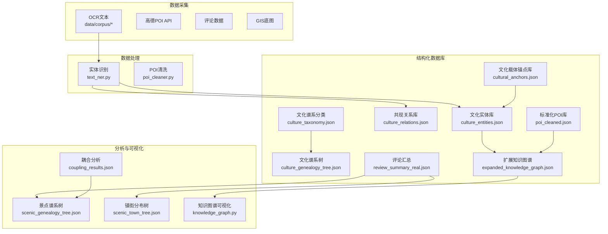
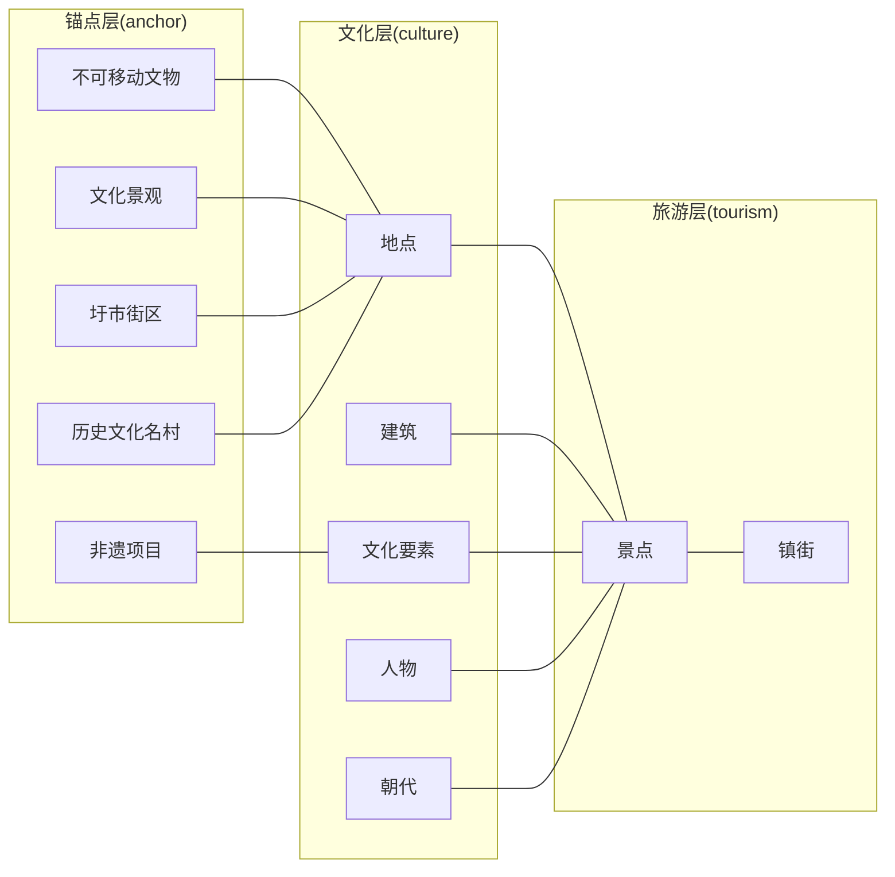
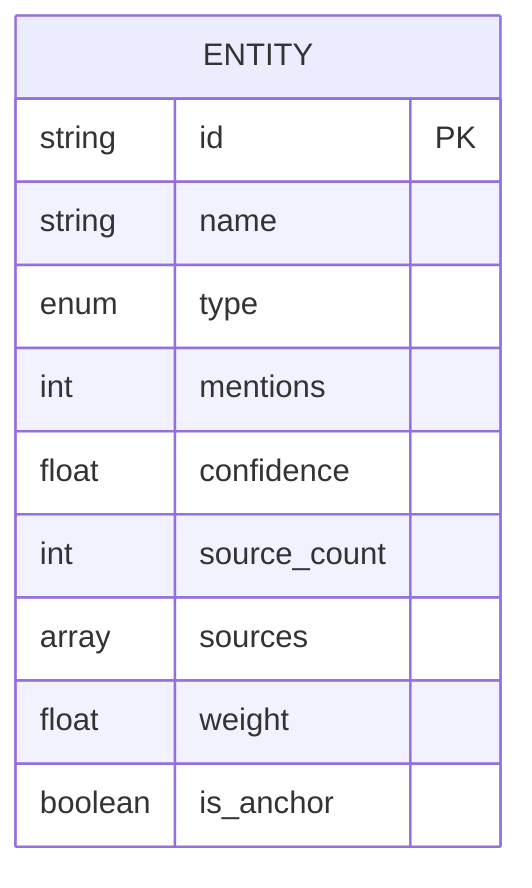
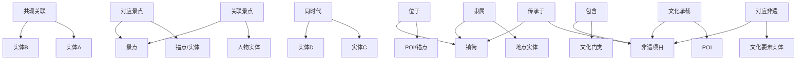
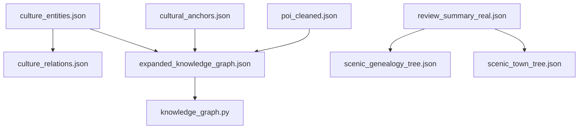

# 数据模型与Schema

<cite>
**本文引用的文件**
- [README.md](file://README.md)
- [数据说明.md](file://data/database/README_数据说明.md)
- [kg_statistics.json](file://output/knowledge_graph/kg_statistics.json)
- [culture_entities.json](file://data/database/culture_entities.json)
- [culture_relations.json](file://data/database/culture_relations.json)
- [cultural_anchors.json](file://data/database/cultural_anchors.json)
- [culture_taxonomy.json](file://data/database/culture_taxonomy.json)
- [culture_genealogy_tree.json](file://data/database/culture_genealogy_tree.json)
- [expanded_knowledge_graph.json](file://data/database/expanded_knowledge_graph.json)
- [poi_cleaned.json](file://data/database/poi_cleaned.json)
- [review_summary_real.json](file://data/reviews/review_summary_real.json)
</cite>

## 目录
1. [简介](#简介)
2. [项目结构](#项目结构)
3. [核心组件](#核心组件)
4. [架构总览](#架构总览)
5. [详细组件分析](#详细组件分析)
6. [依赖分析](#依赖分析)
7. [性能考量](#性能考量)
8. [故障排查指南](#故障排查指南)
9. [结论](#结论)
10. [附录](#附录)

## 简介
本文件面向“基于多元大数据的佛山市南海区文旅融合”项目，系统化梳理知识图谱的数据模型与Schema，明确九类文化实体的属性字段、数据类型与业务含义；阐明十五类语义关系的定义规则、方向性与语义约束；总结Schema设计原则、节点类型与边类型的规范；给出数据字典、字段说明与示例；并提供数据模型演进历史与版本管理策略，以及数据验证规则与一致性检查机制。

## 项目结构
项目采用“数据采集-数据处理-核心分析-可视化”的流水线式组织，数据库目录存放结构化产物，便于后续知识图谱扩展与分析。

图表来源
- [README.md:1-130](file://README.md#L1-L130)
- [数据说明.md:226-255](file://data/database/README_数据说明.md#L226-L255)

章节来源
- [README.md:1-130](file://README.md#L1-L130)
- [数据说明.md:226-255](file://data/database/README_数据说明.md#L226-L255)

## 核心组件
- 文化实体库：包含626个纯文化实体，类型分布涵盖地点、人物、朝代、文化要素、建筑、事件。
- 共现关系库：包含5000条实体共现关系，用于构建知识图谱边。
- 文化载体锚点库：165条不可移动文物、非遗项目、文化景观、圩市街区、历史文化名村等。
- 文化谱系分类与树：8大类、24子类、97条目，支撑文化要素与景点的映射与耦合分析。
- 扩展知识图谱：三层锚定结构（锚点层、文化层、旅游层），10类关系，387节点、2118条边。
- 标准化POI库：13512条POI，按11类进行自动分类，支持非遗与文化锚点关联。
- 评论汇总：用于景点体验度评估与可视化。

章节来源
- [数据说明.md:7-119](file://data/database/README_数据说明.md#L7-L119)
- [kg_statistics.json:1-119](file://output/knowledge_graph/kg_statistics.json#L1-L119)

## 架构总览
知识图谱以“文化实体”为核心节点，通过“共现关系”连接实体；同时引入“文化载体锚点”作为跨源锚定，实现文化层与旅游层的融合。三层结构如下：
- 锚点层（anchor）：不可移动文物、非遗项目、文化景观、圩市街区、历史文化名村
- 文化层（culture）：地点、建筑、文化要素、人物、朝代
- 旅游层（tourism）：景点、镇街

图表来源
- [数据说明.md:191-223](file://data/database/README_数据说明.md#L191-L223)
- [expanded_knowledge_graph.json:1-800](file://data/database/expanded_knowledge_graph.json#L1-L800)

## 详细组件分析

### 九类文化实体数据模型
- 实体类型与数量
  - 地点：206
  - 人物：95
  - 朝代：116
  - 文化要素：88
  - 建筑：114
  - 事件：7
- 典型字段（以文化实体库为例）
  - id：实体唯一标识（字符串）
  - name：实体名称（字符串）
  - type：实体类型（地点/人物/朝代/文化要素/建筑/事件）
  - mentions：在文本中的提及次数（整数）
  - confidence：识别置信度（浮点数，0~1）
  - source_count：来源文本数量（整数）
  - sources：来源文本列表（数组，字符串）
  - weight：加权重要度（浮点数）
  - is_anchor：是否为文化载体锚点（布尔）

图表来源
- [数据说明.md:38](file://data/database/README_数据说明.md#L38)
- [culture_entities.json:1-800](file://data/database/culture_entities.json#L1-L800)

章节来源
- [数据说明.md:38](file://data/database/README_数据说明.md#L38)
- [kg_statistics.json:5-12](file://output/knowledge_graph/kg_statistics.json#L5-L12)

### 十五类语义关系定义与规则
- 关系类型与建立条件（来自扩展知识图谱构建规则）
  - 共现关联：两端实体均在节点集中，基于共现频次（co_occurrence）建立
  - 对应景点：锚点/实体名称匹配到具体景点
  - 位于：POI/锚点 → 所属镇街
  - 同时代：同朝代/年代的锚点或实体
  - 传承于：非遗项目 → 所属镇街
  - 包含：文化门类 → 对应非遗项目
  - 隶属：地点实体 → 所属镇街
  - 关联景点：人物实体 → 以其命名的景点
  - 对应非遗：文化要素实体 → 对应非遗项目
  - 文化承载：POI → 关联的非遗项目
  - 其余关系：对应景点、传承于、包含、隶属、关联景点、对应非遗、文化承载（数量见规则表）
- 方向性与语义约束
  - 一般遵循“从具体到抽象”或“从载体到承载”的语义方向
  - “位于/隶属”等空间关系具有明确的方向性（从子域指向父域）
  - “对应景点/对应非遗/文化承载”等建立在名称匹配基础上，需保证名称一致性与唯一性

图表来源
- [数据说明.md:206-220](file://data/database/README_数据说明.md#L206-L220)
- [expanded_knowledge_graph.json:1-800](file://data/database/expanded_knowledge_graph.json#L1-L800)

章节来源
- [数据说明.md:206-220](file://data/database/README_数据说明.md#L206-L220)

### 知识图谱Schema设计原则
- 节点类型规范
  - 锚点层：不可移动文物、非遗项目、文化景观、圩市街区、历史文化名村
  - 文化层：地点、建筑、文化要素、人物、朝代
  - 旅游层：景点、镇街
- 边类型规范
  - 基于实体类型与业务语义，确保边方向与可解释性
  - 优先使用“名称匹配”与“空间归属”两类强约束关系
- 节点权重与可视化
  - 节点大小与 mentions 或 mentions 的平方根相关，体现实体重要度
  - 颜色与类型绑定，便于区分层级与类型

章节来源
- [数据说明.md:191-223](file://data/database/README_数据说明.md#L191-L223)

### 数据字典与字段说明
- 文化实体库（culture_entities.json）
  - id：实体唯一标识（字符串）
  - name：实体名称（字符串）
  - type：实体类型（枚举：地点/人物/朝代/文化要素/建筑/事件）
  - mentions：提及次数（整数）
  - confidence：置信度（浮点数）
  - source_count：来源数量（整数）
  - sources：来源文本列表（数组）
  - weight：加权重要度（浮点数）
  - is_anchor：是否为文化载体锚点（布尔）
- 共现关系库（culture_relations.json）
  - source_id/target_id：两端实体id（字符串）
  - source_name/target_name：两端实体名称（字符串）
  - co_occurrence：共现次数（整数）
  - source_type/target_type：两端实体类型（字符串）
- 文化载体锚点库（cultural_anchors.json）
  - id/name：锚点标识与名称（字符串）
  - anchor_type/sub_type：锚点主类型与子类型（字符串）
  - era：时代信息（字符串）
  - protection_level：保护级别（字符串）
  - address：地址（字符串）
  - town：所属镇街（字符串）
  - lng/lat：地理坐标（数值）
- 扩展知识图谱（expanded_knowledge_graph.json）
  - nodes：节点集合，包含id、label、type、layer、size、color、weight、intro等
  - edges：边集合，包含source、target、type等
- 标准化POI库（poi_cleaned.json）
  - id/name/category/original_type/address/town/lng/lat/rating等
  - cultural_anchors/has_cultural_anchor：与文化锚点的关联情况
- 评论汇总（review_summary_real.json）
  - name/total_count/avg_rating/positive_rate/sources等

章节来源
- [数据说明.md:38](file://data/database/README_数据说明.md#L38)
- [数据说明.md:51](file://data/database/README_数据说明.md#L51)
- [数据说明.md:103](file://data/database/README_数据说明.md#L103)
- [数据说明.md:222](file://data/database/README_数据说明.md#L222)
- [数据说明.md:85](file://data/database/README_数据说明.md#L85)
- [数据说明.md:139](file://data/database/README_数据说明.md#L139)

### 示例数据
- 文化实体示例（节选）
  - id: "E0001", name: "南海", type: "地点", mentions: 7092, confidence: 0.95, source_count: 50, weight: 111344.4, is_anchor: false
- 共现关系示例（节选）
  - source_id: "E0001", target_id: "E0143", source_name: "南海", target_name: "海县", co_occurrence: 1666, source_type: "地点", target_type: "地点"
- 文化载体锚点示例（节选）
  - name: "云泉仙馆", anchor_type: "不可移动文物", sub_type: "古建筑", era: "清乾隆丁酉年（1777）", protection_level: "省级文物保护单位", address: "西樵镇...", town: "西樵镇", lng: 112.96566, lat: 22.932927, id: "ANC_0001"
- 扩展知识图谱节点示例（节选）
  - id: "ANC_0001", label: "云泉仙馆", type: "不可移动文物", layer: "anchor", size: 26, color: "#E74C3C", weight: 80, intro: "【不可移动文物】云泉仙馆，清乾隆丁酉年（1777），省级文物保护单位，位于西樵镇。"

章节来源
- [culture_entities.json:11-73](file://data/database/culture_entities.json#L11-L73)
- [culture_relations.json:3-30](file://data/database/culture_relations.json#L3-L30)
- [cultural_anchors.json:27-39](file://data/database/cultural_anchors.json#L27-L39)
- [expanded_knowledge_graph.json:2-12](file://data/database/expanded_knowledge_graph.json#L2-L12)

### 数据模型演进历史与版本管理策略
- 演进阶段
  - 第一阶段：基于典籍文本的实体识别与共现关系提取，形成文化实体库与关系库
  - 第二阶段：引入文化载体锚点，将不可移动文物、非遗项目等纳入知识图谱锚定结构
  - 第三阶段：融合POI与评论数据，构建三层知识图谱，支持耦合分析与可视化
- 版本管理建议
  - 以“数据说明.md”为权威文档，记录每次数据结构变更与处理脚本更新
  - 对关键字段（如实体类型、关系类型）建立“白名单”与“枚举约束”
  - 对外发布前统一生成“kg_statistics.json”等统计文件，确保数据质量

章节来源
- [数据说明.md:226-255](file://data/database/README_数据说明.md#L226-L255)

### 数据验证规则与一致性检查机制
- 字段完整性
  - 必填字段：id、name、type；关系库必填：source_id、target_id、co_occurrence
- 类型一致性
  - id为字符串；mentions/source_count为整数；confidence/weight为浮点数；is_anchor/has_cultural_anchor为布尔
- 语义一致性
  - “同时代”关系仅在同朝代/年代实体之间建立
  - “位于/隶属”关系必须满足空间包含关系
  - “名称匹配”关系需保证名称唯一性与规范化
- 一致性检查流程
  - 加载后进行字段存在性与类型校验
  - 建图前执行关系方向与语义约束检查
  - 生成kg_statistics.json进行全局统计核对

章节来源
- [数据说明.md:206-220](file://data/database/README_数据说明.md#L206-L220)
- [kg_statistics.json:1-119](file://output/knowledge_graph/kg_statistics.json#L1-L119)

## 依赖分析
- 数据依赖
  - 文化实体库依赖于典籍文本与NER处理脚本
  - 关系库依赖于实体库与共现分句逻辑
  - 锚点库与POI库共同支撑扩展知识图谱
  - 评论汇总用于体验度评估与耦合分析
- 处理依赖
  - 扩展知识图谱依赖于关系规则与节点选择策略
  - 可视化依赖于ECharts与前端渲染

图表来源
- [数据说明.md:226-255](file://data/database/README_数据说明.md#L226-L255)

章节来源
- [数据说明.md:226-255](file://data/database/README_数据说明.md#L226-L255)

## 性能考量
- 实体识别与共现统计
  - 使用jieba分词与自定义词典，结合后缀规则，提高识别效率与召回
  - 共现统计按句粒度进行，限制每句实体数量，避免组合爆炸
- 图构建与存储
  - 三层结构降低边数量，提升查询与渲染性能
  - 节点权重与颜色预计算，减少运行时开销
- 可扩展性
  - 新增实体类型与关系类型需保持“白名单”与“枚举约束”，避免Schema漂移

## 故障排查指南
- 实体识别异常
  - 检查自定义词典是否覆盖目标领域术语
  - 校验停用词过滤与后缀规则配置
- 关系构建异常
  - 核对共现阈值与名称匹配策略
  - 检查实体id与名称的一致性
- 锚点与POI关联异常
  - 校验地址与镇街字段，必要时回填地理坐标
  - 检查名称规范化与唯一性

章节来源
- [数据说明.md:17-30](file://data/database/README_数据说明.md#L17-L30)
- [数据说明.md:68-89](file://data/database/README_数据说明.md#L68-L89)

## 结论
本知识图谱以文化实体为核心，通过共现关系与文化载体锚点，实现了文化层与旅游层的有机融合。九类实体与十五类关系的Schema设计，既满足业务语义需求，又具备良好的可扩展性与一致性保障。建议在后续工作中持续完善数据质量控制与版本管理，推动Schema迭代与应用落地。

## 附录
- 数据流全景（摘自数据说明）
  - 典籍文本 → jieba+NER → culture_entities.json
  - 典籍文本 → 共现分句 → culture_relations.json
  - 典籍文本 → 文化谱系分类 → culture_taxonomy.json → culture_genealogy_tree.json
  - 典籍文本 → 扩展知识图谱 → expanded_knowledge_graph.json
  - Shapefile/高德API → cultural_anchors.json → poi_cleaned.json → scenic_* 与 coupling_* 分析

章节来源
- [数据说明.md:226-255](file://data/database/README_数据说明.md#L226-L255)