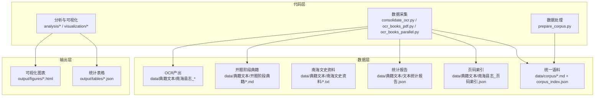
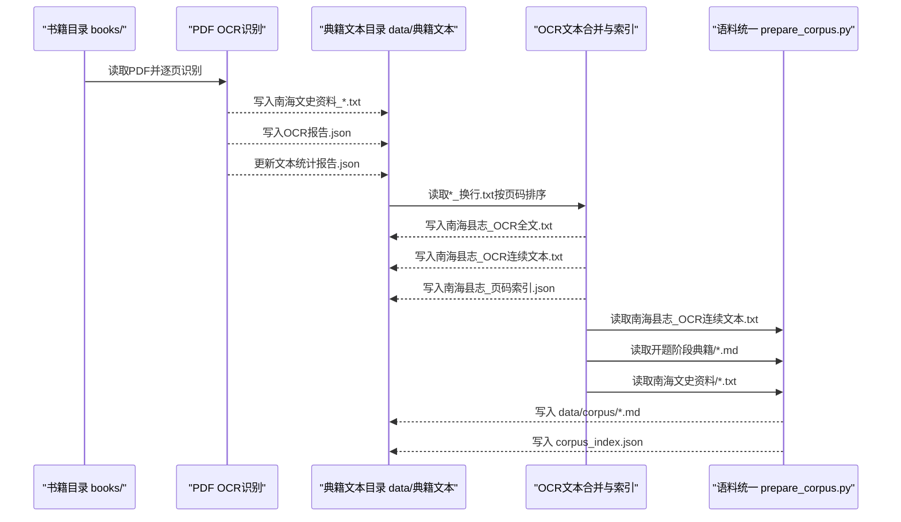
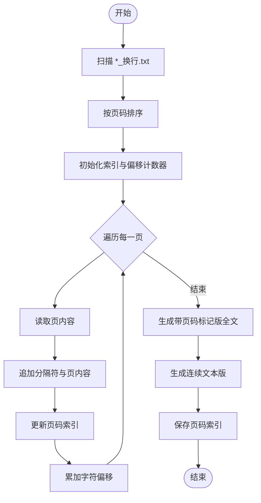
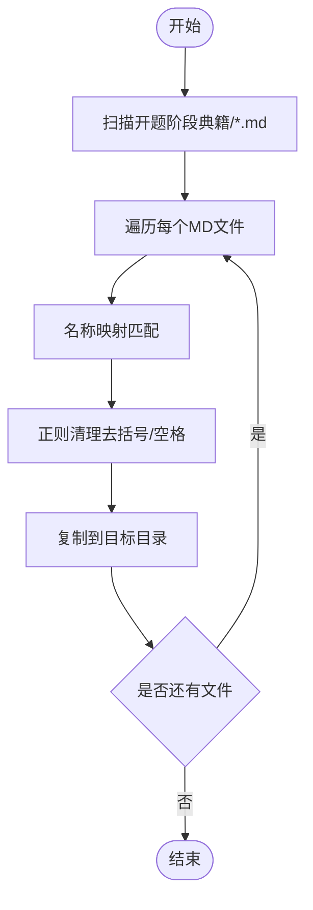
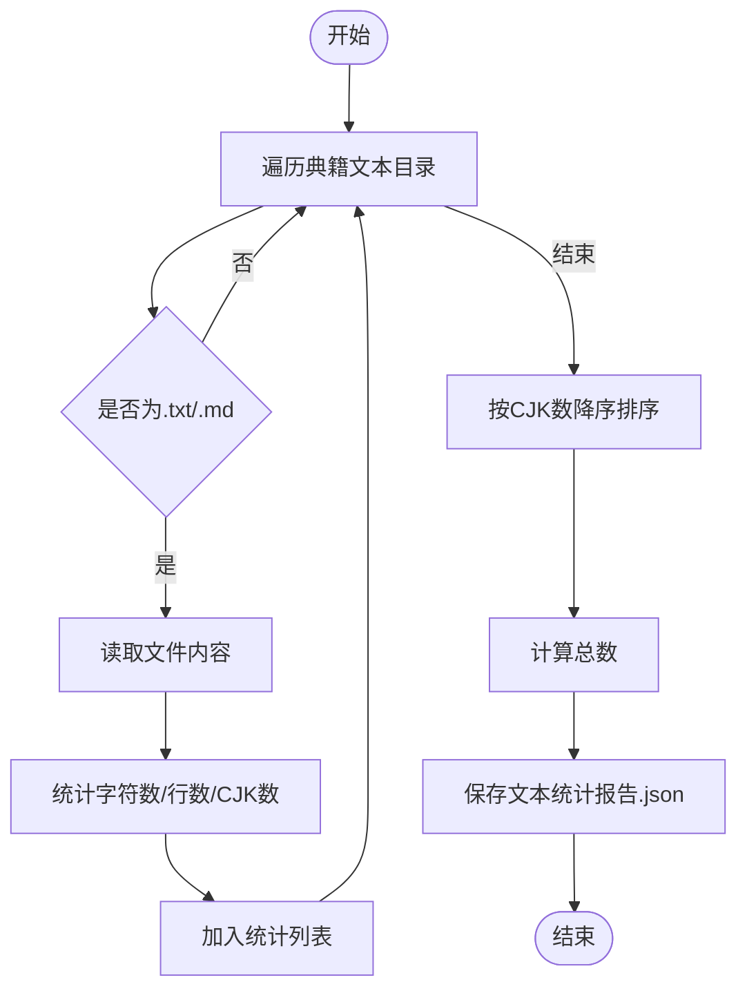
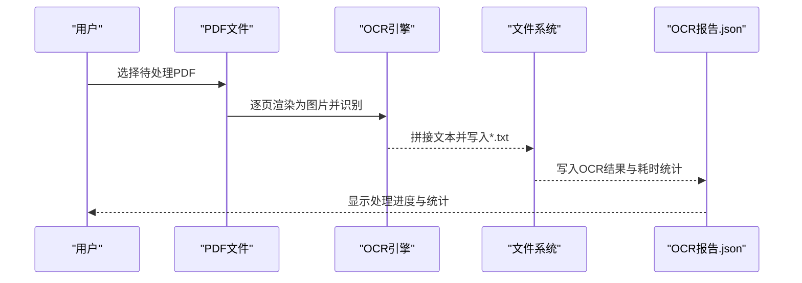
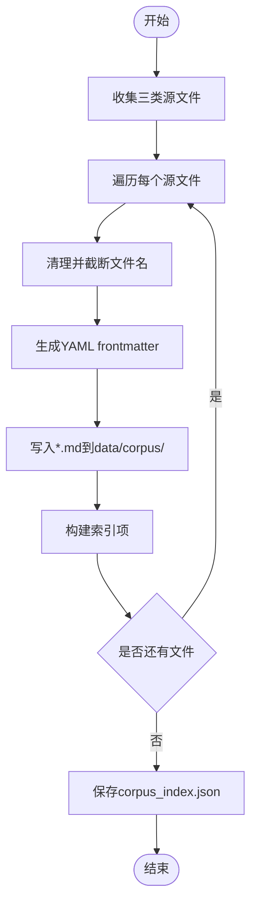
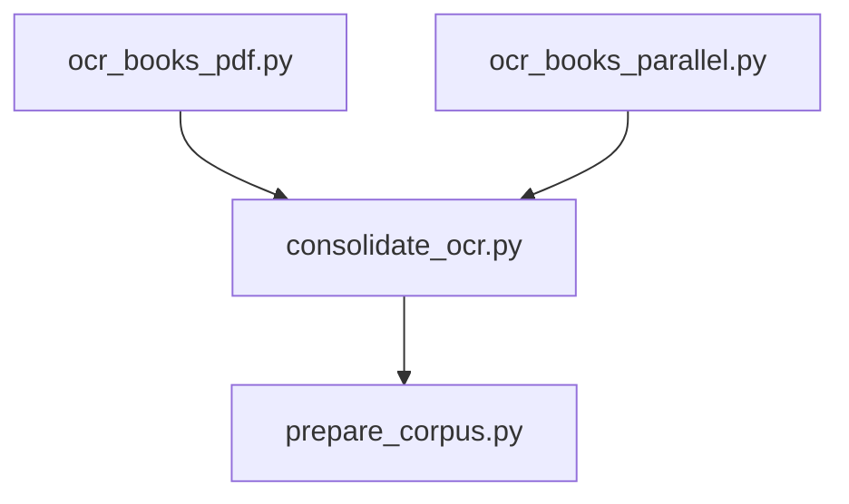

# OCR文本整合工具

<cite>
**本文引用的文件**
- [consolidate_ocr.py](file://code/data_collection/consolidate_ocr.py)
- [ocr_books_pdf.py](file://code/data_collection/ocr_books_pdf.py)
- [ocr_books_parallel.py](file://code/data_collection/ocr_books_parallel.py)
- [prepare_corpus.py](file://code/data_processing/prepare_corpus.py)
- [corpus_index.json](file://data/corpus/corpus_index.json)
- [README.md](file://README.md)
</cite>

## 目录
1. [简介](#简介)
2. [项目结构](#项目结构)
3. [核心组件](#核心组件)
4. [架构概览](#架构概览)
5. [详细组件分析](#详细组件分析)
6. [依赖分析](#依赖分析)
7. [性能考虑](#性能考虑)
8. [故障排查指南](#故障排查指南)
9. [结论](#结论)
10. [附录](#附录)

## 简介
本技术文档围绕“OCR文本整合工具”展开，系统阐述了从看典OCR产出的单页文本到结构化全文的合并流程，涵盖以下关键能力：
- 基于文件名的页码提取与排序
- 带页码标记版与连续文本版的生成策略
- 页码-字符偏移索引的构建与持久化
- 实体定位到原始页面的技术实现思路
- 开题阶段典籍MD文件的统一命名与整理机制
- 文本统计报告的生成逻辑
- 使用示例、参数配置说明与常见问题解决方案

该工具链贯穿数据采集、文本整合、语料统一与后续分析应用，为文化典籍的数字化与知识图谱构建提供高质量文本基础。

## 项目结构
项目采用“代码-数据-输出”三层组织方式：
- 代码层：位于 code/ 目录，包含数据采集、数据处理与分析脚本
- 数据层：位于 data/ 目录，包含OCR产出、典籍文本、统计报告与中间产物
- 输出层：位于 output/ 目录，包含可视化与分析结果

**图表来源**
- [README.md:1-130](file://README.md#L1-L130)
- [consolidate_ocr.py:1-225](file://code/data_collection/consolidate_ocr.py#L1-L225)
- [prepare_corpus.py:1-155](file://code/data_processing/prepare_corpus.py#L1-L155)

**章节来源**
- [README.md:1-130](file://README.md#L1-L130)

## 核心组件
- OCR页面文本合并与索引构建：负责读取单页OCR文本、按页码排序、生成带页码标记版与连续文本版，并构建页码-字符偏移索引
- 开题阶段典籍整理：对既有MD文件进行统一命名与拷贝，形成标准化典籍集合
- 文本统计报告：遍历典籍文本目录，统计各文件的字符数、行数与中文字符数
- PDF典籍OCR：对扫描型PDF进行批量OCR识别，支持断点续跑与进度反馈
- 语料统一整理：将分散文本统一到 data/corpus/，添加YAML frontmatter并生成索引

**章节来源**
- [consolidate_ocr.py:46-123](file://code/data_collection/consolidate_ocr.py#L46-L123)
- [consolidate_ocr.py:126-183](file://code/data_collection/consolidate_ocr.py#L126-L183)
- [consolidate_ocr.py:185-218](file://code/data_collection/consolidate_ocr.py#L185-L218)
- [ocr_books_pdf.py:76-168](file://code/data_collection/ocr_books_pdf.py#L76-L168)
- [ocr_books_parallel.py:114-203](file://code/data_collection/ocr_books_parallel.py#L114-L203)
- [prepare_corpus.py:72-151](file://code/data_processing/prepare_corpus.py#L72-L151)

## 架构概览
整体流程分为三个阶段：
1) 数据采集与OCR：从书籍目录books/读取PDF，调用RapidOCR进行识别，输出文本到data/典籍文本/南海文史资料/，并更新全局统计
2) 文本整合与索引：读取看典OCR产出的单页文本，按页码排序合并，生成带页码标记版与连续文本版，构建页码-字符偏移索引
3) 语料统一与索引：将南海县志、开题阶段典籍、南海文史资料等文本统一到data/corpus/，生成corpus_index.json

**图表来源**
- [ocr_books_pdf.py:76-168](file://code/data_collection/ocr_books_pdf.py#L76-L168)
- [ocr_books_parallel.py:114-203](file://code/data_collection/ocr_books_parallel.py#L114-L203)
- [consolidate_ocr.py:46-123](file://code/data_collection/consolidate_ocr.py#L46-L123)
- [prepare_corpus.py:72-151](file://code/data_processing/prepare_corpus.py#L72-L151)

## 详细组件分析

### 组件A：OCR页面文本合并与索引构建
- 功能要点
  - 从OCR目录扫描*_换行.txt文件，按文件名前缀的数字提取页码并排序
  - 生成两种文本版本：
    - 带页码标记版：在每页内容前插入“--- 第N页 ---”分隔符，便于溯源
    - 连续文本版：去除分隔符，按行拼接，适配NLP处理
  - 构建页码-字符偏移索引：记录每页在全文中的起始字符位置与长度，支持实体定位到原始页面
  - 输出文件：南海县志_OCR全文.txt、南海县志_OCR连续文本.txt、南海县志_页码索引.json
- 关键实现模式
  - 文件名解析：通过替换“_换行.txt”得到页码字符串并转换为整数
  - 字符偏移累积：每次追加内容时累加当前页内容长度与分隔符长度
  - 索引字段：包含页码、字符偏移、字符长度、行数
- 复杂度与性能
  - 时间复杂度：O(N)读取与拼接，O(N log N)排序（N为页数）
  - 空间复杂度：O(N)索引与临时缓冲
- 错误处理
  - 忽略空内容页，避免索引与文本异常
  - 目录不存在时提示并终止

**图表来源**
- [consolidate_ocr.py:57-91](file://code/data_collection/consolidate_ocr.py#L57-L91)
- [consolidate_ocr.py:113-121](file://code/data_collection/consolidate_ocr.py#L113-L121)

**章节来源**
- [consolidate_ocr.py:46-123](file://code/data_collection/consolidate_ocr.py#L46-L123)
- [consolidate_ocr.py:113-121](file://code/data_collection/consolidate_ocr.py#L113-L121)

### 组件B：开题阶段典籍MD文件统一命名与整理
- 功能要点
  - 扫描开题阶段典籍目录，读取所有.md文件
  - 通过名称映射表与正则规则进行规范化命名
  - 复制到统一的目标目录，保持文件名唯一性
- 关键实现模式
  - 名称映射：针对特定关键词进行标准化替换
  - 正则清理：去除括号内注释、多余空白，合并空格为下划线
  - 目录创建与复制：自动创建目标目录并复制文件
- 复杂度与性能
  - 时间复杂度：O(M)遍历与复制（M为MD文件数量）
  - 空间复杂度：O(1)额外内存（不考虑文件大小）

**图表来源**
- [consolidate_ocr.py:126-183](file://code/data_collection/consolidate_ocr.py#L126-L183)

**章节来源**
- [consolidate_ocr.py:126-183](file://code/data_collection/consolidate_ocr.py#L126-L183)

### 组件C：文本统计报告生成
- 功能要点
  - 遍历典籍文本根目录，统计所有.txt/.md文件
  - 计算字符数、行数与中文字符数（CJK范围）
  - 按中文字符数降序排列，生成统计报告
- 关键实现模式
  - 递归遍历：os.walk遍历所有子目录
  - CJK字符计数：使用正则表达式匹配中文字符范围
  - 排序与汇总：按中文字符数排序并计算总数
- 复杂度与性能
  - 时间复杂度：O(T)扫描与统计（T为总字符数）
  - 空间复杂度：O(F)存储文件统计项（F为文件数）

**图表来源**
- [consolidate_ocr.py:185-218](file://code/data_collection/consolidate_ocr.py#L185-L218)

**章节来源**
- [consolidate_ocr.py:185-218](file://code/data_collection/consolidate_ocr.py#L185-L218)

### 组件D：PDF典籍OCR（串行与并行）
- 串行OCR（ocr_books_pdf.py）
  - 读取books/目录下PDF，按卷号排序过滤
  - 逐页渲染为图片并调用RapidOCR识别
  - 将识别结果按“双换行”拼接为全文，写入data/典籍文本/南海文史资料/
  - 生成OCR报告.json并更新全局统计
- 并行OCR（ocr_books_parallel.py）
  - 使用ThreadPoolExecutor并行处理多本PDF
  - 支持断点续跑：若目标文件存在且中文字符数超过阈值则跳过
  - 带锁打印进度条，每本PDF独立显示进度
  - 生成OCR报告.json并更新全局统计

**图表来源**
- [ocr_books_pdf.py:49-74](file://code/data_collection/ocr_books_pdf.py#L49-L74)
- [ocr_books_pdf.py:96-138](file://code/data_collection/ocr_books_pdf.py#L96-L138)
- [ocr_books_parallel.py:58-112](file://code/data_collection/ocr_books_parallel.py#L58-L112)
- [ocr_books_parallel.py:114-203](file://code/data_collection/ocr_books_parallel.py#L114-L203)

**章节来源**
- [ocr_books_pdf.py:76-168](file://code/data_collection/ocr_books_pdf.py#L76-L168)
- [ocr_books_parallel.py:114-203](file://code/data_collection/ocr_books_parallel.py#L114-L203)

### 组件E：语料统一整理与索引
- 功能要点
  - 收集南海县志OCR、开题阶段典籍、南海文史资料三类源文件
  - 统一转为.md格式，添加YAML frontmatter（标题、来源、类别、字数等）
  - 生成编号前缀（001_、002_…）的文件名，避免重复
  - 生成corpus_index.json，包含文件元信息与原始路径
- 关键实现模式
  - 源文件收集：按固定顺序与目录结构扫描
  - frontmatter生成：将元信息序列化为YAML块
  - 索引构建：记录corpus_id、文件名、标题、来源、类别、字数、原始路径与状态

**图表来源**
- [prepare_corpus.py:24-59](file://code/data_processing/prepare_corpus.py#L24-L59)
- [prepare_corpus.py:62-69](file://code/data_processing/prepare_corpus.py#L62-L69)
- [prepare_corpus.py:72-151](file://code/data_processing/prepare_corpus.py#L72-L151)
- [corpus_index.json:1-536](file://data/corpus/corpus_index.json#L1-L536)

**章节来源**
- [prepare_corpus.py:72-151](file://code/data_processing/prepare_corpus.py#L72-L151)
- [corpus_index.json:1-536](file://data/corpus/corpus_index.json#L1-L536)

## 依赖分析
- 组件耦合关系
  - consolidate_ocr.py 依赖于OCR产出目录与开题阶段典籍目录，输出文本统计报告与页码索引
  - ocr_books_pdf.py 与 ocr_books_parallel.py 依赖于PyMuPDF与RapidOCR，输出南海文史资料文本与OCR报告
  - prepare_corpus.py 依赖于典籍文本目录，输出统一语料与索引
- 外部依赖
  - PyMuPDF（fitz）：PDF渲染与页处理
  - RapidOCR（ONNX Runtime）：OCR识别引擎
  - JSON：索引与报告的序列化
- 潜在循环依赖
  - 各组件均为单向数据流，无循环依赖风险

**图表来源**
- [consolidate_ocr.py:46-123](file://code/data_collection/consolidate_ocr.py#L46-L123)
- [ocr_books_pdf.py:76-168](file://code/data_collection/ocr_books_pdf.py#L76-L168)
- [ocr_books_parallel.py:114-203](file://code/data_collection/ocr_books_parallel.py#L114-L203)
- [prepare_corpus.py:72-151](file://code/data_processing/prepare_corpus.py#L72-L151)

**章节来源**
- [consolidate_ocr.py:46-123](file://code/data_collection/consolidate_ocr.py#L46-L123)
- [ocr_books_pdf.py:76-168](file://code/data_collection/ocr_books_pdf.py#L76-L168)
- [ocr_books_parallel.py:114-203](file://code/data_collection/ocr_books_parallel.py#L114-L203)
- [prepare_corpus.py:72-151](file://code/data_processing/prepare_corpus.py#L72-L151)

## 性能考虑
- OCR并行化：ocr_books_parallel.py使用线程池并行处理多本PDF，ONNX Runtime释放GIL，提高吞吐
- 断点续跑：OCR脚本检测目标文件是否存在且满足最小中文字符阈值，避免重复计算
- 索引构建：合并阶段一次性计算字符偏移，避免后续多次扫描
- 统计聚合：文本统计与全局统计分别维护，减少重复IO

[本节为通用性能讨论，无需列出章节来源]

## 故障排查指南
- 未找到OCR文本文件
  - 现象：合并脚本报告未找到OCR文本文件
  - 排查：确认OCR目录路径与文件命名格式（*_换行.txt）
  - 参考实现：[consolidate_ocr.py:52-55](file://code/data_collection/consolidate_ocr.py#L52-L55)
- PDF OCR失败或结果过少
  - 现象：识别结果仅少量中文字符，被判定为失败
  - 排查：检查PDF页数、图像质量与OCR引擎可用性；确认排除规则未误删
  - 参考实现：[ocr_books_pdf.py:109-121](file://code/data_collection/ocr_books_pdf.py#L109-L121)，[ocr_books_parallel.py:62-68](file://code/data_collection/ocr_books_parallel.py#L62-L68)
- 名称映射未命中导致文件名异常
  - 现象：复制后的文件名不符合预期
  - 排查：核对名称映射表与正则清理逻辑
  - 参考实现：[consolidate_ocr.py:142-180](file://code/data_collection/consolidate_ocr.py#L142-L180)
- 统计报告为空或不完整
  - 现象：统计文件缺失或总数为零
  - 排查：确认文本目录结构与文件扩展名；检查过滤条件（如“统计”“报告”关键词）
  - 参考实现：[consolidate_ocr.py:193-204](file://code/data_collection/consolidate_ocr.py#L193-L204)

**章节来源**
- [consolidate_ocr.py:52-55](file://code/data_collection/consolidate_ocr.py#L52-L55)
- [ocr_books_pdf.py:109-121](file://code/data_collection/ocr_books_pdf.py#L109-L121)
- [ocr_books_parallel.py:62-68](file://code/data_collection/ocr_books_parallel.py#L62-L68)
- [consolidate_ocr.py:142-180](file://code/data_collection/consolidate_ocr.py#L142-L180)
- [consolidate_ocr.py:193-204](file://code/data_collection/consolidate_ocr.py#L193-L204)

## 结论
本工具链通过规范化的OCR文本合并、索引构建与语料统一，为后续的知识图谱与文旅融合分析提供了高质量文本基础。其设计强调：
- 可靠的页码提取与排序
- 可溯源的带页码标记版与高效的连续文本版
- 精准的页码-字符偏移索引，支持实体定位到原始页面
- 开题阶段典籍的统一命名与整理机制
- 全局统计与报告的自动化生成

[本节为总结性内容，无需列出章节来源]

## 附录

### 使用示例
- 运行顺序（参考项目README）
  - 数据采集：执行OCR整合与PDF OCR识别脚本
  - 数据处理：运行语料统一整理脚本
  - 分析与可视化：执行分析脚本并查看HTML输出
- 示例命令（基于项目README）
  - python code/data_collection/consolidate_ocr.py
  - python code/data_collection/ocr_books_pdf.py
  - python code/data_processing/prepare_corpus.py

**章节来源**
- [README.md:89-110](file://README.md#L89-L110)

### 参数配置说明
- OCR并行脚本（ocr_books_parallel.py）
  - WORKERS：线程池大小，默认12
  - EXCLUDE_VOLUMES：排除的辑数集合（如涉政或已有文本）
  - 输出目录：data/典籍文本/南海文史资料/
- OCR串行脚本（ocr_books_pdf.py）
  - EXCLUDE_VOLUMES：排除辑数集合
  - 输出目录：data/典籍文本/南海文史资料/
- OCR整合脚本（consolidate_ocr.py）
  - OCR目录：古籍识别/b4b47661-7006-426c-9e3e-0e2cca73fbdf
  - 输出目录：data/典籍文本
  - 开题阶段典籍目录：开题阶段/文化典籍
- 语料统一脚本（prepare_corpus.py）
  - 输入目录：data/典籍文本
  - 输出目录：data/corpus

**章节来源**
- [ocr_books_parallel.py:30-31](file://code/data_collection/ocr_books_parallel.py#L30-L31)
- [ocr_books_parallel.py:26-28](file://code/data_collection/ocr_books_parallel.py#L26-L28)
- [ocr_books_pdf.py:20](file://code/data_collection/ocr_books_pdf.py#L20)
- [ocr_books_pdf.py:16-18](file://code/data_collection/ocr_books_pdf.py#L16-L18)
- [consolidate_ocr.py:41-43](file://code/data_collection/consolidate_ocr.py#L41-L43)
- [prepare_corpus.py:18-22](file://code/data_processing/prepare_corpus.py#L18-L22)