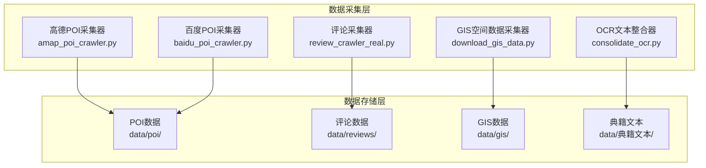
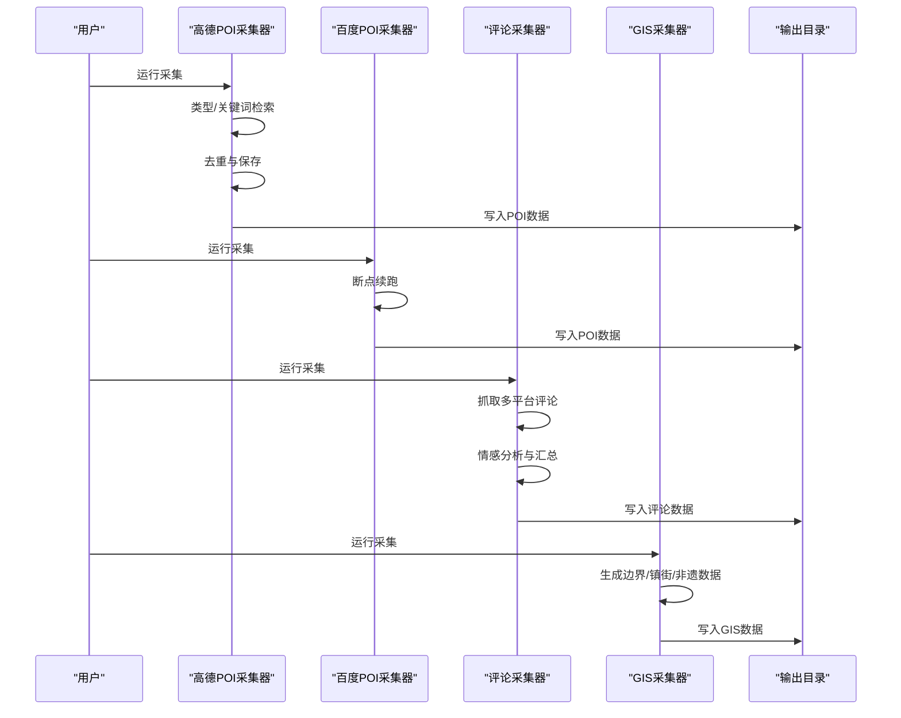
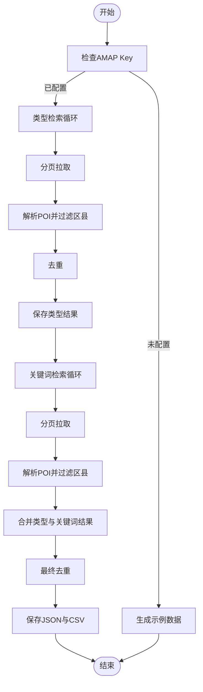
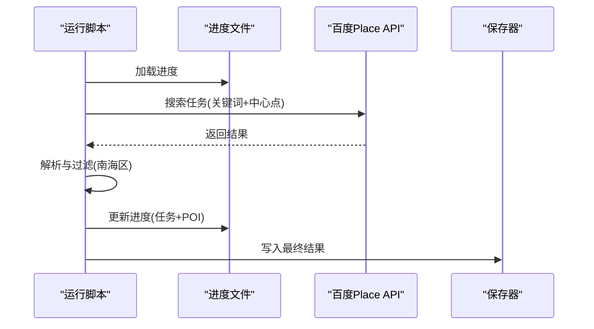
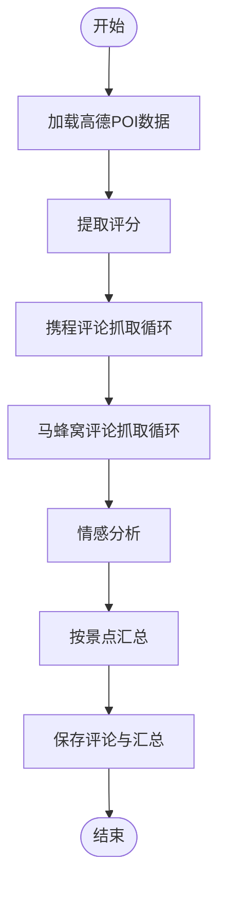
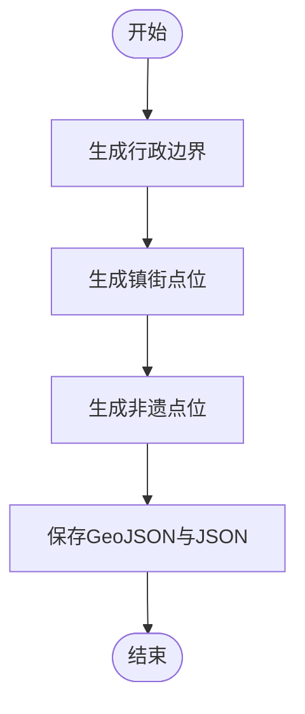
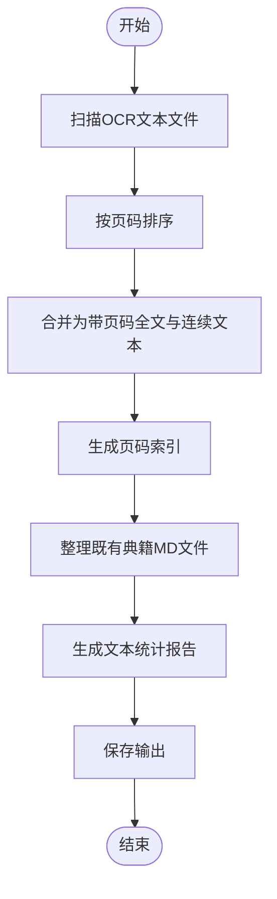
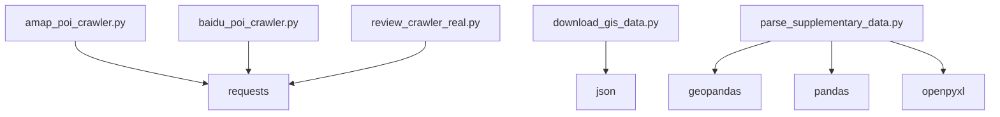

# 数据采集模块

<cite>
**本文档引用的文件**
- [amap_poi_crawler.py](file://code/data_collection/amap_poi_crawler.py)
- [baidu_poi_crawler.py](file://code/data_collection/baidu_poi_crawler.py)
- [consolidate_ocr.py](file://code/data_collection/consolidate_ocr.py)
- [review_crawler_real.py](file://code/data_collection/review_crawler_real.py)
- [download_gis_data.py](file://code/data_collection/download_gis_data.py)
- [crawl_nonheritage_full.py](file://code/data_collection/crawl_nonheritage_full.py)
- [fix_missing_texts.py](file://code/data_collection/fix_missing_texts.py)
- [parse_supplementary_data.py](file://code/data_collection/parse_supplementary_data.py)
- [nanhai_poi_real.json](file://data/poi/nanhai_poi_real.json)
- [nanhai_reviews_real.json](file://data/reviews/nanhai_reviews_real.json)
- [nanhai_nonheritage.json](file://data/gis/nanhai_nonheritage.json)
</cite>

## 目录
1. [简介](#简介)
2. [项目结构](#项目结构)
3. [核心组件](#核心组件)
4. [架构总览](#架构总览)
5. [详细组件分析](#详细组件分析)
6. [依赖关系分析](#依赖关系分析)
7. [性能考虑](#性能考虑)
8. [故障排除指南](#故障排除指南)
9. [结论](#结论)
10. [附录](#附录)

## 简介
本技术文档面向数据采集模块，系统梳理四个核心采集组件的工作原理、配置方法与使用流程，并提供参数配置、错误处理机制与性能优化建议。同时涵盖数据质量控制与验证方法，帮助读者高效、稳定地完成从POI、评论、GIS空间数据到OCR文本的全流程采集与整合。

## 项目结构
数据采集模块位于代码目录 `code/data_collection/`，围绕四大采集器展开：
- 高德POI采集器：按类型与关键词检索，去重与保存
- 百度POI采集器：基于镇街中心点与关键词的断点续跑采集
- 评论采集器：整合高德评分与多平台评论，进行情感分析与汇总
- GIS空间数据采集器：生成南海区基础空间数据与非遗项目空间数据

图表来源
- [amap_poi_crawler.py:21-48](file://code/data_collection/amap_poi_crawler.py#L21-L48)
- [baidu_poi_crawler.py:23-43](file://code/data_collection/baidu_poi_crawler.py#L23-L43)
- [review_crawler_real.py:16-17](file://code/data_collection/review_crawler_real.py#L16-L17)
- [download_gis_data.py:16-17](file://code/data_collection/download_gis_data.py#L16-L17)
- [consolidate_ocr.py:38-43](file://code/data_collection/consolidate_ocr.py#L38-L43)

章节来源
- [amap_poi_crawler.py:1-343](file://code/data_collection/amap_poi_crawler.py#L1-L343)
- [baidu_poi_crawler.py:1-207](file://code/data_collection/baidu_poi_crawler.py#L1-L207)
- [review_crawler_real.py:1-298](file://code/data_collection/review_crawler_real.py#L1-L298)
- [download_gis_data.py:1-186](file://code/data_collection/download_gis_data.py#L1-L186)
- [consolidate_ocr.py:1-225](file://code/data_collection/consolidate_ocr.py#L1-L225)

## 核心组件
本模块围绕四大采集器构建：
- 高德POI采集器：支持类型与关键词双模式检索，内置去重与保存逻辑
- 百度POI采集器：以镇街为中心点、关键词为维度的网格化采集，支持断点续跑
- 评论采集器：整合高德评分与多平台评论，进行情感分析与统计汇总
- GIS空间数据采集器：生成南海区行政边界、镇街点位与非遗项目空间数据

章节来源
- [amap_poi_crawler.py:51-226](file://code/data_collection/amap_poi_crawler.py#L51-L226)
- [baidu_poi_crawler.py:58-202](file://code/data_collection/baidu_poi_crawler.py#L58-L202)
- [review_crawler_real.py:44-293](file://code/data_collection/review_crawler_real.py#L44-L293)
- [download_gis_data.py:20-181](file://code/data_collection/download_gis_data.py#L20-L181)

## 架构总览
采集流程自上而下分为“采集-清洗-整合-输出”四个阶段，各采集器独立运行，最终汇聚到统一的数据目录。

图表来源
- [amap_poi_crawler.py:229-266](file://code/data_collection/amap_poi_crawler.py#L229-L266)
- [baidu_poi_crawler.py:125-201](file://code/data_collection/baidu_poi_crawler.py#L125-L201)
- [review_crawler_real.py:203-293](file://code/data_collection/review_crawler_real.py#L203-L293)
- [download_gis_data.py:151-181](file://code/data_collection/download_gis_data.py#L151-L181)

## 详细组件分析

### 高德POI采集器（amap_poi_crawler.py）
- 工作原理
  - 类型检索：遍历预设类型编码，逐页拉取并解析
  - 关键词检索：遍历关键词集合，逐页拉取并解析
  - 去重策略：优先使用高德ID去重；缺失ID时以“名称+经纬度”组合键去重
  - 保存策略：同时输出JSON与CSV，包含采集时间戳与总数统计
- 参数配置
  - API Key：需在配置中填写有效Key
  - 搜索范围：城市与区县限定
  - 搜索类型与关键词：可扩展类型编码与关键词集合
  - 请求间隔与分页大小：控制请求频率与单页数量
- 使用流程
  - 修改配置中的Key
  - 运行完整采集流程，自动输出带时间戳的文件
- 错误处理
  - API状态检查与异常捕获
  - 请求超时与网络异常处理
  - 缺失Key时生成示例数据供开发验证
- 性能优化
  - 合理设置请求间隔，避免触发限流
  - 分页大小适配目标数据规模
  - 去重逻辑减少重复写入

图表来源
- [amap_poi_crawler.py:21-48](file://code/data_collection/amap_poi_crawler.py#L21-L48)
- [amap_poi_crawler.py:51-186](file://code/data_collection/amap_poi_crawler.py#L51-L186)
- [amap_poi_crawler.py:189-226](file://code/data_collection/amap_poi_crawler.py#L189-L226)

章节来源
- [amap_poi_crawler.py:21-48](file://code/data_collection/amap_poi_crawler.py#L21-L48)
- [amap_poi_crawler.py:51-186](file://code/data_collection/amap_poi_crawler.py#L51-L186)
- [amap_poi_crawler.py:189-226](file://code/data_collection/amap_poi_crawler.py#L189-L226)

### 百度POI采集器（baidu_poi_crawler.py）
- 工作原理
  - 以南海区7个镇街中心点为圆心，半径5km，关键词网格化搜索
  - 支持断点续跑：记录已完成任务与已采集POI，重启后继续
  - 解析与过滤：解析百度API返回，过滤非南海区POI
- 参数配置
  - 百度AK：默认AK可在代码中配置
  - 搜索半径：默认5km
  - 关键词集合：可扩展
  - 进度文件：记录已完成任务与POI集合
- 使用流程
  - 运行采集，自动加载进度并断点续跑
  - 完成后输出统一JSON，包含采集配置与时间戳
- 错误处理
  - API状态检查与配额限制处理
  - 异常重试与等待机制
- 性能优化
  - 控制分页大小与请求间隔
  - 断点续跑减少重复采集

图表来源
- [baidu_poi_crawler.py:46-56](file://code/data_collection/baidu_poi_crawler.py#L46-L56)
- [baidu_poi_crawler.py:58-89](file://code/data_collection/baidu_poi_crawler.py#L58-L89)
- [baidu_poi_crawler.py:125-201](file://code/data_collection/baidu_poi_crawler.py#L125-L201)

章节来源
- [baidu_poi_crawler.py:23-43](file://code/data_collection/baidu_poi_crawler.py#L23-L43)
- [baidu_poi_crawler.py:58-89](file://code/data_collection/baidu_poi_crawler.py#L58-L89)
- [baidu_poi_crawler.py:125-201](file://code/data_collection/baidu_poi_crawler.py#L125-L201)

### 评论采集器（review_crawler_real.py）
- 工作原理
  - 高德评分提取：从已采集的POI数据中提取评分
  - 多平台抓取：携程评论API与马蜂窝网页评论
  - 情感分析：基于关键词集进行简单情感打标
  - 汇总统计：按景点聚合评分与文本数量，输出汇总JSON
- 参数配置
  - 景点评列表：包含名称、携程ID与马蜂窝ID
  - 请求头：User-Agent与Accept等
  - 最大页数：限制抓取深度
- 使用流程
  - 运行主流程，依次提取评分、抓取评论、情感分析与汇总
  - 输出评论JSON与按景点汇总JSON
- 错误处理
  - 接口异常捕获与日志提示
  - 正则匹配失败时降级处理
- 性能优化
  - 随机延时降低被反爬风险
  - 限制最大页数避免过度请求

图表来源
- [review_crawler_real.py:148-177](file://code/data_collection/review_crawler_real.py#L148-L177)
- [review_crawler_real.py:44-145](file://code/data_collection/review_crawler_real.py#L44-L145)
- [review_crawler_real.py:180-246](file://code/data_collection/review_crawler_real.py#L180-L246)
- [review_crawler_real.py:258-293](file://code/data_collection/review_crawler_real.py#L258-L293)

章节来源
- [review_crawler_real.py:19-41](file://code/data_collection/review_crawler_real.py#L19-L41)
- [review_crawler_real.py:44-145](file://code/data_collection/review_crawler_real.py#L44-L145)
- [review_crawler_real.py:148-246](file://code/data_collection/review_crawler_real.py#L148-L246)
- [review_crawler_real.py:258-293](file://code/data_collection/review_crawler_real.py#L258-L293)

### GIS空间数据采集器（download_gis_data.py）
- 工作原理
  - 生成南海区行政边界GeoJSON（简化版）
  - 生成镇街点位数据
  - 生成非遗项目空间数据（点位+属性）
  - 输出GeoJSON与JSON两种格式
- 参数配置
  - 输出目录：统一输出到data/gis/
  - 边界坐标：示例坐标，实际研究建议使用权威数据源
- 使用流程
  - 运行主函数，生成边界、镇街与非遗数据
  - 输出路径与数量提示
- 错误处理
  - 文件写入异常处理
  - 提示使用权威数据替代简化边界
- 性能优化
  - 生成逻辑轻量，无需额外优化

图表来源
- [download_gis_data.py:20-50](file://code/data_collection/download_gis_data.py#L20-L50)
- [download_gis_data.py:53-95](file://code/data_collection/download_gis_data.py#L53-L95)
- [download_gis_data.py:98-148](file://code/data_collection/download_gis_data.py#L98-L148)
- [download_gis_data.py:151-181](file://code/data_collection/download_gis_data.py#L151-L181)

章节来源
- [download_gis_data.py:20-50](file://code/data_collection/download_gis_data.py#L20-L50)
- [download_gis_data.py:53-95](file://code/data_collection/download_gis_data.py#L53-L95)
- [download_gis_data.py:98-148](file://code/data_collection/download_gis_data.py#L98-L148)
- [download_gis_data.py:151-181](file://code/data_collection/download_gis_data.py#L151-L181)

### OCR文本整合器（consolidate_ocr.py）
- 工作原理
  - 从文件名提取页码，按数字排序确保顺序正确
  - 生成带页码标记的全文与连续文本
  - 生成页码-字符偏移索引，支持溯源定位
  - 整理既有典籍MD文件，统一命名与存放
  - 生成文本统计报告（文件名、字符数、行数、中文字符数）
- 参数配置
  - 输入目录：看典OCR输出目录
  - 输出目录：data/典籍文本/
  - 名称映射：既有典籍MD文件的统一命名规则
- 使用流程
  - 运行整合、整理与统计三个步骤
  - 输出全文、连续文本、索引与统计报告
- 错误处理
  - 未找到OCR文件时提示
  - 文件复制与统计异常处理
- 性能优化
  - 顺序读取与索引生成，复杂度与页数线性相关

图表来源
- [consolidate_ocr.py:46-123](file://code/data_collection/consolidate_ocr.py#L46-L123)
- [consolidate_ocr.py:126-182](file://code/data_collection/consolidate_ocr.py#L126-L182)
- [consolidate_ocr.py:185-217](file://code/data_collection/consolidate_ocr.py#L185-L217)
- [consolidate_ocr.py:220-224](file://code/data_collection/consolidate_ocr.py#L220-L224)

章节来源
- [consolidate_ocr.py:46-123](file://code/data_collection/consolidate_ocr.py#L46-L123)
- [consolidate_ocr.py:126-182](file://code/data_collection/consolidate_ocr.py#L126-L182)
- [consolidate_ocr.py:185-217](file://code/data_collection/consolidate_ocr.py#L185-L217)
- [consolidate_ocr.py:220-224](file://code/data_collection/consolidate_ocr.py#L220-L224)

### 补充数据解析器（parse_supplementary_data.py）
- 工作原理
  - 解析shapefile（不可移动文物、非遗、文化景观、村落、圩市街区）为统一锚点表
  - 从佛山市POI shapefile中筛选南海区文旅相关POI
  - 解析多平台评论xlsx，合并为统一JSON
- 参数配置
  - 数据目录：辅助补充数据目录
  - 输出目录：data/database/与data/reviews/
  - 镇街标准化映射：统一不同来源的镇街名称
- 使用流程
  - 安装geopandas/pandas/openpyxl后运行
  - 生成文化载体锚点、文旅POI与合并评论
- 错误处理
  - 缺少依赖时提示安装
  - 文件不存在时跳过解析
- 性能优化
  - 依赖库安装后一次性解析，后续增量更新

章节来源
- [parse_supplementary_data.py:28-34](file://code/data_collection/parse_supplementary_data.py#L28-L34)
- [parse_supplementary_data.py:65-87](file://code/data_collection/parse_supplementary_data.py#L65-L87)
- [parse_supplementary_data.py:260-324](file://code/data_collection/parse_supplementary_data.py#L260-L324)
- [parse_supplementary_data.py:331-417](file://code/data_collection/parse_supplementary_data.py#L331-L417)
- [parse_supplementary_data.py:424-447](file://code/data_collection/parse_supplementary_data.py#L424-L447)

### 非遗完整数据爬取器（crawl_nonheritage_full.py）
- 工作原理
  - 从南海博物馆官网爬取90项非遗信息
  - 基于名称关键字映射归属镇街
  - 统计级别、类别与镇街分布，输出JSON与CSV
- 参数配置
  - 输出目录：data/gis/
  - 页面映射：各级别非遗页面URL
  - 名称映射：非遗名称到镇街的映射字典
- 使用流程
  - 运行主函数，输出完整JSON与CSV
- 错误处理
  - 页面访问异常时跳过
- 性能优化
  - 一次性生成，无需频繁运行

章节来源
- [crawl_nonheritage_full.py:22-27](file://code/data_collection/crawl_nonheritage_full.py#L22-L27)
- [crawl_nonheritage_full.py:157-171](file://code/data_collection/crawl_nonheritage_full.py#L157-L171)
- [crawl_nonheritage_full.py:165-203](file://code/data_collection/crawl_nonheritage_full.py#L165-L203)

### 遗漏文本修复器（fix_missing_texts.py）
- 工作原理
  - 补充缺失的5本典籍
  - 删除无效文件
  - 重新生成文本统计报告
- 参数配置
  - 源目录：开题阶段文化典籍
  - 目标目录：data/典籍文本/开题阶段典籍
  - 映射表：缺失文件到目标文件名的映射
  - 废数据列表：需要删除的文件
- 使用流程
  - 运行修复与统计更新
- 错误处理
  - 文件存在性检查与日志提示

章节来源
- [fix_missing_texts.py:17-23](file://code/data_collection/fix_missing_texts.py#L17-L23)
- [fix_missing_texts.py:31-92](file://code/data_collection/fix_missing_texts.py#L31-L92)

## 依赖关系分析
- 外部依赖
  - 高德/百度API：用于POI数据获取
  - requests：HTTP请求库
  - geopandas/pandas/openpyxl：shapefile与xlsx解析（补充数据解析器）
- 内部依赖
  - 输出目录统一管理：data/poi、data/reviews、data/gis、data/典籍文本
  - 进度文件：百度POI采集器的断点续跑依赖进度JSON

图表来源
- [amap_poi_crawler.py:11-16](file://code/data_collection/amap_poi_crawler.py#L11-L16)
- [baidu_poi_crawler.py:14-15](file://code/data_collection/baidu_poi_crawler.py#L14-L15)
- [review_crawler_real.py:9-14](file://code/data_collection/review_crawler_real.py#L9-L14)
- [parse_supplementary_data.py:28-34](file://code/data_collection/parse_supplementary_data.py#L28-L34)

章节来源
- [parse_supplementary_data.py:28-34](file://code/data_collection/parse_supplementary_data.py#L28-L34)

## 性能考虑
- 请求频率控制
  - 高德与百度采集器均设置请求间隔，避免触发限流
  - 评论采集器使用随机延时，降低被反爬概率
- 断点续跑
  - 百度采集器通过进度文件实现断点续跑，减少重复采集
- 数据去重
  - 高德采集器优先使用ID去重，缺失ID时采用名称+坐标组合键
- I/O优化
  - OCR整合器批量读取与索引生成，避免多次扫描
  - 补充数据解析器一次性解析后输出，减少重复计算

## 故障排除指南
- API Key未配置
  - 现象：高德采集器生成示例数据
  - 处理：在配置中填写有效Key后重新运行
- API配额限制
  - 现象：百度采集器提示配额不足并等待
  - 处理：降低请求频率或更换AK
- 网络异常
  - 现象：评论采集器打印请求异常
  - 处理：检查网络与代理设置，适当增加超时时间
- 依赖缺失
  - 现象：补充数据解析器提示安装geopandas/pandas/openpyxl
  - 处理：pip安装对应依赖后重试
- 文件不存在
  - 现象：补充数据解析器跳过不存在的shapefile或xlsx
  - 处理：确认数据目录路径与文件存在性

章节来源
- [amap_poi_crawler.py:235-241](file://code/data_collection/amap_poi_crawler.py#L235-L241)
- [baidu_poi_crawler.py:76-81](file://code/data_collection/baidu_poi_crawler.py#L76-L81)
- [review_crawler_real.py:89-91](file://code/data_collection/review_crawler_real.py#L89-L91)
- [parse_supplementary_data.py:425-427](file://code/data_collection/parse_supplementary_data.py#L425-L427)

## 结论
本模块通过四个核心采集器实现了从POI、评论、GIS空间数据到OCR文本的全链路采集与整合。各采集器具备明确的参数配置、错误处理与性能优化策略，配合断点续跑与去重逻辑，能够稳定产出高质量数据。建议在实际部署中结合业务需求调整请求频率与数据范围，并持续维护依赖与权威数据源。

## 附录
- 数据样例
  - POI样例：[nanhai_poi_real.json:1-800](file://data/poi/nanhai_poi_real.json#L1-L800)
  - 评论样例：[nanhai_reviews_real.json:1-800](file://data/reviews/nanhai_reviews_real.json#L1-L800)
  - 非遗样例：[nanhai_nonheritage.json:1-262](file://data/gis/nanhai_nonheritage.json#L1-L262)