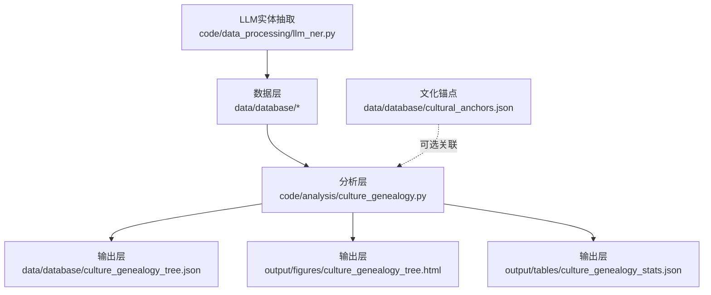
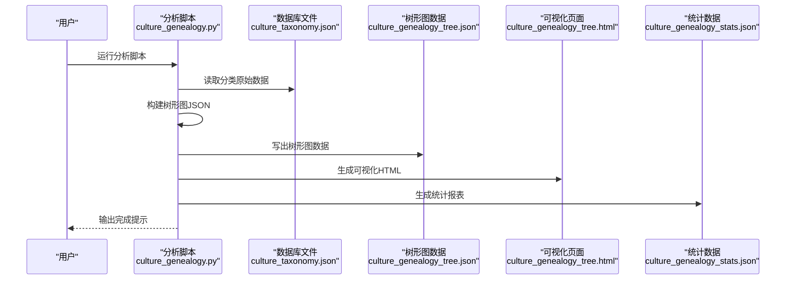
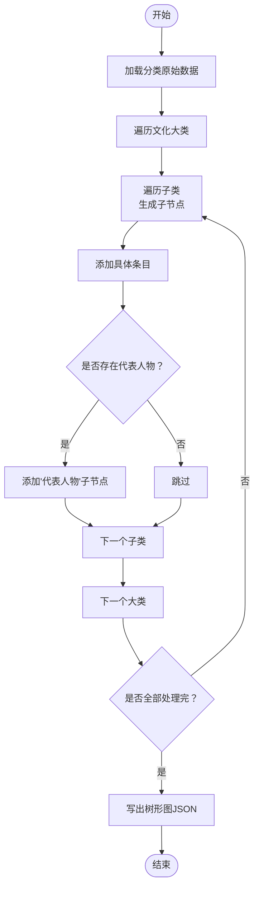
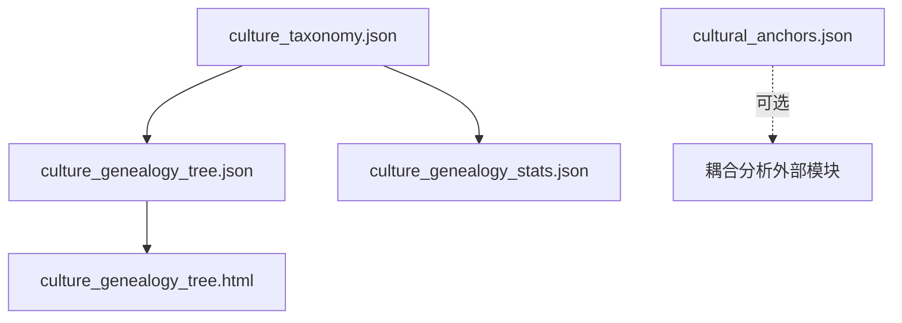

# 文化谱系分析

<cite>
**本文引用的文件**
- [culture_genealogy.py](file://code/analysis/culture_genealogy.py)
- [culture_taxonomy.json](file://data/database/culture_taxonomy.json)
- [culture_genealogy_tree.json](file://data/database/culture_genealogy_tree.json)
- [culture_genealogy_tree.html](file://output/figures/culture_genealogy_tree.html)
- [culture_genealogy_stats.json](file://output/tables/culture_genealogy_stats.json)
- [cultural_anchors.json](file://data/database/cultural_anchors.json)
- [llm_ner.py](file://code/data_processing/llm_ner.py)
- [README.md](file://README.md)
</cite>

## 目录
1. [简介](#简介)
2. [项目结构](#项目结构)
3. [核心组件](#核心组件)
4. [架构总览](#架构总览)
5. [详细组件分析](#详细组件分析)
6. [依赖关系分析](#依赖关系分析)
7. [性能考量](#性能考量)
8. [故障排查指南](#故障排查指南)
9. [结论](#结论)
10. [附录](#附录)

## 简介
本文件围绕“文化谱系分析”功能，系统阐述基于权威分类、典籍内容与NER实体的三重互校逻辑，详解8个文化大类、24个子类、97个具体条目的层级结构设计原理，并给出文化谱系树构建算法、时间维度标注、代表人物与关键地点的标注机制。文档还涵盖ECharts树形图可视化实现、统计数据生成与输出格式规范，并提供算法参数调优建议、性能优化策略与实际应用场景分析，帮助读者快速理解并复用该分析流水线。

## 项目结构
项目采用“数据-代码-输出”的分层组织方式，文化谱系分析位于分析模块，输出包括结构化数据与可视化页面。核心文件如下：
- 分析脚本：code/analysis/culture_genealogy.py
- 原始分类数据：data/database/culture_taxonomy.json
- 谱系树数据：data/database/culture_genealogy_tree.json
- 可视化页面：output/figures/culture_genealogy_tree.html
- 统计数据：output/tables/culture_genealogy_stats.json
- 文化锚点数据：data/database/cultural_anchors.json
- LLM实体抽取：code/data_processing/llm_ner.py
- 项目说明：README.md

图表来源
- [culture_genealogy.py:35-395](file://code/analysis/culture_genealogy.py#L35-L395)
- [culture_taxonomy.json:1-415](file://data/database/culture_taxonomy.json#L1-L415)
- [culture_genealogy_tree.json:1-705](file://data/database/culture_genealogy_tree.json#L1-L705)
- [culture_genealogy_tree.html:1-49](file://output/figures/culture_genealogy_tree.html#L1-L49)
- [culture_genealogy_stats.json:1-170](file://output/tables/culture_genealogy_stats.json#L1-L170)
- [cultural_anchors.json:1-2009](file://data/database/cultural_anchors.json#L1-L2009)
- [llm_ner.py:1-200](file://code/data_processing/llm_ner.py#L1-L200)

章节来源
- [README.md:1-130](file://README.md#L1-L130)

## 核心组件
- 分类体系与层级结构：定义8个文化大类、24个子类、97个具体条目，每个子类标注时间跨度、代表人物与关键地点。
- 谱系树构建：将分类体系转换为ECharts树形图可用的JSON结构。
- 可视化：基于ECharts Tree组件，LR布局，初始展开2层，暗色主题。
- 统计输出：生成谱系统计数据，包含各类别数量、关键人物与地点集合等。
- 三重互校逻辑：结合权威分类、典籍内容与NER实体频次，形成互补与交叉验证。

章节来源
- [culture_genealogy.py:3-30](file://code/analysis/culture_genealogy.py#L3-L30)
- [culture_taxonomy.json:1-415](file://data/database/culture_taxonomy.json#L1-L415)
- [culture_genealogy_tree.json:1-705](file://data/database/culture_genealogy_tree.json#L1-L705)
- [culture_genealogy_tree.html:1-49](file://output/figures/culture_genealogy_tree.html#L1-L49)
- [culture_genealogy_stats.json:1-170](file://output/tables/culture_genealogy_stats.json#L1-L170)

## 架构总览
文化谱系分析的端到端流程如下：
- 输入：权威分类（非遗名录等）与典籍文本（用于高频主题与实体识别）。
- 处理：通过NER抽取文化实体，统计频次；结合权威分类与典籍主题，形成三重互校。
- 输出：ECharts树形图数据、HTML可视化页面、统计报表。

图表来源
- [culture_genealogy.py:228-395](file://code/analysis/culture_genealogy.py#L228-L395)
- [culture_taxonomy.json:1-415](file://data/database/culture_taxonomy.json#L1-L415)
- [culture_genealogy_tree.json:1-705](file://data/database/culture_genealogy_tree.json#L1-L705)
- [culture_genealogy_tree.html:1-49](file://output/figures/culture_genealogy_tree.html#L1-L49)
- [culture_genealogy_stats.json:1-170](file://output/tables/culture_genealogy_stats.json#L1-L170)

## 详细组件分析

### 分类体系与层级结构
- 8个文化大类：武术文化、饮食文化、建筑文化、民俗文化、工艺文化、音乐戏曲、学术文化、中医药文化。
- 24个子类：按功能/形态细分，如“醒狮龙舞”“传统拳术”“酿造技艺”“古村落”“编织技艺”“传统音乐”“岭南理学”“道教医药”等。
- 97个具体条目：每个条目可追溯到具体非遗项目或典籍内容，体现可落地的实体。
- 时间维度：每个子类标注“时期”，如“清代至今”“明代至今”“宋代至今”“明代”“清末民国”“东晋”等。
- 代表人物与关键地点：每个子类标注若干代表人物与关键地点，便于后续耦合分析与可视化。

```mermaid
flowchart TD
Root["南海区文化谱系"] --> Cat1["武术文化"]
Cat1 --> Sub11["醒狮龙舞"]
Cat1 --> Sub12["传统拳术"]
Cat1 --> Sub13["龙舟竞渡"]
Root --> Cat2["饮食文化"]
Cat2 --> Sub21["酿造技艺"]
Cat2 --> Sub22["传统食品"]
Cat2 --> Sub23["水产养殖"]
Root --> Cat3["建筑文化"]
Cat3 --> Sub31["古村落"]
Cat3 --> Sub32["祠堂建筑"]
Cat3 --> Sub33["书院文化"]
Cat3 --> Sub34["宗教建筑"]
Root --> Cat4["民俗文化"]
Cat4 --> Sub41["节庆活动"]
Cat4 --> Sub42["祭祀礼俗"]
Root --> Cat5["工艺文化"]
Cat5 --> Sub51["编织技艺"]
Cat5 --> Sub52["金属工艺"]
Cat5 --> Sub53["纺织工艺"]
Cat5 --> Sub54["装饰工艺"]
Cat5 --> Sub55["其他技艺"]
Root --> Cat6["音乐戏曲"]
Cat6 --> Sub61["传统音乐"]
Cat6 --> Sub62["戏曲文化"]
Root --> Cat7["学术文化"]
Cat7 --> Sub71["岭南理学"]
Cat7 --> Sub72["科举传统"]
Cat7 --> Sub73["近代教育"]
Root --> Cat8["中医药文化"]
Cat8 --> Sub81["道教医药"]
Cat8 --> Sub82["传统中医"]
```

图表来源
- [culture_taxonomy.json:1-415](file://data/database/culture_taxonomy.json#L1-L415)

章节来源
- [culture_taxonomy.json:1-415](file://data/database/culture_taxonomy.json#L1-L415)

### 谱系树构建算法
- 输入：分类原始数据（含描述、子类、条目、代表人物、关键地点、时间跨度）。
- 处理：遍历大类→子类→条目，构造树形节点；若存在代表人物，则追加“代表人物”子节点。
- 输出：ECharts Tree组件可用的JSON结构，包含name、value、children等字段。

图表来源
- [culture_genealogy.py:228-266](file://code/analysis/culture_genealogy.py#L228-L266)

章节来源
- [culture_genealogy.py:228-266](file://code/analysis/culture_genealogy.py#L228-L266)

### 时间维度标注机制
- 在子类节点中以“时期: 年代范围”的形式标注时间跨度，便于直观呈现文化演进脉络。
- 示例：子类“龙舟竞渡”标注“宋代至今”，“岭南理学”标注“明代”。

章节来源
- [culture_taxonomy.json:1-415](file://data/database/culture_taxonomy.json#L1-L415)

### 代表人物与关键地点标注机制
- 代表人物：在子类下追加“代表人物”节点，包含若干人物名称。
- 关键地点：在子类下记录若干地点名称，用于后续空间分析与耦合分析。
- 示例：子类“岭南理学”包含“湛若水”“方献夫”“陈献章”“霍韬”等代表人物；子类“古村落”包含“西樵镇”“九江镇”“丹灶镇”“里水镇”等关键地点。

章节来源
- [culture_taxonomy.json:1-415](file://data/database/culture_taxonomy.json#L1-L415)

### ECharts树形图可视化实现
- 使用ECharts Tree组件，LR布局，标签左对齐，叶子节点右对齐。
- 初始展开2层，便于快速浏览大类与子类。
- 暗色主题，线条曲线风格，增强可读性。
- HTML页面动态注入树形图数据，支持窗口大小变化自适应。

图表来源
- [culture_genealogy_tree.html:18-46](file://output/figures/culture_genealogy_tree.html#L18-L46)
- [culture_genealogy_tree.json:1-705](file://data/database/culture_genealogy_tree.json#L1-L705)

章节来源
- [culture_genealogy_tree.html:1-49](file://output/figures/culture_genealogy_tree.html#L1-L49)
- [culture_genealogy_tree.json:1-705](file://data/database/culture_genealogy_tree.json#L1-L705)

### 统计数据生成与输出格式
- 统计指标：大类总数、子类总数、条目总数、代表人物总数、关键地点总数。
- 细分统计：按大类统计子类数、条目数、代表人物列表、关键地点列表。
- 输出文件：
  - culture_genealogy_tree.json：树形图数据
  - culture_genealogy_tree.html：可视化页面
  - culture_genealogy_stats.json：统计报表

章节来源
- [culture_genealogy.py:323-351](file://code/analysis/culture_genealogy.py#L323-L351)
- [culture_genealogy_stats.json:1-170](file://output/tables/culture_genealogy_stats.json#L1-L170)

### 三重互校逻辑（权威分类、典籍内容、NER实体）
- 权威分类：南海区非遗名录等官方分类，确保文化要素的权威性与可追溯性。
- 典籍内容：43份文化典籍的章节结构与主题，识别高频文化要素。
- NER实体：2,279个自动抽取的文化实体及其频次分布，验证要素的重要性。
- 互校规则：
  - 非遗名录有且典籍中高频 → 核心文化要素（如醒狮、龙舟）
  - 典籍高频但非遗名录未覆盖 → 历史重要但当前保护缺失的文化（如书院文化）
  - 非遗名录有但典籍中低频 → 当代保护但历史记载少的文化（如部分区级非遗）

章节来源
- [culture_genealogy.py:7-17](file://code/analysis/culture_genealogy.py#L7-L17)
- [llm_ner.py:1-200](file://code/data_processing/llm_ner.py#L1-L200)

## 依赖关系分析
- 输入依赖：分类原始数据（culture_taxonomy.json）是构建树形图与统计报表的基础。
- 输出依赖：树形图数据与统计报表分别被可视化页面与分析模块使用。
- 可选关联：文化锚点（cultural_anchors.json）可用于空间锚定与进一步耦合分析。

图表来源
- [culture_taxonomy.json:1-415](file://data/database/culture_taxonomy.json#L1-L415)
- [culture_genealogy_tree.json:1-705](file://data/database/culture_genealogy_tree.json#L1-L705)
- [culture_genealogy_tree.html:1-49](file://output/figures/culture_genealogy_tree.html#L1-L49)
- [culture_genealogy_stats.json:1-170](file://output/tables/culture_genealogy_stats.json#L1-L170)
- [cultural_anchors.json:1-2009](file://data/database/cultural_anchors.json#L1-L2009)

章节来源
- [culture_taxonomy.json:1-415](file://data/database/culture_taxonomy.json#L1-L415)
- [culture_genealogy_tree.json:1-705](file://data/database/culture_genealogy_tree.json#L1-L705)
- [culture_genealogy_tree.html:1-49](file://output/figures/culture_genealogy_tree.html#L1-L49)
- [culture_genealogy_stats.json:1-170](file://output/tables/culture_genealogy_stats.json#L1-L170)
- [cultural_anchors.json:1-2009](file://data/database/cultural_anchors.json#L1-L2009)

## 性能考量
- 数据规模：分类原始数据体量较小，构建树形图与统计计算复杂度低，运行时间短。
- I/O优化：统一路径管理（BASE_DIR/DATA_DIR/DB_DIR/OUTPUT_DIR），避免重复拼接。
- 可视化性能：ECharts Tree默认动画时长适中，初始展开2层减少初次渲染压力。
- 扩展建议：
  - 若未来条目数量增长，可考虑分批构建或延迟加载。
  - 将代表人物与关键地点的标注改为外部配置文件，便于动态更新。
  - 在统计阶段引入缓存，避免重复计算。

[本节为通用性能讨论，无需特定文件引用]

## 故障排查指南
- 无法找到输出文件
  - 检查输出目录是否存在，确认已正确运行分析脚本。
  - 确认路径常量（BASE_DIR/OUTPUT_DIR）指向正确。
- 树形图显示异常
  - 检查树形图JSON是否完整，确保children字段结构正确。
  - 确认HTML中注入的数据与树形图JSON一致。
- 统计数据不准确
  - 检查分类原始数据中条目数量与代表人物/地点列表是否完整。
  - 确认统计函数遍历逻辑无遗漏。

章节来源
- [culture_genealogy.py:354-395](file://code/analysis/culture_genealogy.py#L354-L395)
- [culture_genealogy_tree.html:1-49](file://output/figures/culture_genealogy_tree.html#L1-L49)
- [culture_genealogy_stats.json:1-170](file://output/tables/culture_genealogy_stats.json#L1-L170)

## 结论
文化谱系分析通过权威分类、典籍内容与NER实体的三重互校，构建了8大类、24子类、97条目的层级结构，并以ECharts树形图进行可视化呈现。该方法既保证了文化要素的权威性与可追溯性，又体现了历史与现实的结合。配套的统计数据与可视化页面为后续的文旅融合分析（如耦合分析）提供了坚实基础。

[本节为总结性内容，无需特定文件引用]

## 附录

### 算法参数与调优建议
- 树形图布局与样式
  - orient：LR（左右布局）
  - initialTreeDepth：2（初始展开2层）
  - label/leaves.label：左右对齐，字体大小与颜色适配暗色主题
  - lineStyle：曲线风格，宽度与颜色提升可读性
- 统计指标
  - total_categories：大类总数
  - total_subcategories：子类总数
  - total_items：条目总数
  - total_key_figures：去重后的代表人物总数
  - total_key_places：去重后的关键地点总数
- 输出格式
  - 树形图JSON：name/value/children字段，value用于标签或说明
  - 统计JSON：聚合与明细并存，便于二次加工

章节来源
- [culture_genealogy.py:269-351](file://code/analysis/culture_genealogy.py#L269-L351)
- [culture_genealogy_tree.html:22-46](file://output/figures/culture_genealogy_tree.html#L22-L46)
- [culture_genealogy_stats.json:1-170](file://output/tables/culture_genealogy_stats.json#L1-L170)

### 实际应用场景
- 文旅融合规划：识别强耦合与错位关系，指导文化资源转化与景区内容植入。
- 教育与宣传：以树形图直观展示文化脉络，辅助研学与公众传播。
- 政策制定：基于统计报表，评估不同文化类型的保护与开发现状，提出差异化政策建议。

[本节为应用性讨论，无需特定文件引用]