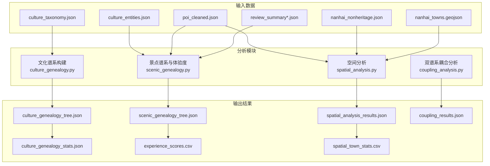
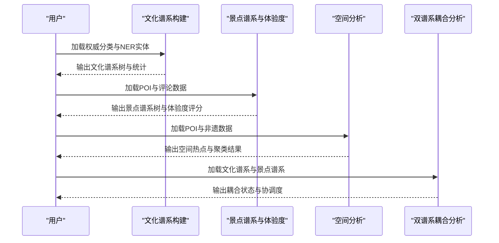
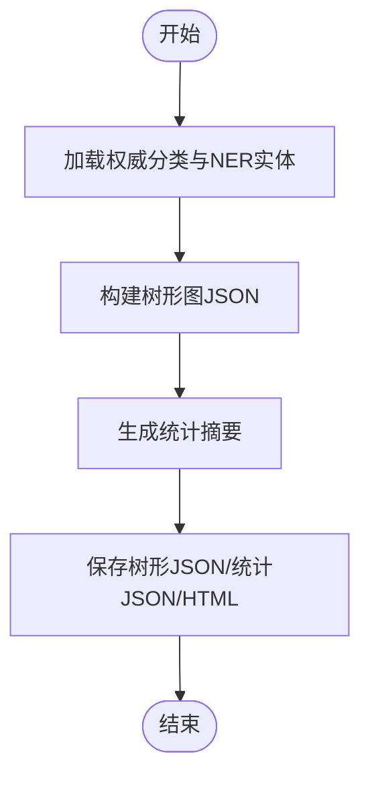
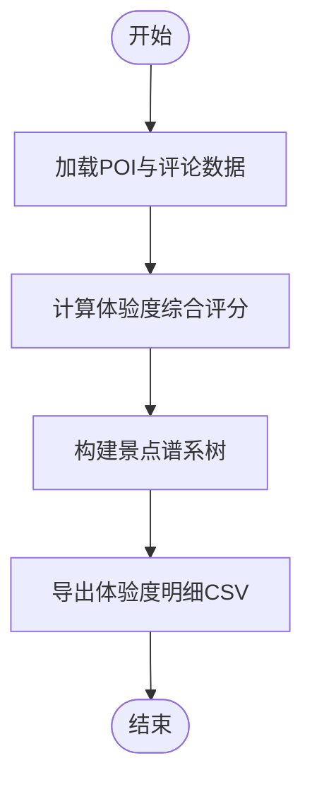
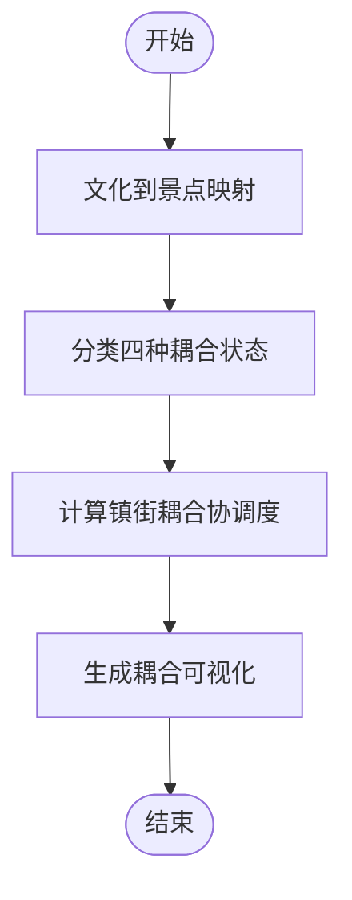
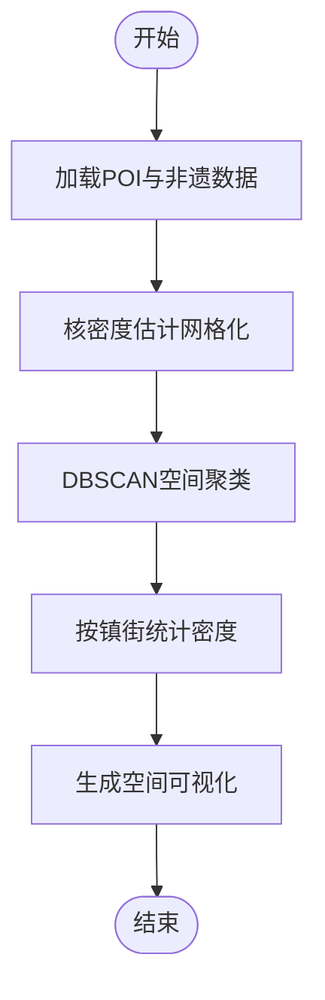
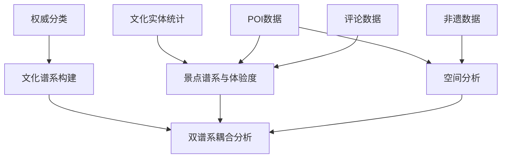

# 核心分析模块

<cite>
**本文档引用的文件**
- [culture_genealogy.py](file://code/analysis/culture_genealogy.py)
- [scenic_genealogy.py](file://code/analysis/scenic_genealogy.py)
- [spatial_analysis.py](file://code/analysis/spatial_analysis.py)
- [coupling_analysis.py](file://code/analysis/coupling_analysis.py)
- [culture_genealogy_tree.json](file://data/database/culture_genealogy_tree.json)
- [culture_taxonomy.json](file://data/database/culture_taxonomy.json)
- [culture_entities.json](file://data/database/culture_entities.json)
- [coupling_results.json](file://data/database/coupling_results.json)
- [cultural_anchors.json](file://data/database/cultural_anchors.json)
- [culture_genealogy_stats.json](file://output/tables/culture_genealogy_stats.json)
- [experience_scores.csv](file://output/tables/experience_scores.csv)
- [spatial_analysis_results.json](file://output/tables/spatial_analysis_results.json)
- [spatial_town_stats.csv](file://output/tables/spatial_town_stats.csv)
</cite>

## 目录
1. [简介](#简介)
2. [项目结构](#项目结构)
3. [核心组件](#核心组件)
4. [架构概览](#架构概览)
5. [详细组件分析](#详细组件分析)
6. [依赖关系分析](#依赖关系分析)
7. [性能考量](#性能考量)
8. [故障排除指南](#故障排除指南)
9. [结论](#结论)
10. [附录](#附录)

## 简介
本文件系统性阐述四大核心分析功能的技术实现与应用价值，涵盖文化谱系构建、景点谱系分析与体验度评估、双谱系耦合分析机制以及空间分布特征分析。文档从理论基础、实现流程、参数配置、结果数据格式、可视化展示到业务价值解读进行全景式解析，并提供算法调优与性能优化策略，帮助读者全面理解各模块间的依赖关系与数据流转。

## 项目结构
四个核心分析模块分别位于 `code/analysis/` 目录下，配套数据与输出文件分布在 `data/database/` 和 `output/` 目录中。模块间通过统一的数据接口（JSON/CVS）进行解耦协作，形成“数据采集-清洗-分析-可视化”的完整链路。

**图表来源**
- [culture_genealogy.py:1-395](file://code/analysis/culture_genealogy.py#L1-L395)
- [scenic_genealogy.py:1-375](file://code/analysis/scenic_genealogy.py#L1-L375)
- [spatial_analysis.py:1-367](file://code/analysis/spatial_analysis.py#L1-L367)
- [coupling_analysis.py:1-400](file://code/analysis/coupling_analysis.py#L1-L400)

**章节来源**
- [culture_genealogy.py:1-395](file://code/analysis/culture_genealogy.py#L1-L395)
- [scenic_genealogy.py:1-375](file://code/analysis/scenic_genealogy.py#L1-L375)
- [spatial_analysis.py:1-367](file://code/analysis/spatial_analysis.py#L1-L367)
- [coupling_analysis.py:1-400](file://code/analysis/coupling_analysis.py#L1-L400)

## 核心组件
- 文化谱系构建：基于权威分类、典籍内容与NER实体频次，构建文化要素的层级谱系树，支持可视化与统计分析。
- 景点谱系与体验度：基于POI与评论数据，构建景点谱系树并计算体验度综合评分，支持按类别/体验度/区位的多维分析。
- 空间分析：采用核密度估计与DBSCAN聚类，识别文旅资源的空间热点与集聚区，对比POI与非遗的空间分布差异。
- 双谱系耦合分析：系统对比文化资源与景点的匹配关系，识别强耦合、错位、缺失A/B四种状态，并计算镇街耦合协调度。

**章节来源**
- [culture_genealogy.py:1-395](file://code/analysis/culture_genealogy.py#L1-L395)
- [scenic_genealogy.py:1-375](file://code/analysis/scenic_genealogy.py#L1-L375)
- [spatial_analysis.py:1-367](file://code/analysis/spatial_analysis.py#L1-L367)
- [coupling_analysis.py:1-400](file://code/analysis/coupling_analysis.py#L1-L400)

## 架构概览
四大模块围绕统一的数据接口协同工作：文化谱系与景点谱系分别从权威分类与POI/评论数据中抽取特征；空间分析从POI与非遗数据中提取地理信息；耦合分析将文化谱系与景点谱系进行跨模态对齐，最终输出可视化与统计结果。

**图表来源**
- [culture_genealogy.py:354-395](file://code/analysis/culture_genealogy.py#L354-L395)
- [scenic_genealogy.py:314-375](file://code/analysis/scenic_genealogy.py#L314-L375)
- [spatial_analysis.py:312-367](file://code/analysis/spatial_analysis.py#L312-L367)
- [coupling_analysis.py:355-400](file://code/analysis/coupling_analysis.py#L355-L400)

## 详细组件分析

### 文化谱系构建算法
- 理论基础：以权威分类（非遗名录）为骨架，结合典籍内容的主题结构与NER实体频次，形成“门类-子类-条目”的三层谱系树，并标注时间跨度、代表人物与关键地点。
- 实现流程：
  1) 定义文化分类体系与属性字段；
  2) 构建ECharts树形图JSON数据；
  3) 生成统计摘要（各类别数量、关键人物与地点集合）；
  4) 输出谱系树、分类原始数据与可视化页面。
- 参数配置：分类体系常量、ECharts渲染参数（方向、标签、动画等）。
- 数据格式：
  - 输入：权威分类JSON、NER实体统计JSON；
  - 输出：树形JSON、统计JSON、HTML可视化。
- 可视化展示：ECharts树图，支持展开/折叠、缩放与响应式布局。
- 业务价值：为文化资源盘点与传播提供结构化框架，支撑后续耦合分析与空间分析的“供给侧”基准。

**图表来源**
- [culture_genealogy.py:228-395](file://code/analysis/culture_genealogy.py#L228-L395)

**章节来源**
- [culture_genealogy.py:1-395](file://code/analysis/culture_genealogy.py#L1-L395)
- [culture_genealogy_tree.json:1-705](file://data/database/culture_genealogy_tree.json#L1-L705)
- [culture_taxonomy.json:1-415](file://data/database/culture_taxonomy.json#L1-L415)
- [culture_genealogy_stats.json:1-170](file://output/tables/culture_genealogy_stats.json#L1-L170)

### 景点评谱系与体验度评估
- 理论基础：以游客体验为中心，构建“类别→体验度→景点”的三层谱系树，体验度综合评分由平台评分、好评率、文化深度、评论活跃度、历史积淀、照片丰富度六个维度加权合成。
- 实现流程：
  1) 加载清洗后的POI与评论数据（含补充多平台评论）；
  2) 计算每个景点的体验度评分与等级；
  3) 构建按类别/体验度/区位的谱系树；
  4) 输出体验度评分明细CSV与可视化页面。
- 参数配置：各维度权重（平台评分30%、好评率20%、文化深度20%、评论活跃度15%、历史积淀10%、照片丰富度5%）。
- 数据格式：
  - 输入：POI JSON、评论汇总JSON；
  - 输出：树形JSON、体验度CSV、HTML可视化。
- 可视化展示：ECharts树图，支持按类别与体验度分层浏览。
- 业务价值：量化游客体验质量，指导产品优化与营销策略制定。

**图表来源**
- [scenic_genealogy.py:126-227](file://code/analysis/scenic_genealogy.py#L126-L227)

**章节来源**
- [scenic_genealogy.py:1-375](file://code/analysis/scenic_genealogy.py#L1-L375)
- [experience_scores.csv:1-800](file://output/tables/experience_scores.csv#L1-L800)

### 双谱系耦合分析机制
- 理论基础：将文化资源（供给侧）与景点（需求侧）进行实体对齐，识别四种耦合状态（强耦合、错位、缺失A、缺失B），并引入连续值模型计算镇街耦合协调度。
- 实现流程：
  1) 定义文化到景点的映射规则与匹配类型；
  2) 识别强耦合与错位关系；
  3) 识别缺失A（文化未转化）与缺失B（有形无魂）；
  4) 计算镇街耦合协调度（基于POI与非遗密度、文化提及度）；
  5) 生成可视化关系图与统计面板。
- 参数配置：匹配规则、缺失项清单、协调度计算权重与分级阈值。
- 数据格式：
  - 输入：文化谱系树、景点谱系树、POI与非遗数据、文化实体提及度；
  - 输出：耦合结果JSON、摘要JSON、HTML可视化。
- 可视化展示：ECharts关系图+统计面板，支持节点分类与交互。
- 业务价值：指导文旅融合路径，提出针对性优化建议，提升文化资源转化效率。

**图表来源**
- [coupling_analysis.py:106-352](file://code/analysis/coupling_analysis.py#L106-L352)

**章节来源**
- [coupling_analysis.py:1-400](file://code/analysis/coupling_analysis.py#L1-L400)
- [coupling_results.json:1-389](file://data/database/coupling_results.json#L1-L389)

### 空间分布特征分析
- 理论基础：采用核密度估计（KDE）识别文旅资源的空间热点，使用DBSCAN进行空间聚类发现集聚区，对比POI与非遗的空间分布差异，并按镇街统计资源密度。
- 实现流程：
  1) 加载POI与非遗数据；
  2) 计算核密度网格（网格化、带宽、Haversine距离）；
  3) 执行DBSCAN聚类（eps、min_points）；
  4) 按镇街统计POI与非遗数量，计算密度等级；
  5) 生成四合一可视化页面（散点图、柱状图、热力图、雷达图）。
- 参数配置：网格大小（40×40）、带宽（3.0km）、DBSCAN半径（3.0km）、最小样本数（3）。
- 数据格式：
  - 输入：POI JSON、非遗JSON、GIS边界；
  - 输出：空间分析结果JSON、可视化HTML。
- 可视化展示：ECharts四合一布局，支持交互缩放与图例切换。
- 业务价值：揭示文旅资源的空间错位与集聚特征，指导区域均衡发展与热点区域运营。

**图表来源**
- [spatial_analysis.py:53-367](file://code/analysis/spatial_analysis.py#L53-L367)

**章节来源**
- [spatial_analysis.py:1-367](file://code/analysis/spatial_analysis.py#L1-L367)
- [spatial_analysis_results.json:1-185](file://output/tables/spatial_analysis_results.json#L1-L185)
- [spatial_town_stats.csv:1-9](file://output/tables/spatial_town_stats.csv#L1-L9)

## 依赖关系分析
- 数据依赖：文化谱系依赖权威分类与NER实体统计；景点谱系依赖POI与评论数据；空间分析依赖POI与非遗数据；耦合分析依赖文化谱系与景点谱系。
- 模块耦合：模块间通过中间产物（树形JSON、统计JSON、CSV）解耦，便于独立扩展与维护。
- 外部依赖：ECharts用于可视化，Haversine公式用于地理距离计算。

**图表来源**
- [culture_genealogy.py:35-395](file://code/analysis/culture_genealogy.py#L35-L395)
- [scenic_genealogy.py:46-90](file://code/analysis/scenic_genealogy.py#L46-L90)
- [spatial_analysis.py:53-66](file://code/analysis/spatial_analysis.py#L53-L66)
- [coupling_analysis.py:271-352](file://code/analysis/coupling_analysis.py#L271-L352)

**章节来源**
- [culture_genealogy.py:1-395](file://code/analysis/culture_genealogy.py#L1-L395)
- [scenic_genealogy.py:1-375](file://code/analysis/scenic_genealogy.py#L1-L375)
- [spatial_analysis.py:1-367](file://code/analysis/spatial_analysis.py#L1-L367)
- [coupling_analysis.py:1-400](file://code/analysis/coupling_analysis.py#L1-L400)

## 性能考量
- 时间复杂度：
  - 核密度估计：O(N×M)，N为点数，M为网格单元数（受网格大小影响）。
  - DBSCAN：朴素实现平均O(N^2)，可通过KD-Tree或R-Tree优化至O(N log N)。
  - 体验度评分：O(N×K)，K为关键词匹配开销。
- 空间复杂度：主要受网格存储与聚类标签数组占用影响。
- 优化建议：
  - 使用更高效的地理距离库（如geopy）替代自定义Haversine。
  - 将网格化与核密度计算并行化，利用多进程处理大数据集。
  - 对DBSCAN引入索引结构（如BallTree）降低邻域查询成本。
  - 对文化提及度查询建立倒排索引，减少字符串匹配开销。
  - 在可视化阶段对大数据集进行抽样或降采样，保证交互流畅性。

[本节为通用性能讨论，无需列出具体代码片段]

## 故障排除指南
- 数据缺失：
  - 若POI或评论数据为空，检查数据加载路径与文件完整性，确保清洗步骤已执行。
  - 若文化实体统计缺失，确认NER实体库是否正确生成与加载。
- 可视化异常：
  - ECharts依赖CDN资源，若网络受限，可将脚本与样式内嵌至本地HTML。
  - 图表空白时，检查JSON数据结构与字段命名是否一致。
- 算法参数敏感：
  - KDE带宽过大导致热点稀疏，过小导致噪声增多；建议在3.0km附近微调。
  - DBSCAN半径与最小样本数需结合实际可达距离与密度设定。
- 结果不一致：
  - 确认不同模块使用的数据版本一致（如同一轮清洗后的POI数据）。
  - 对比输出JSON与CSV字段，确保导入/导出过程未发生字段丢失。

**章节来源**
- [spatial_analysis.py:312-367](file://code/analysis/spatial_analysis.py#L312-L367)
- [scenic_genealogy.py:314-375](file://code/analysis/scenic_genealogy.py#L314-L375)
- [coupling_analysis.py:355-400](file://code/analysis/coupling_analysis.py#L355-L400)

## 结论
四大核心分析模块共同构成“文化资源盘点—需求侧体验—空间分布—融合耦合”的闭环分析体系。文化谱系提供权威“供给侧”基准，景点谱系与体验度评估刻画“需求侧”真实反馈，空间分析揭示资源分布格局，双谱系耦合分析打通供需两侧并量化协调度。通过参数化配置与可视化呈现，模块既满足学术研究的严谨性，又具备政策制定与产业运营的实用价值。

[本节为总结性内容，无需列出具体代码片段]

## 附录
- 关键术语
  - 文化谱系：文化要素的层级结构与属性标注。
  - 景点评谱系：按类别与体验度划分的景点层级结构。
  - 耦合协调度：衡量文化资源与旅游产品融合程度的连续指标。
  - 核密度估计（KDE）：用于识别空间热点的非参数密度估计方法。
  - DBSCAN：基于密度的空间聚类算法。
- 常用参数参考
  - KDE网格：40×40；带宽：3.0km；Haversine距离。
  - DBSCAN：eps=3.0km，min_points=3。
  - 体验度维度权重：平台评分30%、好评率20%、文化深度20%、评论活跃度15%、历史积淀10%、照片丰富度5%。

[本节为辅助说明，无需列出具体代码片段]