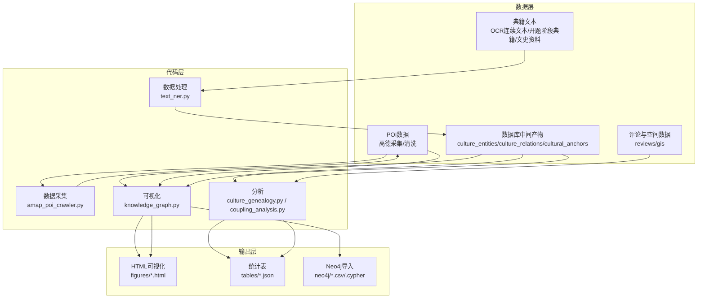
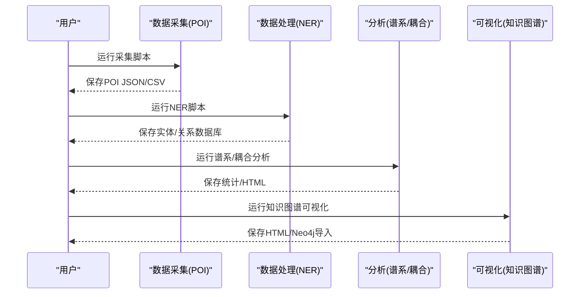
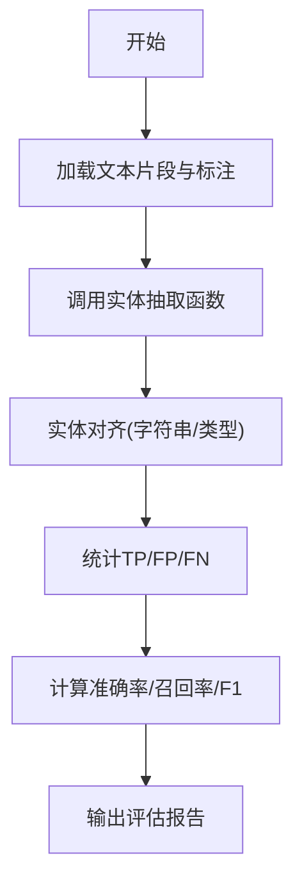
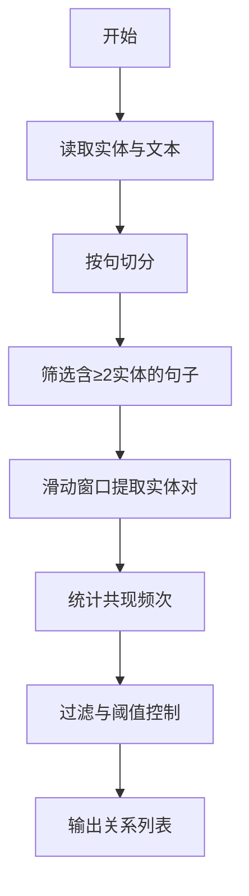
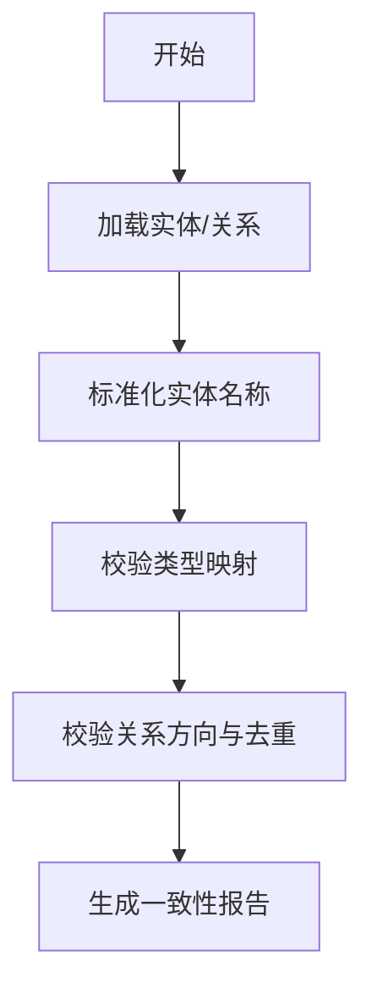
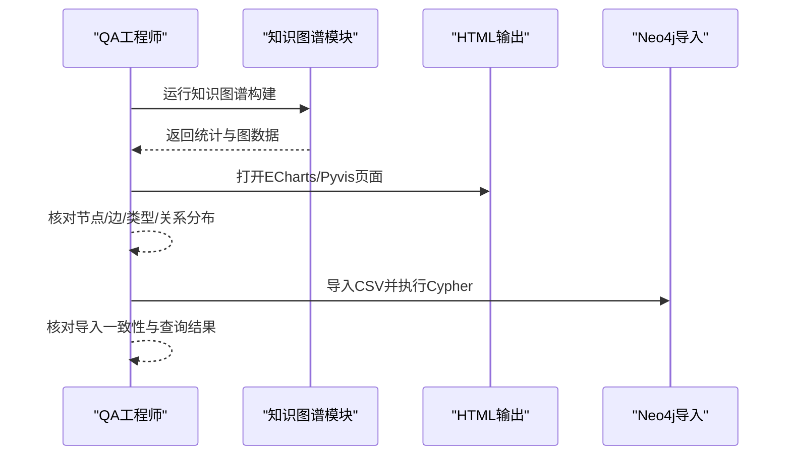
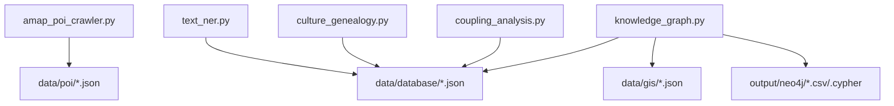

# 测试与验证

<cite>
**本文引用的文件**
- [README.md](file://README.md)
- [text_ner.py](file://code/data_processing/text_ner.py)
- [amap_poi_crawler.py](file://code/data_collection/amap_poi_crawler.py)
- [culture_genealogy.py](file://code/analysis/culture_genealogy.py)
- [coupling_analysis.py](file://code/analysis/coupling_analysis.py)
- [knowledge_graph.py](file://code/visualization/knowledge_graph.py)
</cite>

## 目录
1. [简介](#简介)
2. [项目结构](#项目结构)
3. [核心组件](#核心组件)
4. [架构总览](#架构总览)
5. [详细组件分析](#详细组件分析)
6. [依赖分析](#依赖分析)
7. [性能考虑](#性能考虑)
8. [故障排查指南](#故障排查指南)
9. [结论](#结论)
10. [附录](#附录)

## 简介
本指南围绕知识图谱项目的数据质量测试、可视化结果验证、单元/集成/端到端测试策略，以及性能基准、压力与回归测试方法进行系统化说明。结合项目现有代码与数据流，给出可操作的测试方案与质量评估标准，帮助在不同阶段（数据采集、处理、分析、可视化）保障产出的准确性与一致性。

## 项目结构
项目采用“数据-代码-输出”三层组织方式：
- 数据层：原始文本、POI、评论、GIS、数据库中间产物
- 代码层：数据采集、数据处理、分析、可视化
- 输出层：HTML可视化、统计表、Neo4j导入脚本

图表来源
- [README.md:1-130](file://README.md#L1-L130)
- [text_ner.py:1-549](file://code/data_processing/text_ner.py#L1-L549)
- [amap_poi_crawler.py:1-343](file://code/data_collection/amap_poi_crawler.py#L1-L343)
- [culture_genealogy.py:1-395](file://code/analysis/culture_genealogy.py#L1-L395)
- [coupling_analysis.py:1-400](file://code/analysis/coupling_analysis.py#L1-L400)
- [knowledge_graph.py:1-903](file://code/visualization/knowledge_graph.py#L1-L903)

章节来源
- [README.md:1-130](file://README.md#L1-L130)

## 核心组件
- 数据采集（POI）：高德API按类型与关键词检索，去重与持久化
- 数据处理（NER）：基于词典与锚点的实体抽取、合并与关系提取
- 分析（谱系/耦合）：文化谱系树构建、双谱系耦合分析与协调度计算
- 可视化（知识图谱）：三层结构图谱构建与HTML/pyvis/Neo4j导出

章节来源
- [amap_poi_crawler.py:1-343](file://code/data_collection/amap_poi_crawler.py#L1-L343)
- [text_ner.py:1-549](file://code/data_processing/text_ner.py#L1-L549)
- [culture_genealogy.py:1-395](file://code/analysis/culture_genealogy.py#L1-L395)
- [coupling_analysis.py:1-400](file://code/analysis/coupling_analysis.py#L1-L400)
- [knowledge_graph.py:1-903](file://code/visualization/knowledge_graph.py#L1-L903)

## 架构总览
整体流程从数据采集开始，经NER抽取与关系构建，进入谱系与耦合分析，最终输出可视化与Neo4j导入。

图表来源
- [amap_poi_crawler.py:229-267](file://code/data_collection/amap_poi_crawler.py#L229-L267)
- [text_ner.py:496-549](file://code/data_processing/text_ner.py#L496-L549)
- [culture_genealogy.py:354-395](file://code/analysis/culture_genealogy.py#L354-L395)
- [coupling_analysis.py:355-399](file://code/analysis/coupling_analysis.py#L355-L399)
- [knowledge_graph.py:717-800](file://code/visualization/knowledge_graph.py#L717-L800)

## 详细组件分析

### 数据质量测试：实体识别准确率
目标：评估NER模块对文化实体的抽取质量，包括准确率、召回率与F1分数。建议使用人工标注的黄金标准集（实体边界、类型标注）进行对比。

- 输入：文本片段（来自典籍文本）与人工标注实体清单
- 处理：对每个片段调用实体抽取函数，得到候选实体集合
- 对齐：基于字符串匹配与类型一致性的对齐策略，允许同义/别名
- 指标：
  - TP：正确识别的实体数
  - FP：误报实体数
  - FN：漏检实体数
  - 准确率 = TP/(TP+FP)，召回率 = TP/(TP+FN)，F1 = 2×Precision×Recall/(Precision+Recall)
- 可视化验证：将抽取实体在知识图谱中以节点呈现，核验类型与权重是否合理

图表来源
- [text_ner.py:253-318](file://code/data_processing/text_ner.py#L253-L318)
- [text_ner.py:321-377](file://code/data_processing/text_ner.py#L321-L377)

章节来源
- [text_ner.py:1-549](file://code/data_processing/text_ner.py#L1-L549)

### 数据质量测试：关系抽取完整性
目标：评估共现关系提取的完整性与一致性，确保文化实体之间的语义连结合理。

- 输入：合并后的实体字典与全部文本
- 处理：按句切分，提取包含至少两个实体的句子，计算实体对共现频次
- 质量控制：
  - 去除短句与噪声
  - 控制实体对窗口大小（如最多前6个实体）
  - 最小共现阈值过滤
- 可视化验证：在知识图谱中以边呈现关系，核验关系类型与权重分布

图表来源
- [text_ner.py:407-439](file://code/data_processing/text_ner.py#L407-L439)

章节来源
- [text_ner.py:1-549](file://code/data_processing/text_ner.py#L1-L549)

### 数据质量测试：数据一致性检查
目标：确保跨模块数据的一致性与完整性，避免重复、缺失与冲突。

- 实体一致性：
  - 去重：实体名称统一标准化（大小写、空白、常见别名）
  - 类型一致性：实体类型与自定义词典/锚点映射一致
  - 来源一致性：多文本源提及次数与交叉来源权重一致
- 关系一致性：
  - 边方向与类型：确保关系方向与业务语义一致
  - 去重：同一实体对仅保留一条边（或聚合多重关系）
- 可视化验证：检查图谱中是否存在孤立节点、孤岛、重复边

图表来源
- [text_ner.py:380-404](file://code/data_processing/text_ner.py#L380-L404)
- [knowledge_graph.py:104-337](file://code/visualization/knowledge_graph.py#L104-L337)

章节来源
- [text_ner.py:1-549](file://code/data_processing/text_ner.py#L1-L549)
- [knowledge_graph.py:1-903](file://code/visualization/knowledge_graph.py#L1-L903)

### 可视化结果验证流程与质量评估标准
- 节点与边数量核对：与统计表一致（节点/边/类型分布/关系分布）
- 图结构合理性：三层结构（文化载体锚点层/典籍文化层/旅游产品层）清晰可见
- 交互体验：悬停提示、搜索、边标签开关、稳定化后性能
- 导出一致性：pyvis HTML与ECharts HTML、Neo4j CSV/Cypher导入一致性

图表来源
- [knowledge_graph.py:340-384](file://code/visualization/knowledge_graph.py#L340-L384)
- [knowledge_graph.py:387-501](file://code/visualization/knowledge_graph.py#L387-L501)
- [knowledge_graph.py:504-714](file://code/visualization/knowledge_graph.py#L504-L714)
- [knowledge_graph.py:717-800](file://code/visualization/knowledge_graph.py#L717-L800)

章节来源
- [knowledge_graph.py:1-903](file://code/visualization/knowledge_graph.py#L1-L903)

### 单元测试、集成测试与端到端测试策略
- 单元测试（Unit Tests）
  - NER模块：对实体抽取函数、合并函数、关系提取函数分别编写测试，覆盖边界输入、空输入、异常路径
  - POI采集：模拟API响应，验证去重与保存逻辑
  - 分析模块：对谱系树构建、耦合分析函数进行断言，确保输出结构与统计字段正确
- 集成测试（Integration Tests）
  - 端到端链路：从采集→处理→分析→可视化的完整流程，断言中间产物文件存在与字段完整
  - 数据一致性：跨模块产物一致性校验（实体ID映射、关系两端节点存在）
- 端到端测试（E2E Tests）
  - 可视化验证：打开HTML页面，断言关键节点/关系存在、交互控件可用
  - Neo4j导入：执行Cypher导入脚本，查询节点/关系数量与标签一致性

章节来源
- [text_ner.py:1-549](file://code/data_processing/text_ner.py#L1-L549)
- [amap_poi_crawler.py:1-343](file://code/data_collection/amap_poi_crawler.py#L1-L343)
- [culture_genealogy.py:1-395](file://code/analysis/culture_genealogy.py#L1-L395)
- [coupling_analysis.py:1-400](file://code/analysis/coupling_analysis.py#L1-L400)
- [knowledge_graph.py:1-903](file://code/visualization/knowledge_graph.py#L1-L903)

### 性能基准测试、压力测试与回归测试
- 性能基准（Benchmark）
  - NER：记录不同文本规模下的实体抽取耗时，绘制吞吐曲线
  - 可视化：记录图谱渲染时间与交互流畅度（稳定化后关闭物理引擎）
- 压力测试（Stress）
  - POI采集：模拟高并发请求与网络抖动，验证重试与去重逻辑
  - 关系提取：对超长文本进行窗口大小与最小共现阈值的压力测试
- 回归测试（Regression）
  - 对比历史版本的实体/关系/统计表差异，确保关键指标不退化
  - 可视化回归：对比HTML页面关键元素数量与样式一致性

章节来源
- [text_ner.py:1-549](file://code/data_processing/text_ner.py#L1-L549)
- [knowledge_graph.py:1-903](file://code/visualization/knowledge_graph.py#L1-L903)

### 自动化测试框架与持续集成配置
- 测试框架建议
  - Python：pytest + pytest-html（生成测试报告）
  - 可视化：Playwright/Selenium（页面元素断言）
  - 数据一致性：自定义断言工具（JSON Schema校验、字段存在性检查）
- CI流水线建议
  - 触发：push/pr触发
  - 步骤：安装依赖→运行单元/集成测试→生成覆盖率→运行E2E→上传报告
  - 产物：测试报告、覆盖率、可视化截图、Neo4j导入样例

章节来源
- [README.md:81-130](file://README.md#L81-L130)

## 依赖分析
- 组件内聚与耦合
  - NER模块内部高内聚，与数据采集/可视化模块通过文件接口解耦
  - 分析模块依赖数据库中间产物，耦合度中等
  - 可视化模块依赖分析与数据模块输出，形成闭环
- 外部依赖
  - requests（POI采集）
  - jieba（中文分词）
  - pyvis/echarts（可视化）

图表来源
- [amap_poi_crawler.py:18-226](file://code/data_collection/amap_poi_crawler.py#L18-L226)
- [text_ner.py:42-493](file://code/data_processing/text_ner.py#L42-L493)
- [culture_genealogy.py:36-381](file://code/analysis/culture_genealogy.py#L36-L381)
- [coupling_analysis.py:46-379](file://code/analysis/coupling_analysis.py#L46-L379)
- [knowledge_graph.py:52-101](file://code/visualization/knowledge_graph.py#L52-L101)

章节来源
- [amap_poi_crawler.py:1-343](file://code/data_collection/amap_poi_crawler.py#L1-L343)
- [text_ner.py:1-549](file://code/data_processing/text_ner.py#L1-L549)
- [culture_genealogy.py:1-395](file://code/analysis/culture_genealogy.py#L1-L395)
- [coupling_analysis.py:1-400](file://code/analysis/coupling_analysis.py#L1-L400)
- [knowledge_graph.py:1-903](file://code/visualization/knowledge_graph.py#L1-L903)

## 性能考虑
- NER性能
  - 使用jieba分词替代词性标注以提升速度
  - 控制单文件最大字符数，避免内存峰值过高
- 可视化性能
  - 稳定化后关闭物理引擎，提升交互流畅度
  - 合理设置节点大小与边权重，避免过度密集导致渲染缓慢
- 数据导入性能
  - CSV导入与Cypher批量导入相结合，减少导入时间

章节来源
- [text_ner.py:240-251](file://code/data_processing/text_ner.py#L240-L251)
- [knowledge_graph.py:488-498](file://code/visualization/knowledge_graph.py#L488-L498)
- [knowledge_graph.py:757-799](file://code/visualization/knowledge_graph.py#L757-L799)

## 故障排查指南
- POI采集失败
  - 检查高德Key配置与网络连通性
  - 观察API返回状态与异常日志
- NER无输出或输出异常
  - 检查自定义词典与锚点文件是否存在
  - 核对输入文本编码与长度限制
- 可视化空白或渲染异常
  - 检查HTML文件是否完整生成
  - 确认浏览器控制台无JS错误
- Neo4j导入失败
  - 校验CSV字段与Cypher脚本一致性
  - 确认约束与标签创建顺序

章节来源
- [amap_poi_crawler.py:229-267](file://code/data_collection/amap_poi_crawler.py#L229-L267)
- [text_ner.py:496-549](file://code/data_processing/text_ner.py#L496-L549)
- [knowledge_graph.py:717-800](file://code/visualization/knowledge_graph.py#L717-L800)

## 结论
通过建立覆盖单元、集成与端到端的测试体系，结合可视化与Neo4j导入的交叉验证，可有效保障知识图谱项目在数据采集、处理、分析与可视化全流程的质量与稳定性。建议在CI中固化测试与验证步骤，持续监控关键指标，确保迭代过程中不发生回归。

## 附录
- 测试清单
  - NER：实体抽取、合并、关系提取
  - POI：采集、去重、保存
  - 分析：谱系树、耦合分析、统计
  - 可视化：HTML、pyvis、Neo4j导入
- 质量评估指标
  - 实体识别：准确率、召回率、F1
  - 关系抽取：完整性、一致性
  - 可视化：节点/边/类型/关系分布一致性
  - 性能：吞吐、渲染时间、导入时间