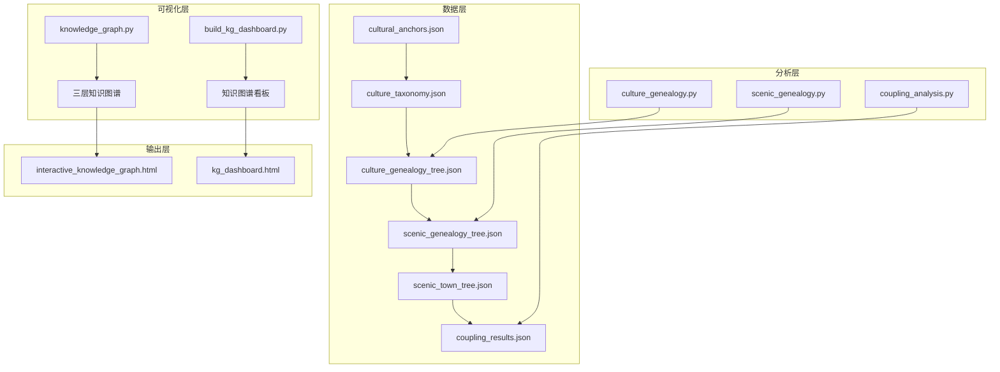
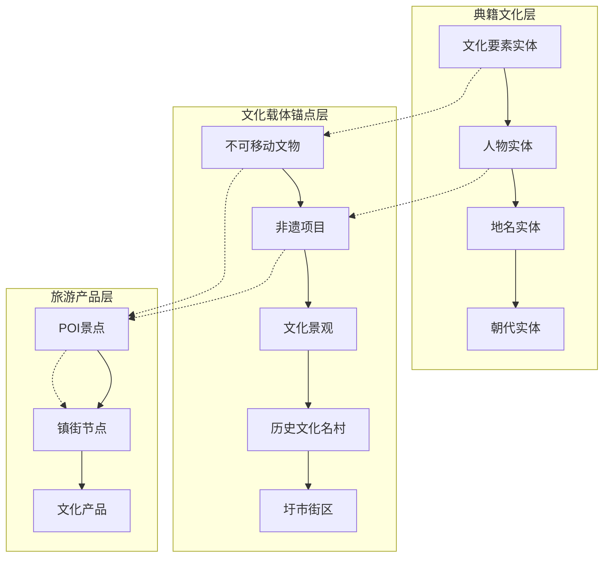
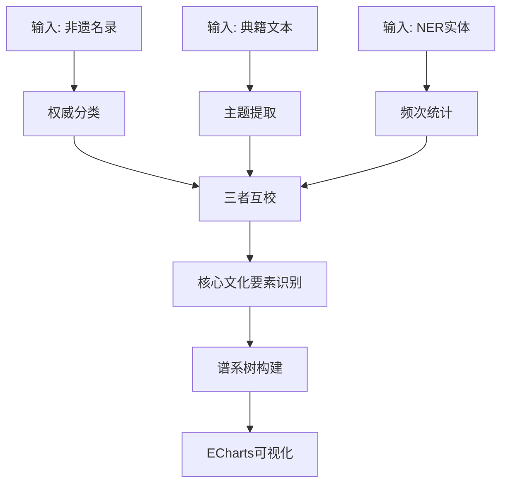
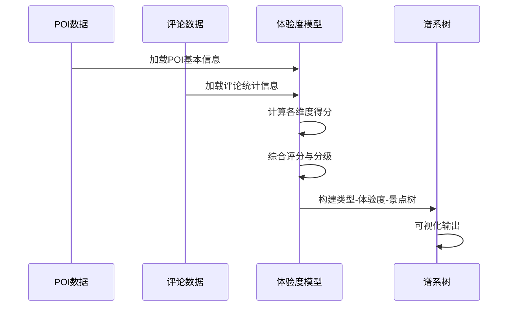
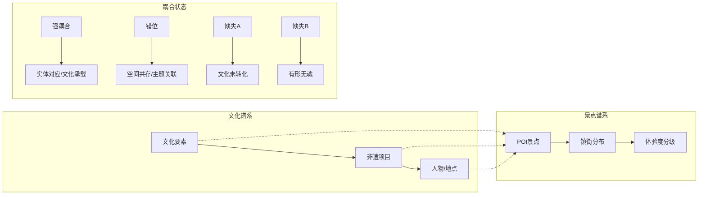
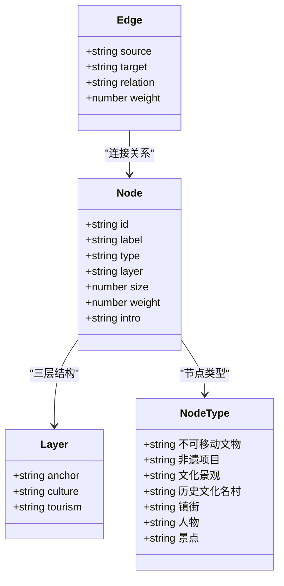
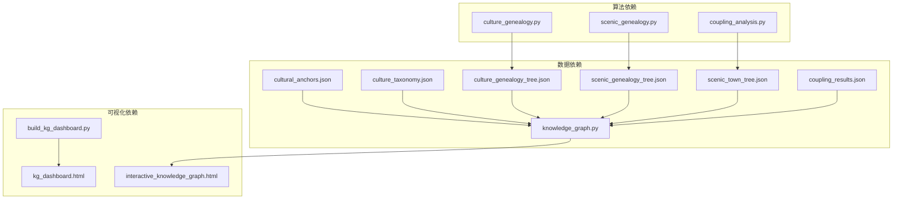

# 三层结构设计

<cite>
**本文档引用的文件**
- [README.md](file://README.md)
- [需求文档_数据补充清单.md](file://需求文档_数据补充清单.md)
- [knowledge_graph.py](file://code/visualization/knowledge_graph.py)
- [culture_genealogy.py](file://code/analysis/culture_genealogy.py)
- [scenic_genealogy.py](file://code/analysis/scenic_genealogy.py)
- [coupling_analysis.py](file://code/analysis/coupling_analysis.py)
- [cultural_anchors.json](file://data/database/cultural_anchors.json)
- [culture_taxonomy.json](file://data/database/culture_taxonomy.json)
- [culture_genealogy_tree.json](file://data/database/culture_genealogy_tree.json)
- [scenic_genealogy_tree.json](file://data/database/scenic_genealogy_tree.json)
- [scenic_town_tree.json](file://data/database/scenic_town_tree.json)
- [coupling_results.json](file://data/database/coupling_results.json)
</cite>

## 目录
1. [简介](#简介)
2. [项目结构](#项目结构)
3. [核心组件](#核心组件)
4. [架构概览](#架构概览)
5. [详细组件分析](#详细组件分析)
6. [依赖分析](#依赖分析)
7. [性能考虑](#性能考虑)
8. [故障排除指南](#故障排除指南)
9. [结论](#结论)
10. [附录](#附录)

## 简介

本项目基于多元大数据构建佛山市南海区文旅融合知识图谱，采用三层结构设计理念，通过"典籍文化层-文化载体锚点层-旅游产品层"的有机联动，实现文化资源与旅游产品的精准对接。该设计不仅体现了深厚的历史文化底蕴，更展现了现代文旅产业的发展脉络。

三层结构的核心在于以文化载体为锚点，向上连接典籍文化记忆，向下对应现实旅游产品，形成完整的文化传承与旅游开发闭环。这种设计既保证了文化资源的系统性梳理，又确保了旅游产品的实用性开发。

## 项目结构

项目采用模块化架构，围绕三层结构设计形成了完整的数据处理、分析和可视化体系：

**图表来源**
- [knowledge_graph.py:1-800](file://code/visualization/knowledge_graph.py#L1-L800)
- [culture_genealogy.py:1-395](file://code/analysis/culture_genealogy.py#L1-L395)
- [scenic_genealogy.py:1-375](file://code/analysis/scenic_genealogy.py#L1-L375)
- [coupling_analysis.py:1-400](file://code/analysis/coupling_analysis.py#L1-L400)

**章节来源**
- [README.md:1-130](file://README.md#L1-L130)

## 核心组件

### 典籍文化层

典籍文化层作为三层结构的顶层，负责承载南海区丰富的历史文化信息。该层以文化实体为核心节点，通过NER技术从43份文化典籍中提取2,279个文化实体，涵盖人物、朝代、事件、文化要素等多个维度。

**节点类型选择标准**：
- **文化要素**：直接来源于非遗项目和典籍内容的实体
- **人物**：与南海文化相关的历史人物
- **地名**：具有文化意义的地理实体
- **朝代**：反映历史时期的文化背景
- **事件**：重要的历史事件和文化现象

**数量限制与权重计算**：
- 采用TOP100筛选策略，去除"其他"类别的干扰
- 权重计算综合考虑实体在典籍中的提及次数、来源文本数量和重要性
- 尺寸映射遵循sqrt函数，确保视觉层次清晰

### 文化载体锚点层

文化载体锚点层是三层结构的核心中介，承担着连接文化资源与旅游产品的桥梁作用。该层包含165个精选的文化载体，涵盖不可移动文物、非遗项目、文化景观、历史文化名村和圩市街区等类型。

**节点类型选择标准**：
- **不可移动文物**：80个，包括古建筑、古遗址、古墓葬等
- **非遗项目**：36个，涵盖传统技艺、传统美术、传统医药等
- **文化景观**：19个，体现自然与文化的和谐统一
- **历史文化名村**：12个，保存完整的传统村落文化
- **圩市街区**：18个，承载商业文化记忆

**数量限制与权重计算**：
- 全量保留165个核心锚点，确保文化资源的完整性
- 权重分配考虑保护级别、历史价值和文化影响力
- 尺寸映射与保护级别挂钩，国家级30px，省级26px，市级22px

### 旅游产品层

旅游产品层作为三层结构的底层，直接面向游客需求，提供可体验的文化旅游产品。该层基于POI数据和评论分析，构建了完整的旅游产品谱系。

**节点类型选择标准**：
- **POI景点**：优先选择与文化锚点有空间关联的景点
- **镇街**：南海区7个主要行政区划单元
- **文化要素**：与非遗项目直接对应的旅游产品

**数量限制与权重计算**：
- POI景点采用混合策略：优先80个有文化关联的景点，再补充20个其他景点
- 权重计算综合考虑评分、评论数量、文化深度等指标
- 尺寸映射与体验度分级挂钩，高体验度节点更大

**章节来源**
- [knowledge_graph.py:28-72](file://code/visualization/knowledge_graph.py#L28-L72)
- [cultural_anchors.json:1-800](file://data/database/cultural_anchors.json#L1-L800)
- [culture_taxonomy.json:1-415](file://data/database/culture_taxonomy.json#L1-L415)

## 架构概览

三层结构采用"自下而上"的构建方式，通过多层次的关系映射实现文化资源的有效转化：

**图表来源**
- [knowledge_graph.py:104-337](file://code/visualization/knowledge_graph.py#L104-L337)

### 映射关系与数据流向

三层结构内部建立了复杂的关系网络，实现了文化资源的多维度映射：

**垂直映射关系**：
- 典籍文化层 → 文化载体锚点层：通过"典籍记载"关系建立历史联系
- 文化载体锚点层 → 旅游产品层：通过"文化承载"关系实现产品转化

**水平映射关系**：
- 同时代锚点：反映历史时期的关联性
- 同门类锚点：体现文化类型的相似性
- 共现关联：基于文本共现的语义联系

**数据流向**：
1. **上游输入**：典籍文本、非遗名录、POI数据
2. **中间处理**：实体抽取、关系计算、权重评估
3. **下游输出**：三层知识图谱、可视化界面、分析报告

**章节来源**
- [knowledge_graph.py:226-337](file://code/visualization/knowledge_graph.py#L226-L337)

## 详细组件分析

### 典籍文化谱系构建

文化谱系构建采用权威分类、典籍内容和NER实体三重验证的方法，确保文化要素的准确性和完整性。

**图表来源**
- [culture_genealogy.py:7-30](file://code/analysis/culture_genealogy.py#L7-L30)

**节点属性设计**：
- **文化大类**：8个主要文化门类
- **子类**：24个功能细分领域  
- **具体条目**：97个可追溯的文化要素
- **附加维度**：时间跨度、代表人物、关键地点

**权重计算方法**：
- 基于非遗名录权威性（1.0）
- 基于典籍高频度（0.8）
- 基于NER实体频次（0.6）

### 景点谱系构建

景点谱系构建采用体验度评估模型，综合考虑游客评价、文化深度、历史积淀等多个维度。

**图表来源**
- [scenic_genealogy.py:126-179](file://code/analysis/scenic_genealogy.py#L126-L179)

**体验度评估模型**：
- **平台评分**：30%（最高权重）
- **好评率**：20%
- **文化深度**：20%
- **评论活跃度**：15%
- **历史积淀**：10%
- **照片丰富度**：5%

**分级标准**：
- 高体验度：≥60分
- 中体验度：40-59分  
- 低体验度：<40分

### 双谱系耦合分析

双谱系耦合分析通过对比文化谱系与景点谱系，识别文旅融合的四种状态，为优化策略提供科学依据。

**图表来源**
- [coupling_analysis.py:11-46](file://code/analysis/coupling_analysis.py#L11-L46)

**耦合协调度模型**：
- **耦合度**：C_coupling = sqrt(C×T) / ((C+T)/2)
- **综合发展指数**：T_index = 0.5×C + 0.5×T
- **耦合协调度**：D = sqrt(C_coupling × T_index)

**镇街协调度分级**：
- 极高协调：D≥0.8
- 高度协调：0.6≤D<0.8
- 中度协调：0.4≤D<0.6
- 低度协调：0.2≤D<0.4
- 极低协调：D<0.2

**章节来源**
- [coupling_analysis.py:27-32](file://code/analysis/coupling_analysis.py#L27-L32)
- [scenic_genealogy.py:10-28](file://code/analysis/scenic_genealogy.py#L10-L28)

### 三层知识图谱构建

三层知识图谱采用统一的节点属性体系和关系映射机制，实现了跨层的数据流转和语义关联。

**图表来源**
- [knowledge_graph.py:340-384](file://code/visualization/knowledge_graph.py#L340-L384)

**节点属性设计**：
- **基础属性**：id、label、type、layer
- **视觉属性**：size、weight、color
- **描述属性**：intro、description
- **空间属性**：town、location

**关系构建策略**：
- **10类语义关系**：典籍记载、关联人物、文化承载、对应景点等
- **权重分配**：基于关系重要性和数据可靠性
- **去重处理**：避免重复边和循环关系

**章节来源**
- [knowledge_graph.py:104-337](file://code/visualization/knowledge_graph.py#L104-L337)

## 依赖分析

三层结构的实现依赖于多个数据源和算法模块，形成了复杂的依赖关系网络：

**图表来源**
- [knowledge_graph.py:75-101](file://code/visualization/knowledge_graph.py#L75-L101)

**核心依赖关系**：
- **数据依赖**：三层结构依赖于标准化的数据格式
- **算法依赖**：分析模块独立运行，结果服务于可视化
- **可视化依赖**：统一的节点和关系格式支持多种展示方式

**潜在风险点**：
- 数据格式变更可能影响整个分析流程
- 算法参数调整会影响结果的准确性
- 可视化配置错误可能导致展示异常

**章节来源**
- [knowledge_graph.py:75-101](file://code/visualization/knowledge_graph.py#L75-L101)

## 性能考虑

三层结构设计在保证功能完整性的同时，充分考虑了性能优化和可扩展性：

### 数据处理性能

**批处理策略**：
- 采用分块读取和流式处理，避免内存溢出
- 使用集合和字典进行快速查找和去重
- 实现增量更新机制，支持数据动态扩展

**索引优化**：
- 建立多级索引加速查询
- 使用倒排索引优化文本匹配
- 实现缓存机制减少重复计算

### 可视化性能

**渲染优化**：
- 采用虚拟滚动技术处理大量节点
- 实现节点分层渲染，优先显示关键节点
- 使用Web Workers进行后台计算

**交互优化**：
- 实现节点选择和高亮的高效算法
- 优化边的绘制和动画效果
- 提供离线模式支持

### 扩展性设计

**模块化架构**：
- 各层功能相对独立，便于单独优化
- 插件化设计支持新功能扩展
- 配置驱动实现灵活的功能开关

**数据标准化**：
- 统一的数据格式和接口规范
- 版本控制机制确保向后兼容
- 数据迁移工具简化升级过程

## 故障排除指南

### 常见问题诊断

**数据加载失败**：
- 检查文件路径和权限设置
- 验证JSON格式的正确性
- 确认数据编码格式（UTF-8）

**分析结果异常**：
- 核对输入数据的质量和完整性
- 检查算法参数的合理性
- 验证权重计算的逻辑正确性

**可视化显示问题**：
- 检查浏览器兼容性和版本要求
- 验证CSS和JavaScript文件的完整性
- 确认网络资源的可访问性

### 性能问题排查

**内存使用过高**：
- 检查大数据集的处理策略
- 优化数据结构和算法复杂度
- 实现适当的垃圾回收机制

**响应速度慢**：
- 分析瓶颈环节并针对性优化
- 实现异步处理和进度反馈
- 考虑分布式计算方案

### 数据质量监控

**完整性检查**：
- 实现数据完整性验证机制
- 建立异常数据报警系统
- 定期进行数据质量评估

**一致性维护**：
- 实现数据版本管理和回滚机制
- 建立数据变更追踪系统
- 提供数据修复和清理工具

**章节来源**
- [需求文档_数据补充清单.md:1-157](file://需求文档_数据补充清单.md#L1-L157)

## 结论

三层知识图谱结构设计通过"典籍文化层-文化载体锚点层-旅游产品层"的有机整合，为南海区文旅融合发展提供了系统性的解决方案。该设计不仅体现了深厚的历史文化底蕴，更展现了现代文旅产业的发展智慧。

**理论价值**：
- 建立了文化资源与旅游产品之间的理论桥梁
- 提供了文旅融合的量化评估方法
- 探索了传统文化传承的新路径

**实践价值**：
- 为政府决策提供数据支撑
- 为企业投资提供参考依据
- 为游客体验提供智能引导

**创新特色**：
- 采用三层结构实现文化资源的系统性梳理
- 运用多源数据融合提升分析精度
- 构建可视化平台增强用户体验

未来发展方向包括：扩大数据覆盖范围、优化算法性能、增强个性化推荐、拓展应用场景等。通过持续改进和完善，三层结构设计将为南海区乃至全国的文旅融合发展贡献更大的价值。

## 附录

### 节点属性定义表

| 属性名称 | 类型 | 描述 | 示例值 |
|---------|------|------|--------|
| id | string | 节点唯一标识符 | ANC_0001 |
| label | string | 节点显示名称 | 云泉仙馆 |
| type | string | 节点类型 | 不可移动文物 |
| layer | string | 所属层级 | anchor |
| size | number | 节点显示大小 | 22 |
| weight | number | 节点权重 | 80 |
| intro | string | 节点简介信息 | 【不可移动文物】云泉仙馆，清乾隆丁酉年... |

### 关系类型定义表

| 关系类型 | 权重 | 描述 | 示例 |
|---------|------|------|------|
| 典籍记载 | 2.5 | 文化实体与载体的文本关联 | 广东醒狮 ↔ 南海醒狮传承基地 |
| 关联人物 | 2.0 | 人物实体与载体/景点的命名关联 | 黄飞鸿 ↔ 黄飞鸿纪念馆 |
| 文化承载 | 2.0 | 景点与非遗项目的承载关系 | 九江双蒸博物馆 ↔ 九江双蒸酒酿制技艺 |
| 对应景点 | 2.0 | 载体与空间匹配的景点 | 云泉仙馆 ↔ 云泉仙馆景区 |
| 传承于 | 1.5 | 非遗项目与传承地的归属关系 | 九江双蒸酒酿制技艺 ↔ 九江镇 |
| 位于 | 1.0-1.5 | 空间位置关系 | 云泉仙馆 ↔ 西樵镇 |
| 同时代 | 0.5 | 历史时期关联 | 明代建筑群 |
| 同门类 | 1.0 | 文化类型相似性 | 传统舞蹈类非遗 |
| 共现关联 | 0.1-3.0 | 文本共现的语义关系 | 人物与事件 |
| 文化关联 | 2.0 | 文化要素与非遗的对应关系 | 岭南理学 ↔ 白沙学派 |

### 颜色编码体系

| 节点类型 | 颜色代码 | 用途 | 尺寸映射 |
|---------|----------|------|----------|
| 不可移动文物 | #E74C3C | 核心文化载体 | 22-30px |
| 非遗项目 | #F39C12 | 传统技艺传承 | 14-20px |
| 文化景观 | #1ABC9C | 自然文化融合 | 18-24px |
| 历史文化名村 | #8E44AD | 传统村落保护 | 16-22px |
| 镇街 | #3498DB | 行政区划单元 | 28px |
| 人物 | #FF6B6B | 历史人物代表 | 12-18px |
| 景点 | #2ECC71 | 旅游产品载体 | 14px |
| 文化要素 | #F7DC6F | 文化概念元素 | 10-35px |
| 朝代 | #98D8C8 | 历史时期背景 | 8-12px |
| 地点 | #4ECDC4 | 地理空间标识 | 10-16px |

### 尺寸映射规则

**节点尺寸计算**：
- **文化要素**：size = 8 + sqrt(mentions) × 1.2
- **不可移动文物**：size = 22（市级）/26（省级）/30（国家级）
- **非遗项目**：size = 14（区级）/20（市级及以上）
- **景点**：size = 14（默认）

**关系权重计算**：
- **文本共现**：weight = min(co_occurrence / 5.0, 3.0)
- **体验度评分**：weight = rating × 10
- **保护级别**：weight = {国家级: 100, 省级: 70, 市级: 50, 区级: 30}