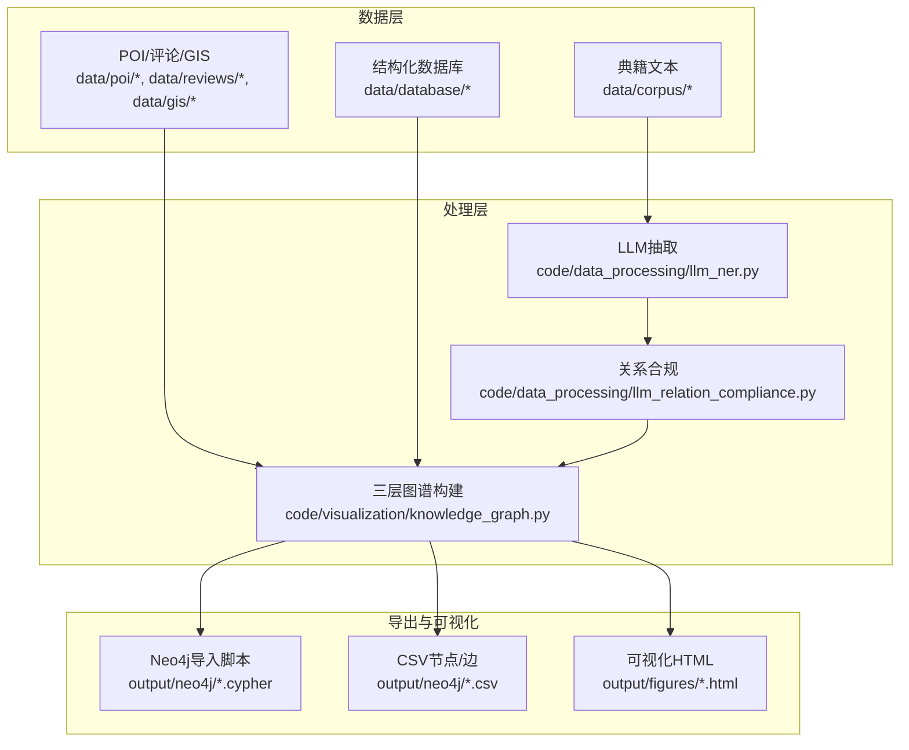
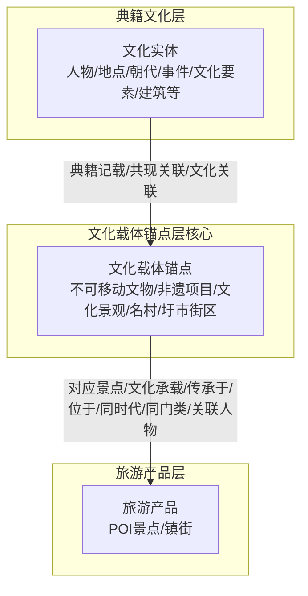
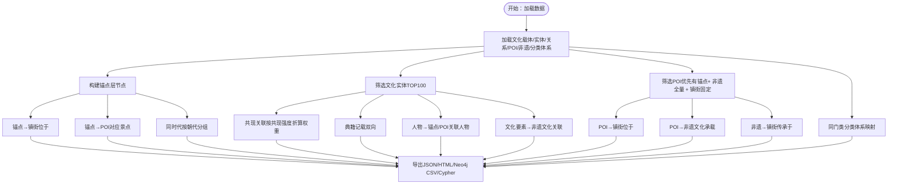
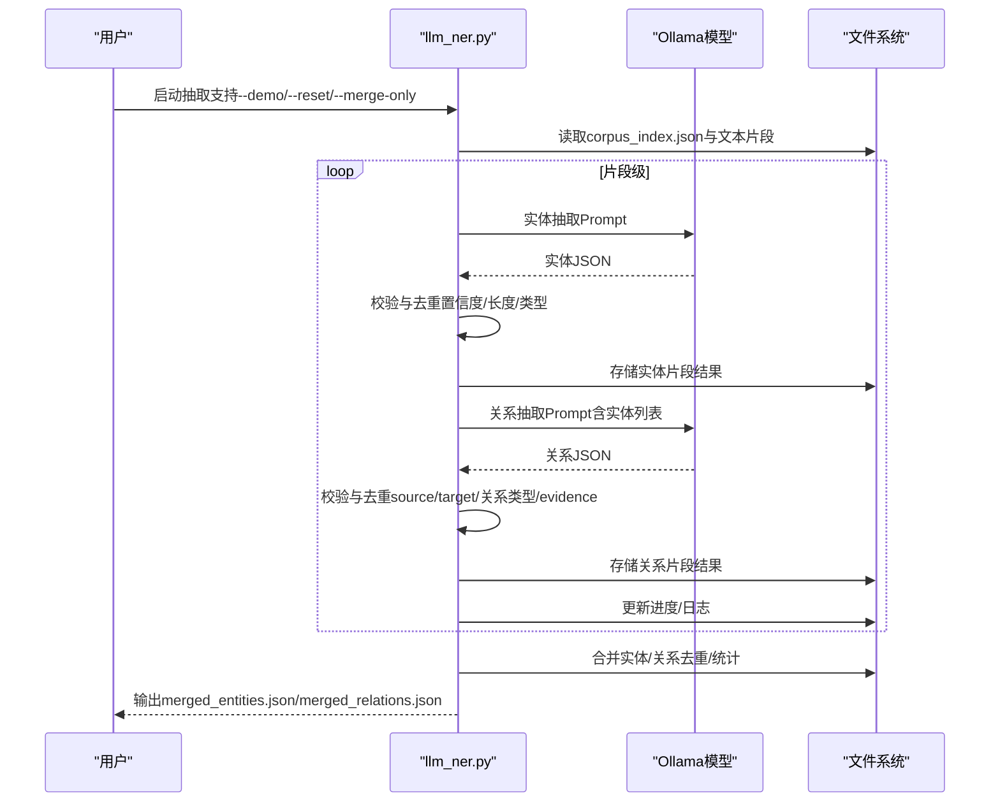
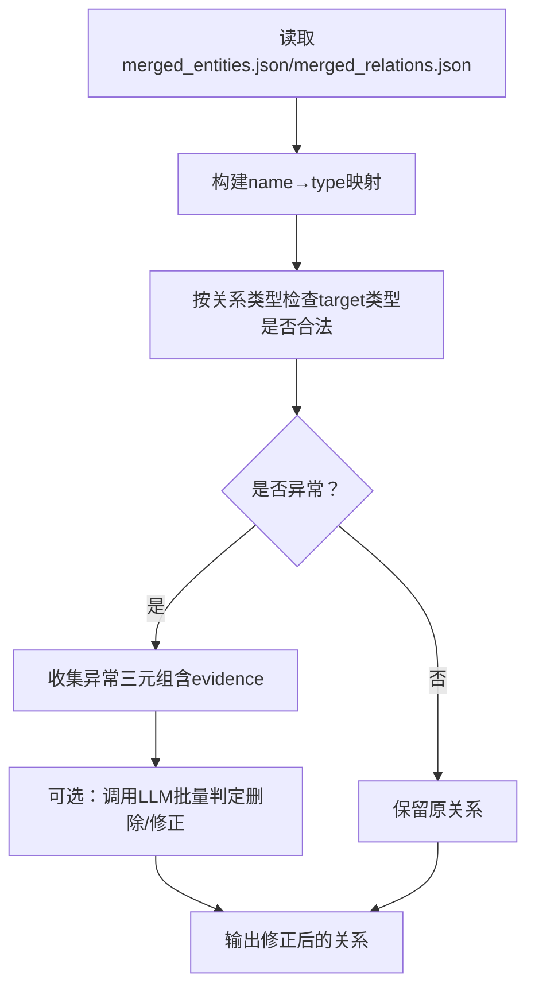
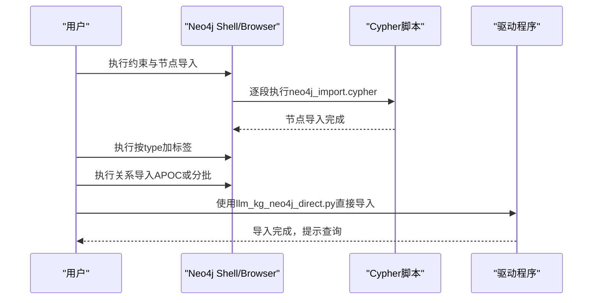
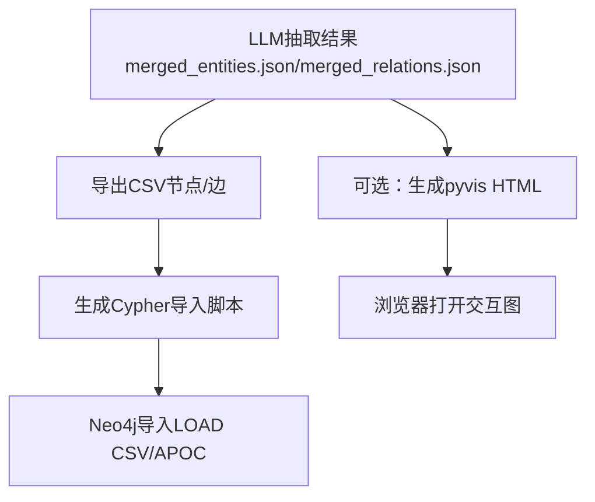
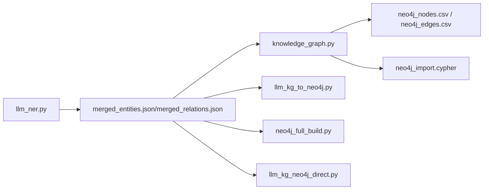

# 知识图谱构建

<cite>
**本文引用的文件**   
- [README.md](file://README.md)
- [knowledge_graph.py](file://code/visualization/knowledge_graph.py)
- [llm_kg_to_neo4j.py](file://code/data_processing/llm_kg_to_neo4j.py)
- [llm_ner.py](file://code/data_processing/llm_ner.py)
- [llm_relation_compliance.py](file://code/data_processing/llm_relation_compliance.py)
- [check_relation_semantics.py](file://code/visualization/check_relation_semantics.py)
- [neo4j_full_build.py](file://code/visualization/neo4j_full_build.py)
- [llm_kg_neo4j_direct.py](file://code/visualization/llm_kg_neo4j_direct.py)
- [culture_entities.json](file://data/database/culture_entities.json)
- [culture_relations.json](file://data/database/culture_relations.json)
- [cultural_anchors.json](file://data/database/cultural_anchors.json)
- [neo4j_import.cypher](file://output/neo4j/neo4j_import.cypher)
- [browser_统计与查看.cypher](file://output/neo4j/browser_统计与查看.cypher)
- [neo4j_llm_nodes.csv](file://output/neo4j/neo4j_llm_nodes.csv)
- [neo4j_llm_edges.csv](file://output/neo4j/neo4j_llm_edges.csv)
</cite>

## 目录
1. [简介](#简介)
2. [项目结构](#项目结构)
3. [核心组件](#核心组件)
4. [架构总览](#架构总览)
5. [详细组件分析](#详细组件分析)
6. [依赖分析](#依赖分析)
7. [性能考虑](#性能考虑)
8. [故障排查指南](#故障排查指南)
9. [结论](#结论)
10. [附录](#附录)

## 简介
本项目围绕佛山市南海区文旅融合主题，基于多源异构数据（典籍文本、POI、评论、GIS、非遗等）构建三层知识图谱：典籍文化层、文化载体锚点层、旅游产品层。通过实体抽取与关系抽取（LLM流水线）、关系合规校验、可视化与Neo4j导入，形成可查询、可验证、可扩展的知识网络，支撑文旅资源挖掘、可达性分析与体验度评估。

## 项目结构
项目采用“数据采集-数据处理-核心分析-可视化/导出”的分层组织方式，核心产出包括：
- 结构化数据：文化实体、共现关系、文化载体锚点、POI、非遗、GIS等
- 可视化图谱：三层结构的交互式图（ECharts/PyVis）
- Neo4j导入：CSV+Cypher脚本，支持约束、标签、关系导入与查询示例

图表来源
- [README.md:1-130](file://README.md#L1-L130)
- [knowledge_graph.py:1-903](file://code/visualization/knowledge_graph.py#L1-L903)
- [llm_ner.py:1-902](file://code/data_processing/llm_ner.py#L1-L902)
- [llm_relation_compliance.py:1-290](file://code/data_processing/llm_relation_compliance.py#L1-L290)

章节来源
- [README.md:1-130](file://README.md#L1-L130)

## 核心组件
- 三层知识图谱构建器：以文化载体锚点为核心，连接典籍文化实体与旅游产品节点，构建跨层关系网络
- LLM实体/关系抽取：定义11类实体与15类关系，支持多重关系、证据抽取与置信度
- 关系合规校验：规则筛+LLM判定，修正或删除不合规关系
- Neo4j导入与可视化：CSV+Cypher脚本，约束与标签设置，查询示例与统计脚本

章节来源
- [knowledge_graph.py:1-903](file://code/visualization/knowledge_graph.py#L1-L903)
- [llm_ner.py:1-902](file://code/data_processing/llm_ner.py#L1-L902)
- [llm_relation_compliance.py:1-290](file://code/data_processing/llm_relation_compliance.py#L1-L290)

## 架构总览
三层结构设计与关系映射如下：

图表来源
- [knowledge_graph.py:12-46](file://code/visualization/knowledge_graph.py#L12-L46)

章节来源
- [knowledge_graph.py:12-46](file://code/visualization/knowledge_graph.py#L12-L46)

## 详细组件分析

### 三层知识图谱构建器
- 节点选择策略：锚点全量、文化实体TOP100、POI优先关联锚点、非遗全量、镇街固定
- 关系构建（10类语义关系）：
  1) 典籍记载：实体↔锚点（文本共现）
  2) 关联人物：人物→以其命名的锚点/POI
  3) 文化承载：POI→关联的非遗项目
  4) 对应景点：锚点→空间匹配的POI
  5) 传承于：非遗→所在镇街
  6) 位于：锚点/POI→所属镇街
  7) 同时代：相同朝代的锚点之间
  8) 同门类：相同文化大类的锚点/非遗之间
  9) 共现关联：NER共现关系（两端均为文化实体）
  10) 文化关联：文化要素实体→对应非遗项目
- 权重与可视化：节点size/weight、边weight、类型颜色、分层标签

图表来源
- [knowledge_graph.py:104-337](file://code/visualization/knowledge_graph.py#L104-L337)

章节来源
- [knowledge_graph.py:75-337](file://code/visualization/knowledge_graph.py#L75-L337)

### LLM实体/关系抽取（11类实体、15类关系）
- 实体体系：非遗体系、文物体系、传承主体、空间载体、文献记忆、历史时序
- 关系体系：创建修建、出生于、活动于、著有、位于、始建于、承载文化、传承于、记载于、属于时期、发生于、盛产、关联人物、同族、同类
- 流程：文本分片→实体抽取→关系抽取→断点续跑→合并去重→多重关系保留
- 质量控制：置信度阈值、锚点优先、证据抽取、批量日志

图表来源
- [llm_ner.py:517-694](file://code/data_processing/llm_ner.py#L517-L694)

章节来源
- [llm_ner.py:90-111](file://code/data_processing/llm_ner.py#L90-L111)
- [llm_ner.py:320-421](file://code/data_processing/llm_ner.py#L320-L421)
- [llm_ner.py:696-799](file://code/data_processing/llm_ner.py#L696-L799)

### 关系合规校验与语义检查
- 规则筛：按关系类型限定目标实体类型（如“活动于”应指向地点/朝代/建筑）
- LLM判定：对可疑关系给出删除或修正建议（修改target或relation）
- 语义检查脚本：输出关系语义异常清单，辅助人工审核

图表来源
- [llm_relation_compliance.py:96-286](file://code/data_processing/llm_relation_compliance.py#L96-L286)
- [check_relation_semantics.py:18-91](file://code/visualization/check_relation_semantics.py#L18-L91)

章节来源
- [llm_relation_compliance.py:195-286](file://code/data_processing/llm_relation_compliance.py#L195-L286)
- [check_relation_semantics.py:39-91](file://code/visualization/check_relation_semantics.py#L39-L91)

### Neo4j导入与查询
- 导入流程：约束→LOAD CSV导入节点→按type加标签→LOAD CSV导入关系（APOC或按关系类型分批）
- 直接驱动导入：无需import目录，直接通过驱动批量写入
- 查询示例：统计、度分布、按关系类型查看、异常关系核对

图表来源
- [neo4j_import.cypher:1-119](file://output/neo4j/neo4j_import.cypher#L1-L119)
- [llm_kg_neo4j_direct.py:33-97](file://code/visualization/llm_kg_neo4j_direct.py#L33-L97)

章节来源
- [neo4j_import.cypher:1-119](file://output/neo4j/neo4j_import.cypher#L1-L119)
- [llm_kg_neo4j_direct.py:33-97](file://code/visualization/llm_kg_neo4j_direct.py#L33-L97)
- [browser_统计与查看.cypher:1-57](file://output/neo4j/browser_统计与查看.cypher#L1-L57)

### LLM抽取到Neo4j的转换与可视化
- 将LLM抽取结果导出为Neo4j兼容的CSV与Cypher
- 生成浏览器可直接打开的交互式HTML（可选）

图表来源
- [llm_kg_to_neo4j.py:54-153](file://code/data_processing/llm_kg_to_neo4j.py#L54-L153)

章节来源
- [llm_kg_to_neo4j.py:54-153](file://code/data_processing/llm_kg_to_neo4j.py#L54-L153)

## 依赖分析
- 数据依赖：文化实体/关系、文化载体锚点、POI、非遗、GIS、评论
- 处理依赖：LLM抽取（Ollama/Qwen系列）、Neo4j驱动、pyvis、tqdm
- 导出依赖：CSV、Cypher脚本、ECharts/vis.js

图表来源
- [llm_ner.py:696-799](file://code/data_processing/llm_ner.py#L696-L799)
- [knowledge_graph.py:717-800](file://code/visualization/knowledge_graph.py#L717-L800)
- [llm_kg_to_neo4j.py:54-153](file://code/data_processing/llm_kg_to_neo4j.py#L54-L153)
- [neo4j_full_build.py:44-201](file://code/visualization/neo4j_full_build.py#L44-L201)
- [llm_kg_neo4j_direct.py:33-97](file://code/visualization/llm_kg_neo4j_direct.py#L33-L97)

章节来源
- [llm_ner.py:696-799](file://code/data_processing/llm_ner.py#L696-L799)
- [knowledge_graph.py:717-800](file://code/visualization/knowledge_graph.py#L717-L800)

## 性能考虑
- 实体/关系合并：按name聚合、去重、统计多重关系，降低重复存储与查询成本
- 导入批处理：Neo4j导入采用批量参数化写入，减少事务开销
- 约束与标签：唯一约束（id/name）、按type动态加标签，提升查询效率
- 可视化优化：节点size/weight、边宽度与透明度、力引导布局参数调优
- LLM并发：支持单线程/多线程抽取，断点续跑减少重复计算

## 故障排查指南
- LLM抽取失败：检查Ollama服务状态、模型名称、分片大小与重试机制
- 关系语义异常：使用语义检查脚本定位“活动于”等关系终点类型错误
- Neo4j导入问题：确认约束、节点/边CSV格式、APOC插件可用性；或按关系类型分批导入
- 可视化空白：确认浏览器加载ECharts/vis.js资源路径，检查节点/边数量上限

章节来源
- [check_relation_semantics.py:39-91](file://code/visualization/check_relation_semantics.py#L39-L91)
- [browser_统计与查看.cypher:1-57](file://output/neo4j/browser_统计与查看.cypher#L1-L57)
- [llm_kg_neo4j_direct.py:33-97](file://code/visualization/llm_kg_neo4j_direct.py#L33-L97)

## 结论
本项目通过三层知识图谱构建、LLM驱动的实体/关系抽取与合规校验、Neo4j导入与可视化，形成了可扩展、可验证、可查询的知识网络。建议在后续工作中完善数据源覆盖、引入图算法进行可达性分析与体验度评估，并持续优化关系权重与查询性能。

## 附录
- 数据样例：文化实体/关系、文化载体锚点、LLM抽取CSV
- 导入脚本：neo4j_import.cypher、browser_统计与查看.cypher
- 可视化：knowledge_graph.html、knowledge_graph_llm.html

章节来源
- [culture_entities.json:1-200](file://data/database/culture_entities.json#L1-L200)
- [culture_relations.json:1-200](file://data/database/culture_relations.json#L1-L200)
- [cultural_anchors.json:1-200](file://data/database/cultural_anchors.json#L1-L200)
- [neo4j_llm_nodes.csv:1-200](file://output/neo4j/neo4j_llm_nodes.csv#L1-L200)
- [neo4j_llm_edges.csv:1-200](file://output/neo4j/neo4j_llm_edges.csv#L1-L200)