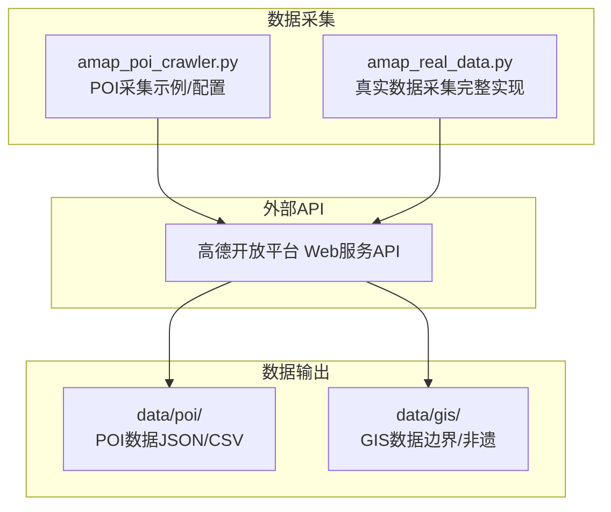
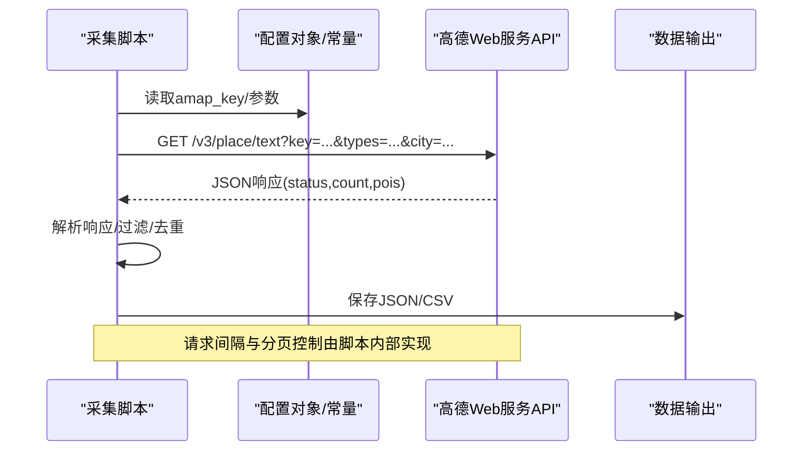
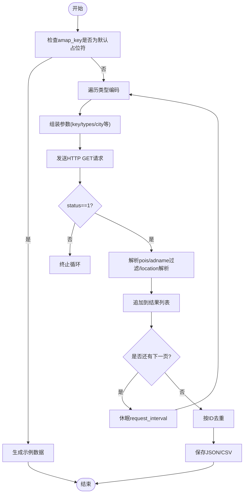
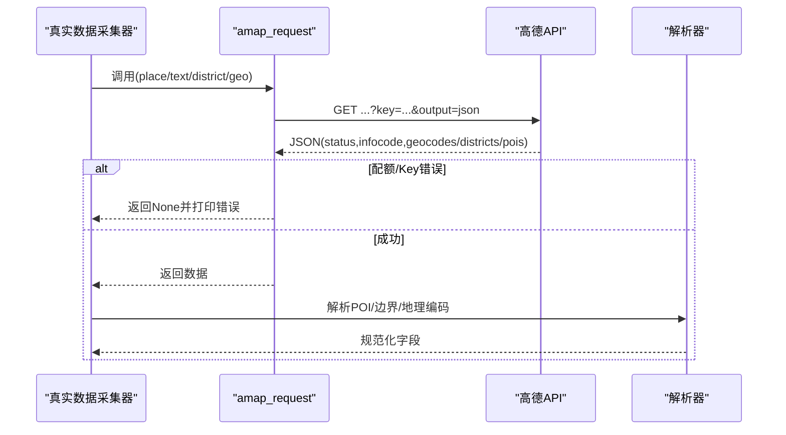
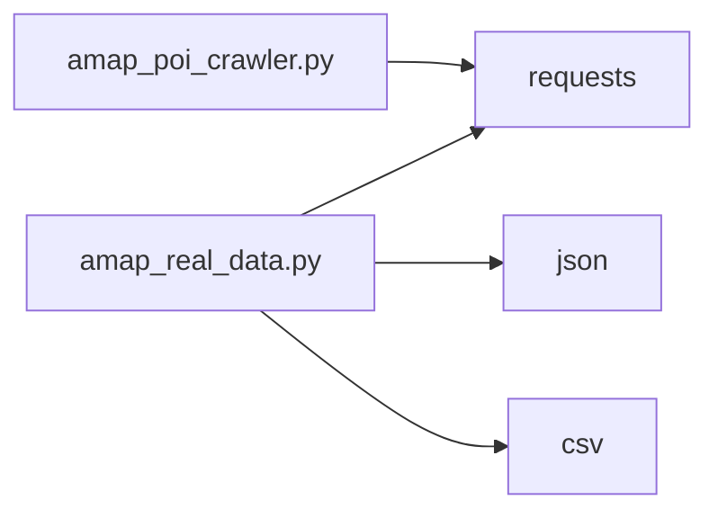

# API集成配置

<cite>
**本文档引用的文件**
- [amap_poi_crawler.py](file://code/data_collection/amap_poi_crawler.py)
- [amap_real_data.py](file://code/data_collection/amap_real_data.py)
- [README.md](file://README.md)
- [需求文档_数据补充清单.md](file://需求文档_数据补充清单.md)
</cite>

## 目录
1. [简介](#简介)
2. [项目结构](#项目结构)
3. [核心组件](#核心组件)
4. [架构总览](#架构总览)
5. [详细组件分析](#详细组件分析)
6. [依赖分析](#依赖分析)
7. [性能考虑](#性能考虑)
8. [故障排除指南](#故障排除指南)
9. [结论](#结论)
10. [附录](#附录)

## 简介
本文件面向API集成配置，聚焦高德地图Web API的申请、配置与使用限制，结合仓库中的高德POI采集脚本，系统阐述API密钥安全管理、请求频率控制、错误处理机制，并提供完整的配置示例、环境变量设置与API调用参数说明。同时给出常见API错误的诊断与解决方案，涵盖配额限制、签名验证与网络超时等问题。

## 项目结构
本项目围绕“佛山市南海区文旅融合”主题，包含数据采集、处理、分析与可视化模块。与高德API集成相关的核心文件位于 data_collection 目录，分别实现POI采集与真实数据采集两类能力。

图表来源
- [amap_poi_crawler.py:1-343](file://code/data_collection/amap_poi_crawler.py#L1-L343)
- [amap_real_data.py:1-565](file://code/data_collection/amap_real_data.py#L1-L565)

章节来源
- [README.md:1-130](file://README.md#L1-L130)

## 核心组件
- 高德POI采集器（示例/配置）
  - 功能：按类型编码与关键词检索POI，支持分页与去重，输出JSON/CSV。
  - 关键点：内置默认配置，包含API Key占位符；若未配置则生成示例数据。
- 高德真实数据采集器（完整实现）
  - 功能：POI采集、行政区划边界获取、非遗项目地理编码。
  - 关键点：集中式请求封装与错误处理，包含配额/Key校验分支。

章节来源
- [amap_poi_crawler.py:21-48](file://code/data_collection/amap_poi_crawler.py#L21-L48)
- [amap_poi_crawler.py:229-266](file://code/data_collection/amap_poi_crawler.py#L229-L266)
- [amap_real_data.py:47-126](file://code/data_collection/amap_real_data.py#L47-L126)
- [amap_real_data.py:253-303](file://code/data_collection/amap_real_data.py#L253-L303)

## 架构总览
高德API集成采用“配置驱动 + 请求封装 + 错误处理”的模式，统一在脚本内完成API Key注入、参数组装、请求发送与响应解析。

图表来源
- [amap_poi_crawler.py:56-118](file://code/data_collection/amap_poi_crawler.py#L56-L118)
- [amap_real_data.py:105-126](file://code/data_collection/amap_real_data.py#L105-L126)

## 详细组件分析

### 组件A：高德POI采集器（示例/配置）
- 配置项
  - amap_key：高德Web API Key（默认占位符）
  - city/district：默认城市与区县过滤
  - search_types：类型编码与标签映射
  - keyword_searches：关键词集合
  - request_interval/page_size：请求间隔与分页大小
- 关键流程
  - 参数组装：key、types/keywords、city、citylimit、offset、page、extensions、output
  - 请求发送：GET https://restapi.amap.com/v3/place/text，超时10秒
  - 响应解析：status判断、pois提取、adname过滤、location解析
  - 去重与保存：按高德ID去重，输出JSON/CSV
- 安全与环境变量
  - 当前实现直接在脚本内硬编码或使用默认占位符，未使用环境变量读取。
  - 建议迁移到环境变量读取以避免密钥泄露风险。

图表来源
- [amap_poi_crawler.py:229-266](file://code/data_collection/amap_poi_crawler.py#L229-L266)
- [amap_poi_crawler.py:56-118](file://code/data_collection/amap_poi_crawler.py#L56-L118)

章节来源
- [amap_poi_crawler.py:21-48](file://code/data_collection/amap_poi_crawler.py#L21-L48)
- [amap_poi_crawler.py:56-118](file://code/data_collection/amap_poi_crawler.py#L56-L118)
- [amap_poi_crawler.py:189-201](file://code/data_collection/amap_poi_crawler.py#L189-L201)
- [amap_poi_crawler.py:203-226](file://code/data_collection/amap_poi_crawler.py#L203-L226)
- [amap_poi_crawler.py:229-266](file://code/data_collection/amap_poi_crawler.py#L229-L266)

### 组件B：高德真实数据采集器（完整实现）
- 集中式请求封装
  - amap_request：统一注入key与output，带重试逻辑；根据infocode区分Key无效与日配额上限等错误
- 多API场景
  - POI文本检索：/v3/place/text
  - 行政区划查询：/v3/config/district
  - 地理编码：/v3/geocode/geo
- 错误处理与配额控制
  - infocode=10003：日调用量上限，提示“请明天再试或升级配额”
  - infocode=10001：Key无效，提示“请检查Key是否正确”
  - 通用异常捕获与指数回退等待
- 数据处理
  - POI解析：location拆分、biz_ext安全访问、照片URL截取
  - 边界解析：polyline转GeoJSON
  - 非遗编码：优先地理编码，失败回退POI搜索

图表来源
- [amap_real_data.py:105-126](file://code/data_collection/amap_real_data.py#L105-L126)
- [amap_real_data.py:133-166](file://code/data_collection/amap_real_data.py#L133-L166)
- [amap_real_data.py:310-423](file://code/data_collection/amap_real_data.py#L310-L423)
- [amap_real_data.py:451-543](file://code/data_collection/amap_real_data.py#L451-L543)

章节来源
- [amap_real_data.py:47-126](file://code/data_collection/amap_real_data.py#L47-L126)
- [amap_real_data.py:105-126](file://code/data_collection/amap_real_data.py#L105-L126)
- [amap_real_data.py:133-166](file://code/data_collection/amap_real_data.py#L133-L166)
- [amap_real_data.py:310-423](file://code/data_collection/amap_real_data.py#L310-L423)
- [amap_real_data.py:451-543](file://code/data_collection/amap_real_data.py#L451-L543)

### 组件C：API调用参数说明
- 通用参数
  - key：高德Web API Key
  - output：固定为json
  - extensions：可选all/base，用于获取扩展信息
  - city/citylimit：限定城市与仅返回限定城市范围
  - offset/page：分页参数
- POI文本检索
  - types：类型编码（如110000）
  - keywords：关键词（与types可同时使用）
- 行政区划查询
  - keywords：区/镇名称或adcode
  - subdistrict：1=返回区级+下辖街道，0=仅返回区级
  - extensions：all
- 地理编码
  - address：完整地址字符串（含区县）
  - city：城市

章节来源
- [amap_poi_crawler.py:56-66](file://code/data_collection/amap_poi_crawler.py#L56-L66)
- [amap_poi_crawler.py:126-136](file://code/data_collection/amap_poi_crawler.py#L126-L136)
- [amap_real_data.py:138-145](file://code/data_collection/amap_real_data.py#L138-L145)
- [amap_real_data.py:317-321](file://code/data_collection/amap_real_data.py#L317-L321)
- [amap_real_data.py:467-470](file://code/data_collection/amap_real_data.py#L467-L470)

## 依赖分析
- 组件耦合
  - amap_poi_crawler.py：低耦合，独立脚本，便于演示与配置
  - amap_real_data.py：高内聚，统一封装请求与错误处理，适合生产使用
- 外部依赖
  - requests：HTTP客户端
  - json/csv：数据序列化与导出
- 潜在风险
  - 硬编码API Key：存在泄露风险
  - 缺乏统一的环境变量配置：不利于CI/CD与多环境部署

图表来源
- [amap_poi_crawler.py:11-16](file://code/data_collection/amap_poi_crawler.py#L11-L16)
- [amap_real_data.py:41-45](file://code/data_collection/amap_real_data.py#L41-L45)

章节来源
- [amap_poi_crawler.py:11-16](file://code/data_collection/amap_poi_crawler.py#L11-L16)
- [amap_real_data.py:41-45](file://code/data_collection/amap_real_data.py#L41-L45)

## 性能考虑
- 请求频率控制
  - 示例脚本：每轮请求后sleep request_interval（默认0.3秒）
  - 真实脚本：同理，避免触发限流
- 分页与总量
  - 示例脚本：page_size=25，按count与page*offset判断是否继续
  - 真实脚本：POI分页最多20页，关键词搜索最多10页
- 超时设置
  - 示例脚本：timeout=10秒
  - 真实脚本：timeout=15秒
- 建议
  - 在高并发或多脚本场景下，建议引入令牌桶/漏桶限流与指数退避
  - 对热点区域/关键词增加缓存层，减少重复请求

章节来源
- [amap_poi_crawler.py:46-48](file://code/data_collection/amap_poi_crawler.py#L46-L48)
- [amap_poi_crawler.py:112-118](file://code/data_collection/amap_poi_crawler.py#L112-L118)
- [amap_poi_crawler.py:180-184](file://code/data_collection/amap_poi_crawler.py#L180-L184)
- [amap_real_data.py:16-18](file://code/data_collection/amap_real_data.py#L16-L18)
- [amap_real_data.py:164-165](file://code/data_collection/amap_real_data.py#L164-L165)
- [amap_real_data.py:198-199](file://code/data_collection/amap_real_data.py#L198-L199)

## 故障排除指南
- 配额限制（日调用量上限）
  - 现象：infocode=10003，提示“日调用量已达上限”
  - 处理：等待次日或升级套餐；优化分页与关键词策略
- Key无效
  - 现象：infocode=10001，提示“Key无效”
  - 处理：核对Key是否正确、是否启用相应服务；检查域名/IP白名单
- 网络超时/异常
  - 现象：请求异常或响应解析失败
  - 处理：增加重试次数与指数退避；检查网络与代理；调整timeout
- 响应状态异常
  - 现象：status!=1
  - 处理：记录info/infocode，定位具体原因；必要时降级或切换关键词
- 输出为空
  - 现象：pois为空或过滤后为空
  - 处理：扩大关键词/类型范围；放宽adname过滤；检查city/citylimit

章节来源
- [amap_real_data.py:117-122](file://code/data_collection/amap_real_data.py#L117-L122)
- [amap_real_data.py:123-126](file://code/data_collection/amap_real_data.py#L123-L126)
- [amap_poi_crawler.py:72-74](file://code/data_collection/amap_poi_crawler.py#L72-L74)
- [amap_poi_crawler.py:142-143](file://code/data_collection/amap_poi_crawler.py#L142-L143)

## 结论
本项目提供了高德API集成的两套实现：示例脚本强调配置与流程演示，真实脚本强调健壮性与错误处理。建议在生产环境中：
- 将API Key迁移到环境变量
- 引入统一的配置管理与日志
- 增加重试与限流策略
- 完善错误分类与告警机制

## 附录

### A. 高德API申请与配置步骤
- 申请地址：https://console.amap.com/dev/key/app
- 创建应用并获取Web服务API Key
- 在脚本中替换默认占位符或通过环境变量注入

章节来源
- [amap_poi_crawler.py:7-8](file://code/data_collection/amap_poi_crawler.py#L7-L8)
- [amap_poi_crawler.py:235-241](file://code/data_collection/amap_poi_crawler.py#L235-L241)

### B. 环境变量设置建议
- 推荐变量名
  - AMAP_KEY
- 设置方式
  - Windows：set AMAP_KEY=your_key_value
  - Linux/macOS：export AMAP_KEY=your_key_value
- 在脚本中读取
  - 从环境变量读取，若不存在则回落到默认占位符

章节来源
- [amap_poi_crawler.py:22-22](file://code/data_collection/amap_poi_crawler.py#L22-L22)
- [amap_real_data.py:47-47](file://code/data_collection/amap_real_data.py#L47-L47)

### C. API调用参数对照表
- 通用
  - key：高德Web API Key
  - output：json
  - extensions：all/base
  - city/citylimit：限定城市与范围
  - offset/page：分页
- POI文本检索
  - types：类型编码
  - keywords：关键词
- 行政区划查询
  - keywords：区/镇名称或adcode
  - subdistrict：1/0
  - extensions：all
- 地理编码
  - address：完整地址
  - city：城市

章节来源
- [amap_poi_crawler.py:56-66](file://code/data_collection/amap_poi_crawler.py#L56-L66)
- [amap_poi_crawler.py:126-136](file://code/data_collection/amap_poi_crawler.py#L126-L136)
- [amap_real_data.py:138-145](file://code/data_collection/amap_real_data.py#L138-L145)
- [amap_real_data.py:317-321](file://code/data_collection/amap_real_data.py#L317-L321)
- [amap_real_data.py:467-470](file://code/data_collection/amap_real_data.py#L467-L470)

### D. 常见错误与解决方案速查
- infocode=10003：日配额上限 → 等待/升级
- infocode=10001：Key无效 → 核对Key与服务
- 网络异常：重试+退避+超时调整
- 响应为空：扩大关键词/类型范围，放宽过滤条件

章节来源
- [amap_real_data.py:117-122](file://code/data_collection/amap_real_data.py#L117-L122)
- [amap_real_data.py:123-126](file://code/data_collection/amap_real_data.py#L123-L126)
- [amap_poi_crawler.py:72-74](file://code/data_collection/amap_poi_crawler.py#L72-L74)
- [amap_poi_crawler.py:142-143](file://code/data_collection/amap_poi_crawler.py#L142-L143)