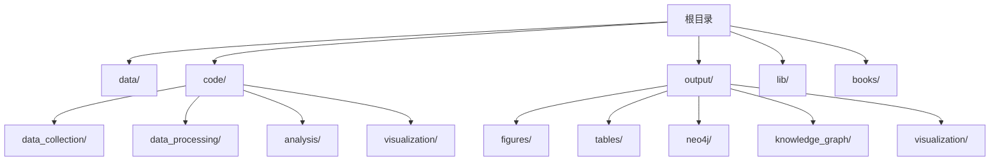
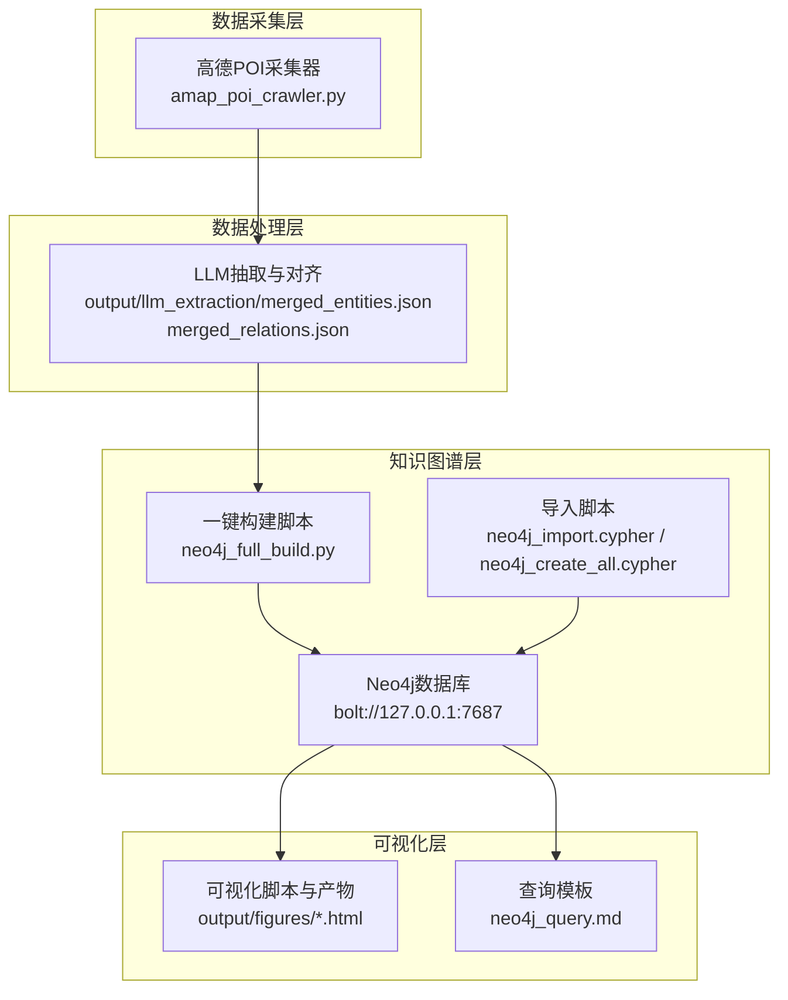
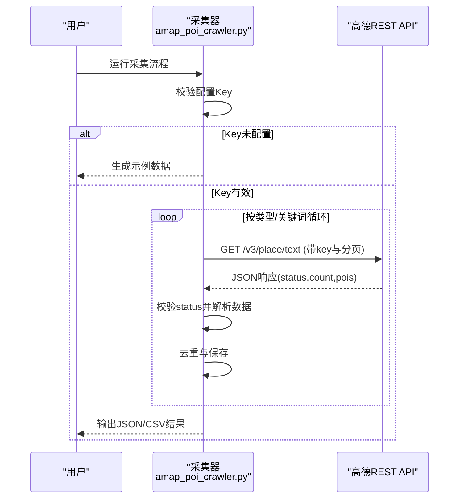
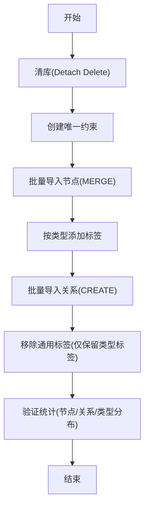
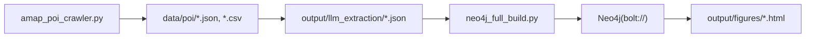

# 系统集成与部署

<cite>
**本文引用的文件**
- [README.md](file://README.md)
- [amap_poi_crawler.py](file://code/data_collection/amap_poi_crawler.py)
- [neo4j_full_build.py](file://code/visualization/neo4j_full_build.py)
- [neo4j_import.cypher](file://output/neo4j/neo4j_import.cypher)
- [neo4j_create_all.cypher](file://output/neo4j/neo4j_create_all.cypher)
- [neo4j_query.md](file://neo4j_query.md)
</cite>

## 目录
1. [简介](#简介)
2. [项目结构](#项目结构)
3. [核心组件](#核心组件)
4. [架构总览](#架构总览)
5. [详细组件分析](#详细组件分析)
6. [依赖分析](#依赖分析)
7. [性能考虑](#性能考虑)
8. [故障排除指南](#故障排除指南)
9. [结论](#结论)
10. [附录](#附录)

## 简介
本文件面向系统集成与部署，围绕以下目标展开：
- 高德地图API的集成配置、认证机制与调用限制说明
- 本地模型API的部署与配置建议（基于仓库现状的可行方案）
- Neo4j图数据库的安装、配置、性能优化与运维要点
- 环境变量设置、依赖版本管理与容器化部署思路
- 系统监控、日志记录与故障排除指南
- 生产环境部署最佳实践与安全注意事项

## 项目结构
项目采用模块化组织，数据采集、处理、分析与可视化分别位于独立目录，便于分阶段部署与扩展。

图表来源
- [README.md:1-130](file://README.md#L1-L130)

章节来源
- [README.md:1-130](file://README.md#L1-L130)

## 核心组件
- 高德POI采集器：负责从高德地图API拉取POI数据，并进行去重与导出。
- Neo4j构建器：负责将LLM抽取的实体与关系导入Neo4j，完成节点与关系的批量导入、标签规范化与清理。
- Neo4j查询与可视化：提供Cypher查询模板与可视化建议，支撑后续分析与前端展示。

章节来源
- [amap_poi_crawler.py:1-343](file://code/data_collection/amap_poi_crawler.py#L1-L343)
- [neo4j_full_build.py:1-204](file://code/visualization/neo4j_full_build.py#L1-L204)
- [neo4j_query.md:1-599](file://neo4j_query.md#L1-L599)

## 架构总览
系统由“数据采集-数据处理-知识图谱构建-可视化”四层组成，Neo4j作为知识存储与查询引擎，支持后续可视化与分析。

图表来源
- [amap_poi_crawler.py:1-343](file://code/data_collection/amap_poi_crawler.py#L1-L343)
- [neo4j_full_build.py:1-204](file://code/visualization/neo4j_full_build.py#L1-L204)
- [neo4j_import.cypher:1-119](file://output/neo4j/neo4j_import.cypher#L1-L119)
- [neo4j_create_all.cypher:1-800](file://output/neo4j/neo4j_create_all.cypher#L1-L800)
- [neo4j_query.md:1-599](file://neo4j_query.md#L1-L599)

## 详细组件分析

### 高德地图API集成与配置
- 配置项与认证
  - 配置项：在采集器中定义高德Web API Key、城市、区县、搜索类型与关键词集合、请求间隔与分页大小。
  - 认证方式：通过URL参数携带Key进行访问REST接口。
  - 示例路径：[CONFIG定义与请求参数构造:21-48](file://code/data_collection/amap_poi_crawler.py#L21-L48)
- 调用限制与速率控制
  - 仓库中未明确列出具体配额与QPS限制；实际使用时应参考高德开放平台官方文档。
  - 代码内置了请求间隔与分页参数，有助于降低限流风险。
  - 示例路径：[请求间隔与分页参数:46-48](file://code/data_collection/amap_poi_crawler.py#L46-L48)
- 错误处理与降级
  - 对API响应状态进行校验，遇到错误或异常时打印提示并终止当前批次。
  - 当未配置Key时，生成示例数据以便流程验证。
  - 示例路径：[状态校验与示例数据生成:68-76](file://code/data_collection/amap_poi_crawler.py#L68-L76), [示例数据生成:269-339](file://code/data_collection/amap_poi_crawler.py#L269-L339)

图表来源
- [amap_poi_crawler.py:229-267](file://code/data_collection/amap_poi_crawler.py#L229-L267)
- [amap_poi_crawler.py:51-118](file://code/data_collection/amap_poi_crawler.py#L51-L118)
- [amap_poi_crawler.py:121-186](file://code/data_collection/amap_poi_crawler.py#L121-L186)

章节来源
- [amap_poi_crawler.py:1-343](file://code/data_collection/amap_poi_crawler.py#L1-L343)

### 本地模型API部署与配置（基于仓库现状）
- 现状说明
  - 仓库中未发现本地模型API服务的实现或配置文件。
  - LLM抽取产物位于output/llm_extraction/，可作为Neo4j导入的数据源。
- 可行的部署建议（概念性）
  - 选择轻量推理框架（如OpenCV/DNN、TensorRT、ONNX Runtime等）适配现有模型。
  - 使用FastAPI/Flask提供REST接口，统一输入输出格式，便于与采集/处理流程对接。
  - 通过环境变量管理模型路径、设备与并发参数。
  - 与采集器解耦，采用消息队列或定时任务触发推理与入库。
- 与Neo4j集成
  - 将推理结果转换为实体与关系，走现有导入脚本或一键构建脚本导入Neo4j。

章节来源
- [neo4j_full_build.py:51-66](file://code/visualization/neo4j_full_build.py#L51-L66)

### Neo4j图数据库安装、配置与性能优化
- 安装与启动
  - 使用默认端口 bolt://127.0.0.1:7687 连接，用户名与密码在构建脚本中硬编码。
  - 建议在生产环境改为受控网络与专用账号。
  - 示例路径：[连接参数与凭据:14-17](file://code/visualization/neo4j_full_build.py#L14-L17)
- 数据导入
  - 方式一：使用Cypher脚本（LOAD CSV）批量导入节点与关系。
    - 示例路径：[导入脚本（节点+关系）:7-35](file://output/neo4j/neo4j_import.cypher#L7-L35)
  - 方式二：使用一键构建脚本，自动清库、创建约束、批量导入、打标签与清理。
    - 示例路径：[一键构建流程:71-196](file://code/visualization/neo4j_full_build.py#L71-L196)
- 性能优化要点
  - 批量导入：分批提交（脚本中使用500为批次大小）。
  - 约束与索引：导入前创建唯一约束，避免重复与冲突。
  - 标签规范化：按类型添加标签，减少全量扫描。
  - 查询优化：遵循查询模板，优先使用标签过滤与属性匹配。
  - 示例路径：[批量导入与约束:87-84](file://code/visualization/neo4j_full_build.py#L87-L84), [标签规范化:122-132](file://code/visualization/neo4j_full_build.py#L122-L132)

图表来源
- [neo4j_full_build.py:71-196](file://code/visualization/neo4j_full_build.py#L71-L196)

章节来源
- [neo4j_import.cypher:1-119](file://output/neo4j/neo4j_import.cypher#L1-L119)
- [neo4j_create_all.cypher:1-800](file://output/neo4j/neo4j_create_all.cypher#L1-L800)
- [neo4j_full_build.py:1-204](file://code/visualization/neo4j_full_build.py#L1-L204)

### 环境变量设置与依赖版本管理
- Python依赖
  - 项目运行依赖jieba与requests，建议在requirements.txt中固定版本。
  - 示例路径：[依赖声明:83-87](file://README.md#L83-L87)
- 环境变量建议
  - 高德Key：AMAP_KEY
  - Neo4j连接：NEO4J_URI/NEO4J_USER/NEO4J_PASSWORD/NEO4J_DATABASE
  - 日志级别：LOG_LEVEL
  - 并发与批大小：BATCH_SIZE/WORKER_COUNT
- 版本管理
  - 使用pip-tools或Poetry锁定依赖版本，确保可复现性。
  - Docker镜像中固定Python与系统包版本，避免漂移。

章节来源
- [README.md:83-87](file://README.md#L83-L87)

### 容器化部署方案
- 基础镜像
  - Python 3.x基础镜像，安装系统依赖与Python包。
- 多阶段构建
  - 构建阶段：安装依赖与编译（如需要）。
  - 运行阶段：仅包含运行时依赖，减小镜像体积。
- 容器编排
  - 使用Compose编排采集器、Neo4j与可视化服务。
  - 通过卷挂载共享数据与配置，便于调试与升级。
- 安全加固
  - 以非root用户运行，最小权限原则。
  - 使用只读根文件系统与受限能力。
  - 通过Secrets注入敏感配置（如高德Key、Neo4j凭据）。

[本节为概念性内容，不直接分析具体文件]

## 依赖分析
- 组件耦合
  - 采集器与Neo4j构建器之间通过中间产物（JSON/CSV）解耦。
  - Neo4j构建器与导入脚本之间存在直接依赖（驱动与Cypher语法）。
- 外部依赖
  - 高德REST API：受配额与限流影响，需合理控制请求频率。
  - Neo4j驱动：Python驱动用于批量导入与查询。
- 循环依赖
  - 未发现循环依赖，整体呈单向数据流。

图表来源
- [amap_poi_crawler.py:203-226](file://code/data_collection/amap_poi_crawler.py#L203-L226)
- [neo4j_full_build.py:51-66](file://code/visualization/neo4j_full_build.py#L51-L66)

章节来源
- [amap_poi_crawler.py:1-343](file://code/data_collection/amap_poi_crawler.py#L1-L343)
- [neo4j_full_build.py:1-204](file://code/visualization/neo4j_full_build.py#L1-L204)

## 性能考虑
- 高德API
  - 控制请求间隔与分页大小，避免触发限流。
  - 对响应状态进行严格校验，失败重试与退避策略可选。
- Neo4j
  - 批量导入时使用MERGE与UNWIND，减少网络往返。
  - 导入前创建唯一约束，避免重复键冲突。
  - 合理设置内存参数与索引，平衡写入与查询性能。
- 可视化
  - HTML可视化文件较大时，建议启用懒加载与分页展示。

[本节提供通用指导，不直接分析具体文件]

## 故障排除指南
- 高德API相关
  - 现象：采集器提示API错误或异常。
  - 排查：检查Key是否正确、城市/区县参数是否匹配、网络连通性。
  - 降级：未配置Key时生成示例数据，继续验证流程。
  - 示例路径：[状态校验与异常处理:68-76](file://code/data_collection/amap_poi_crawler.py#L68-L76), [示例数据生成:269-339](file://code/data_collection/amap_poi_crawler.py#L269-L339)
- Neo4j导入相关
  - 现象：导入失败或重复键冲突。
  - 排查：确认唯一约束已创建、批次大小与参数正确、节点/关系命名一致。
  - 处理：使用一键构建脚本清库后重试。
  - 示例路径：[清库与约束:71-84](file://code/visualization/neo4j_full_build.py#L71-L84), [批量导入:87-170](file://code/visualization/neo4j_full_build.py#L87-L170)
- 查询与可视化
  - 现象：查询结果为空或标签无法识别。
  - 排查：确认标签已按类型添加、移除通用标签后按类型分色生效。
  - 参考：查询模板与使用规范。
  - 示例路径：[查询模板:1-599](file://neo4j_query.md#L1-L599)

章节来源
- [amap_poi_crawler.py:1-343](file://code/data_collection/amap_poi_crawler.py#L1-L343)
- [neo4j_full_build.py:1-204](file://code/visualization/neo4j_full_build.py#L1-L204)
- [neo4j_query.md:1-599](file://neo4j_query.md#L1-L599)

## 结论
本项目提供了完整的数据采集、处理与知识图谱构建流程，Neo4j作为核心存储与查询引擎，配合Cypher脚本与可视化产物，形成闭环。建议在生产环境中完善环境变量管理、容器化与安全加固，并结合实际业务场景扩展本地模型API与监控告警体系。

[本节为总结性内容，不直接分析具体文件]

## 附录
- 快速执行顺序（来自仓库说明）
  - 数据采集 → 数据处理 → 核心分析 → 可视化
  - 示例路径：[执行顺序:89-110](file://README.md#L89-L110)
- Neo4j查询模板与使用规范
  - 示例路径：[查询模板:1-599](file://neo4j_query.md#L1-L599)

章节来源
- [README.md:89-110](file://README.md#L89-L110)
- [neo4j_query.md:1-599](file://neo4j_query.md#L1-L599)