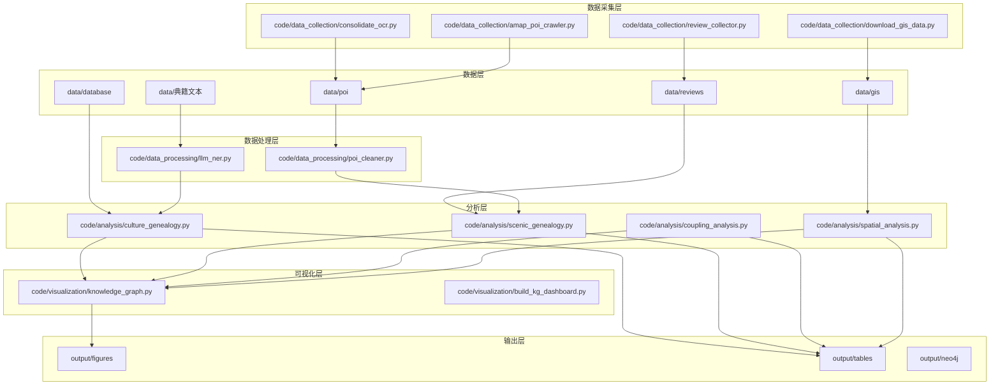
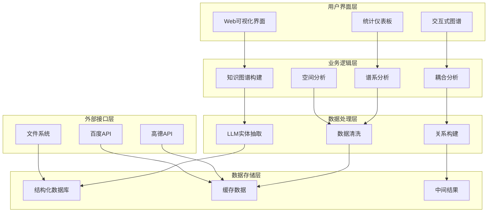
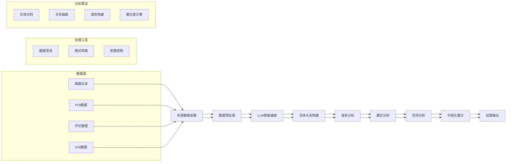
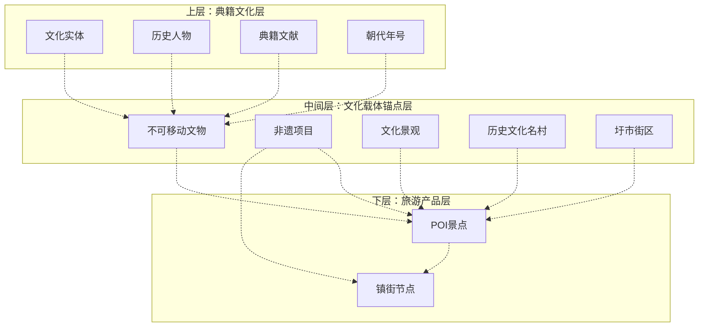
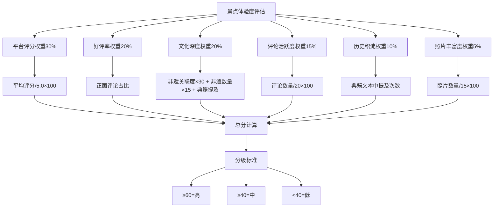
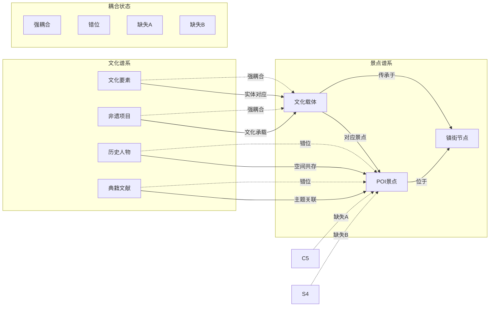
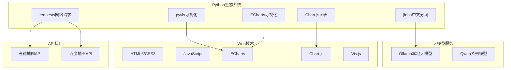
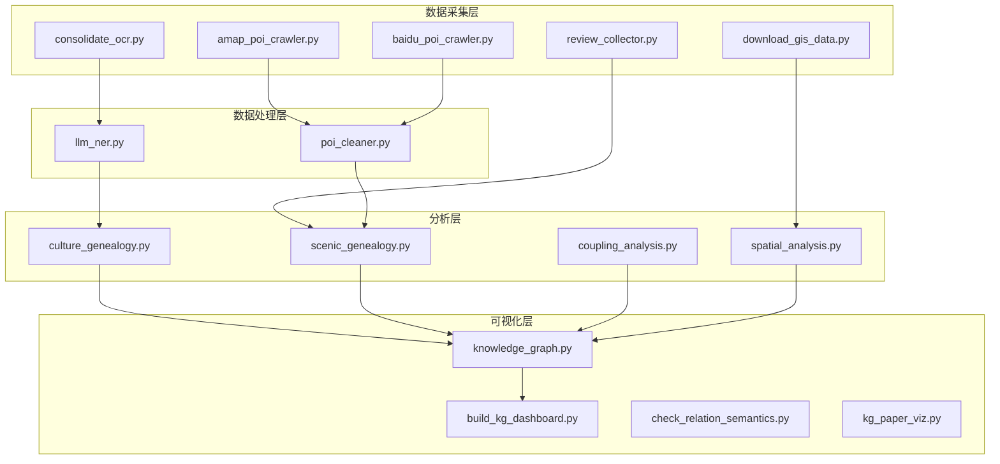

# 项目概述

<cite>
**本文档引用的文件**
- [README.md](file://README.md)
- [需求文档_数据补充清单.md](file://需求文档_数据补充清单.md)
- [amap_poi_crawler.py](file://code/data_collection/amap_poi_crawler.py)
- [baidu_poi_crawler.py](file://code/data_collection/baidu_poi_crawler.py)
- [llm_ner.py](file://code/data_processing/llm_ner.py)
- [culture_genealogy.py](file://code/analysis/culture_genealogy.py)
- [scenic_genealogy.py](file://code/analysis/scenic_genealogy.py)
- [coupling_analysis.py](file://code/analysis/coupling_analysis.py)
- [knowledge_graph.py](file://code/visualization/knowledge_graph.py)
- [build_kg_dashboard.py](file://code/visualization/build_kg_dashboard.py)
- [culture_entities.json](file://data/database/culture_entities.json)
- [coupling_results.json](file://data/database/coupling_results.json)
- [README_成果说明.md](file://output/README_成果说明.md)
</cite>

## 目录
1. [项目简介](#项目简介)
2. [项目结构](#项目结构)
3. [核心组件](#核心组件)
4. [架构概览](#架构概览)
5. [详细组件分析](#详细组件分析)
6. [依赖关系分析](#依赖关系分析)
7. [性能考虑](#性能考虑)
8. [故障排除指南](#故障排除指南)
9. [结论](#结论)
10. [附录](#附录)

## 项目简介

基于多元大数据的佛山市南海区文旅融合知识图谱项目是一个综合性文化旅游研究项目，旨在通过构建知识图谱来促进南海区文旅产业的深度融合。该项目运用现代信息技术手段，整合多源异构数据，建立文化资源与旅游产品之间的智能关联网络。

### 项目核心目标

项目致力于实现以下目标：
- **文化资源数字化**：将南海区丰富的文化资源进行系统化梳理和数字化呈现
- **旅游产品优化**：通过知识图谱分析，识别现有旅游产品的优势和不足
- **决策支持**：为政府部门和文旅企业提供科学的决策依据
- **文旅融合促进**：搭建文化传承与旅游开发的桥梁

### 技术创新点

1. **多源数据融合**：整合典籍文本、POI数据、评论数据、GIS数据等多种数据源
2. **智能实体抽取**：基于LLM的智能实体识别和关系抽取技术
3. **双谱系耦合分析**：同时分析文化谱系和景点谱系的匹配程度
4. **三层知识图谱**：构建典籍文化层、文化载体锚点层、旅游产品层的立体化知识网络

## 项目结构

项目采用模块化设计，按照数据采集、数据处理、核心分析、可视化展示的层次结构组织：

**图表来源**
- [README.md:3-79](file://README.md#L3-L79)

**章节来源**
- [README.md:1-130](file://README.md#L1-L130)

## 核心组件

### 数据采集组件

项目实现了完整的数据采集体系，涵盖多个数据源：

#### POI数据采集
- **高德地图POI采集**：支持按类型和关键词的双重检索机制
- **百度地图POI采集**：基于镇街中心点的空间范围搜索
- **评论数据采集**：整合多平台评论信息

#### 典籍文本处理
- **OCR文本整合**：处理扫描版典籍的OCR结果
- **文本质量控制**：建立文本质量评估和筛选机制

**章节来源**
- [amap_poi_crawler.py:1-343](file://code/data_collection/amap_poi_crawler.py#L1-L343)
- [baidu_poi_crawler.py:1-207](file://code/data_collection/baidu_poi_crawler.py#L1-L207)

### 数据处理组件

#### 智能实体抽取
- **LLM驱动的NER系统**：基于Qwen系列大模型的智能实体识别
- **多层次实体分类**：人物、地名、建筑、非遗、文献等11种类型
- **关系抽取**：识别实体间的15种语义关系

#### 数据清洗和标准化
- **POI数据清洗**：统一数据格式和质量标准
- **实体去重**：基于名称和地理位置的智能去重

**章节来源**
- [llm_ner.py:1-902](file://code/data_processing/llm_ner.py#L1-L902)

### 分析组件

#### 文化谱系构建
- **8大文化门类**：武术文化、饮食文化、建筑文化等
- **24个子类**：涵盖具体的非遗项目和文化要素
- **97个条目**：可追溯到具体非遗项目或典籍内容

#### 景点谱系分析
- **体验度评估模型**：六维加权评分系统
- **镇街分布分析**：识别文化资源的空间分布特征

#### 双谱系耦合分析
- **四种匹配类型**：实体对应、文化承载、空间共存、主题关联
- **四种耦合状态**：强耦合、错位、缺失A、缺失B

**章节来源**
- [culture_genealogy.py:1-395](file://code/analysis/culture_genealogy.py#L1-L395)
- [scenic_genealogy.py:1-375](file://code/analysis/scenic_genealogy.py#L1-L375)
- [coupling_analysis.py:1-400](file://code/analysis/coupling_analysis.py#L1-L400)

### 可视化组件

#### 交互式知识图谱
- **三层结构可视化**：文化载体锚点层、典籍文化层、旅游产品层
- **多关系展示**：支持10类语义关系的可视化
- **动态交互**：支持节点搜索、关系标签切换等功能

#### 统计仪表板
- **实体类型分布**：直观展示各类实体的数量和比例
- **关系类型统计**：分析关系的分布特征
- **子图预览**：提供知识图谱的局部视图

**章节来源**
- [knowledge_graph.py:1-903](file://code/visualization/knowledge_graph.py#L1-L903)
- [build_kg_dashboard.py:1-269](file://code/visualization/build_kg_dashboard.py#L1-L269)

## 架构概览

项目采用分层架构设计，确保各组件之间的松耦合和高内聚：

**图表来源**
- [knowledge_graph.py:104-337](file://code/visualization/knowledge_graph.py#L104-L337)

### 数据流设计

项目的数据流遵循"采集-处理-分析-可视化"的完整闭环：

**图表来源**
- [README.md:89-110](file://README.md#L89-L110)

## 详细组件分析

### 知识图谱构建组件

#### 三层结构设计

项目构建了独特的三层知识图谱结构：

**图表来源**
- [knowledge_graph.py:12-46](file://code/visualization/knowledge_graph.py#L12-L46)

#### 关系构建策略

项目建立了10类语义关系来连接不同层次的知识：

| 关系类型 | 连接方向 | 用途 | 示例 |
|---------|---------|------|------|
| 典籍记载 | 文化实体 ↔ 文化载体 | 历史关联 | 《南海县志》→ 西樵山 |
| 关联人物 | 人物 → 文化载体/景点 | 人物关联 | 康有为 → 康有为故居 |
| 文化承载 | 景点 → 非遗项目 | 文化传承 | 黄飞鸿纪念馆 → 咏春拳 |
| 对应景点 | 文化载体 → 景点 | 空间匹配 | 佛山祖庙 → 佛山祖庙 |
| 传承于 | 非遗 → 镇街 | 地域关联 | 九江双蒸 → 九江镇 |
| 位于 | 节点 → 镇街 | 空间归属 | 西樵山 → 西樵镇 |
| 同时代 | 文化载体 | 时间关联 | 清代建筑群 |
| 同门类 | 文化载体 | 类别关联 | 非遗项目分类 |
| 共现关联 | 文化实体 | 共现关系 | 人物与地点 |
| 文化关联 | 文化要素 → 非遗 | 功能关联 | 饮食文化 → 双蒸酒 |

**章节来源**
- [knowledge_graph.py:227-337](file://code/visualization/knowledge_graph.py#L227-L337)

### 景点体验度评估模型

项目开发了六维加权评分模型来评估景点的体验质量：

**图表来源**
- [scenic_genealogy.py:10-34](file://code/analysis/scenic_genealogy.py#L10-L34)

**章节来源**
- [scenic_genealogy.py:126-179](file://code/analysis/scenic_genealogy.py#L126-L179)

### 双谱系耦合分析

项目通过对比文化谱系和景点谱系来识别文旅融合的不同状态：

**图表来源**
- [coupling_analysis.py:11-37](file://code/analysis/coupling_analysis.py#L11-L37)

**章节来源**
- [coupling_analysis.py:106-146](file://code/analysis/coupling_analysis.py#L106-L146)

## 依赖关系分析

### 外部依赖

项目依赖以下关键技术栈：

**图表来源**
- [README.md:116-122](file://README.md#L116-L122)

### 内部模块依赖

项目内部模块之间存在清晰的依赖关系：

**图表来源**
- [README.md:45-63](file://README.md#L45-L63)

**章节来源**
- [README.md:83-110](file://README.md#L83-L110)

## 性能考虑

### 数据处理性能

项目在数据处理方面采用了多项优化策略：

1. **并行处理**：LLM实体抽取支持多线程并行处理
2. **断点续跑**：所有处理步骤都支持断点续跑，避免重复计算
3. **内存优化**：采用分块处理方式，避免大文件一次性加载
4. **缓存机制**：中间结果自动缓存，提高重复运行效率

### 可视化性能

知识图谱可视化采用了以下优化措施：

1. **节点选择策略**：根据重要性和权重选择性展示节点
2. **关系聚合**：对多重关系进行聚合展示
3. **动态加载**：支持按需加载和懒加载
4. **交互优化**：提供节点搜索、关系标签切换等交互功能

## 故障排除指南

### 常见问题及解决方案

#### API密钥配置问题
- **问题**：高德地图API调用失败
- **解决方案**：在配置文件中正确设置API Key

#### LLM模型连接问题
- **问题**：Ollama服务连接失败
- **解决方案**：确保Ollama服务正常运行，模型已正确加载

#### 数据质量问题
- **问题**：实体抽取结果不准确
- **解决方案**：检查输入文本质量，调整模型参数

#### 内存不足问题
- **问题**：处理大型数据集时内存溢出
- **解决方案**：分批处理数据，释放不必要的中间结果

**章节来源**
- [amap_poi_crawler.py:229-267](file://code/data_collection/amap_poi_crawler.py#L229-L267)

## 结论

基于多元大数据的佛山市南海区文旅融合知识图谱项目是一个技术先进、结构完整、应用价值显著的研究项目。项目通过构建知识图谱，有效促进了文化资源的数字化管理和旅游产品的优化升级。

### 主要成就

1. **技术架构完善**：建立了从数据采集到可视化展示的完整技术链路
2. **分析方法创新**：提出了双谱系耦合分析的新方法
3. **应用价值突出**：为政府决策和企业发展提供了有力支撑
4. **成果丰富多样**：形成了可视化的分析结果和统计数据

### 未来发展方向

1. **数据质量提升**：继续扩充高质量数据源
2. **算法优化**：改进实体抽取和关系识别的准确性
3. **功能扩展**：增加更多分析维度和预测功能
4. **应用推广**：将研究成果推广到更多地区和领域

## 附录

### 项目当前进展状态

项目已完成中期阶段的所有核心功能，包括：

- **数据采集**：完成多源数据的采集和整合
- **知识抽取**：实现基于LLM的智能实体和关系抽取
- **谱系分析**：构建文化谱系和景点谱系
- **耦合分析**：识别文旅融合的不同状态
- **可视化展示**：提供交互式的知识图谱展示

### 已完成的功能模块

1. **数据采集模块**：支持多源数据的自动化采集
2. **数据处理模块**：提供完整的数据清洗和标准化
3. **分析计算模块**：实现复杂的谱系分析和耦合分析
4. **可视化展示模块**：提供丰富的交互式可视化界面

### 后续发展规划

1. **数据补充**：继续扩充典籍文本和POI数据
2. **算法优化**：提升实体抽取的准确性和效率
3. **功能完善**：增加更多分析维度和预测功能
4. **应用拓展**：将项目成果应用于实际的文旅产业发展

**章节来源**
- [README.md:123-130](file://README.md#L123-L130)
- [需求文档_数据补充清单.md:126-157](file://需求文档_数据补充清单.md#L126-L157)