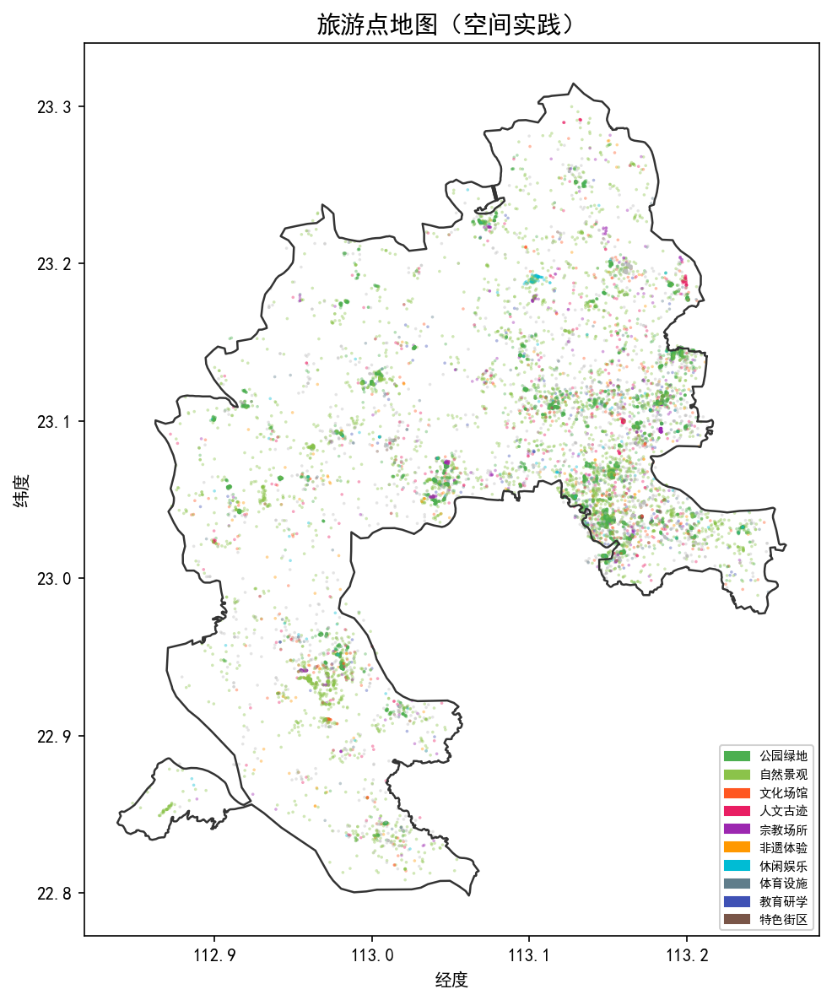
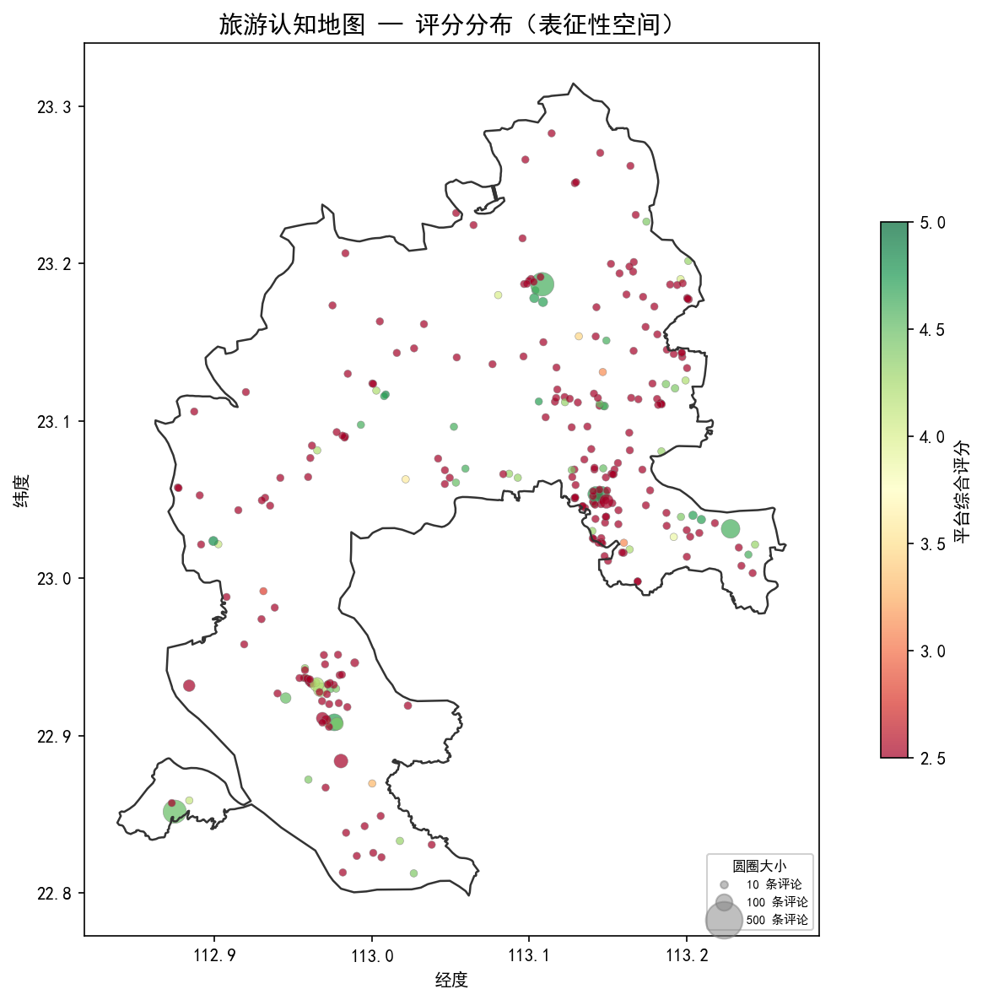
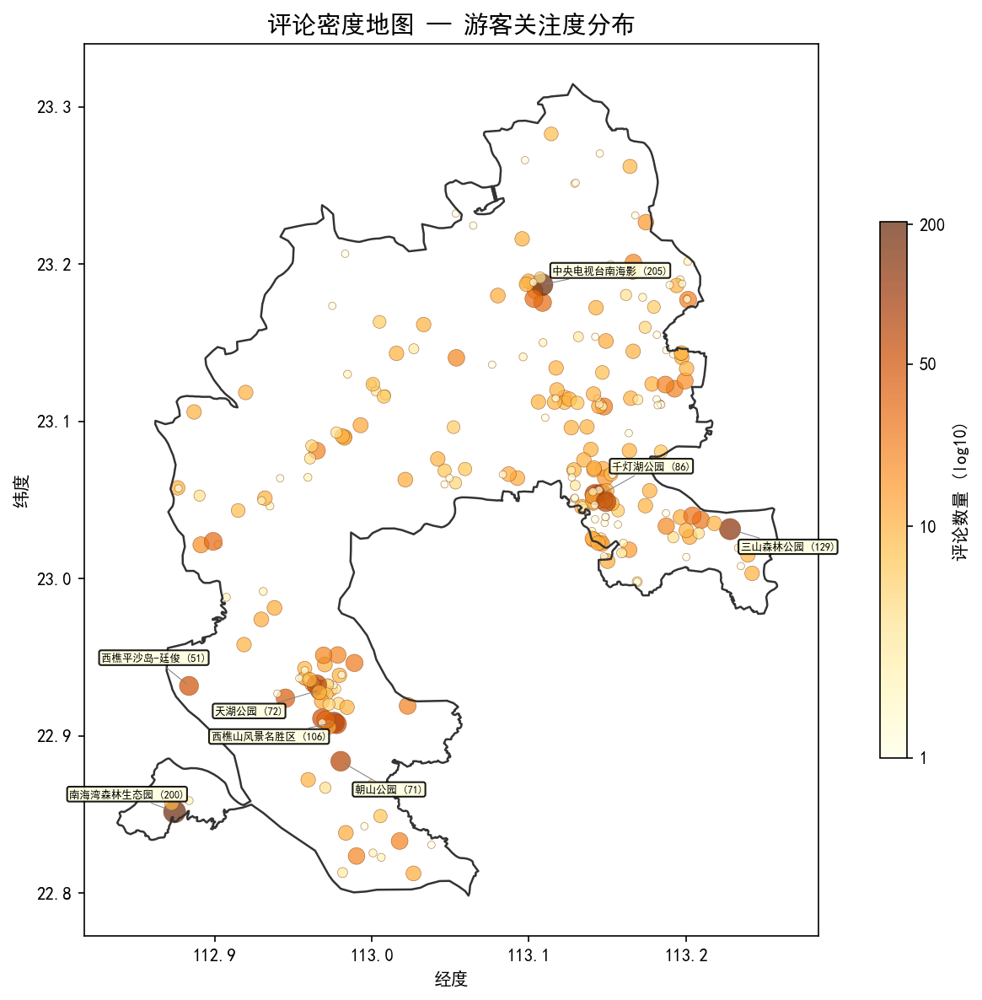
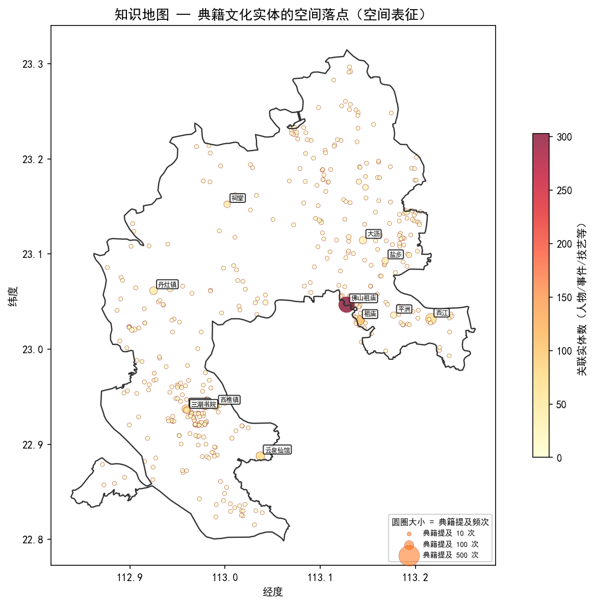

# 三张地图的空间数据构建

## 一、数据概况

本阶段围绕文旅融合潜力识别，完成了空间数据链路搭建，输出三张地图与一张评论密度图。

数据来源：POI（13512条）、知识图谱实体（8048个）与关系（19382条）、政府普查文化载体（165条）、游客评论汇总（265个有效POI）。

- 知识图谱实体空间定位率：575/2395 = **24.0%**
- 地点关系反向索引覆盖：**469个地名**
- 三层数据齐全的点位：**50个**

## 二、旅游点地图（空间实践）

呈现南海区 13512 个 POI 的类型分布，按十类业态着色，可直观看出**各镇街旅游资源密度差异**。

桂城、大沥、狮山三镇 POI 密度最高，文化场馆和人文古迹多集中在桂城—西樵一线。

## 三、旅游认知地图（表征性空间）

颜色 = 平台综合评分（2.5~5.0分），圆圈大小 = 评论数量。用于反映**游客实际感知与口碑评价的空间格局**。

整体评分中位数约 3.5 分，西樵山片区和南海湾周边评分较高（绿色），部分城区景点评分偏低（红色），暗示这些点位存在**体验提升的潜力空间**。

下图单独展示评论数量的空间分布（对数尺度），标注了评论量前 8 的 POI。评论集中在南海影视城（205条）、南海湾森林生态园（200条）、三山森林公园（129条）、西樵山（106条）等头部景区，多数 POI 评论不足 10 条，**关注度呈长尾分布**。

## 四、知识地图（空间表征）

来自典籍的文化实体经空间定位后落入地图。颜色 = 该地点关联的实体数（人物、事件、技艺等），圆圈大小 = 在典籍中被提及的频次。

佛山祖庙、南海城区、云泉仙馆周边关联实体最密集，康有为故居、松塘村等节点清晰可见。这些是**典籍文化资源与空间的对应关系**，为后续耦合分析提供了"文化侧"的空间基底。
