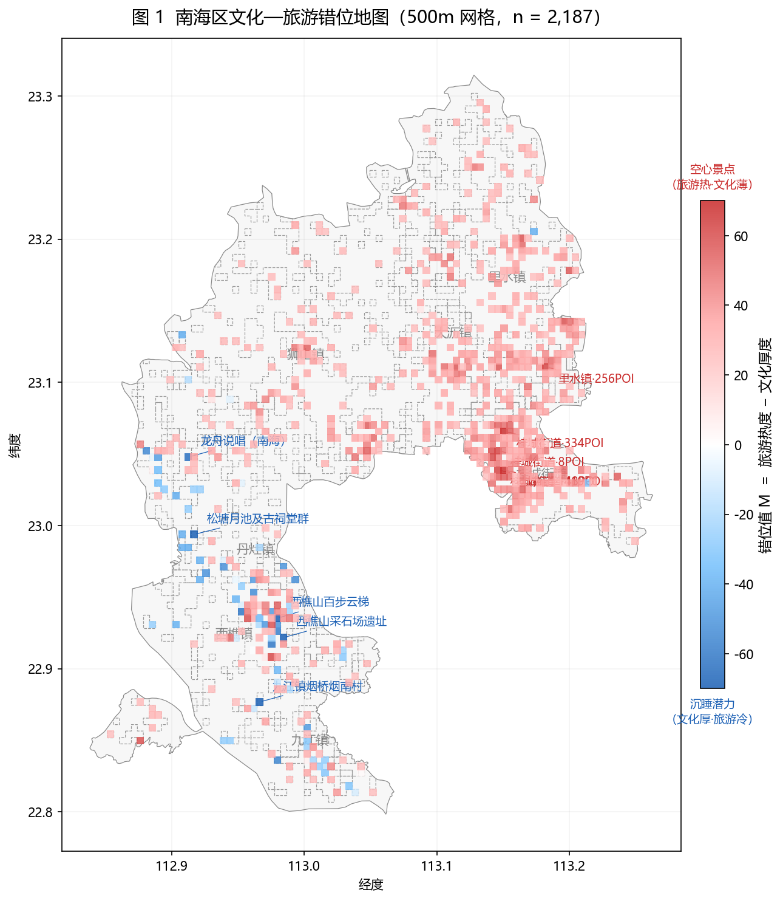
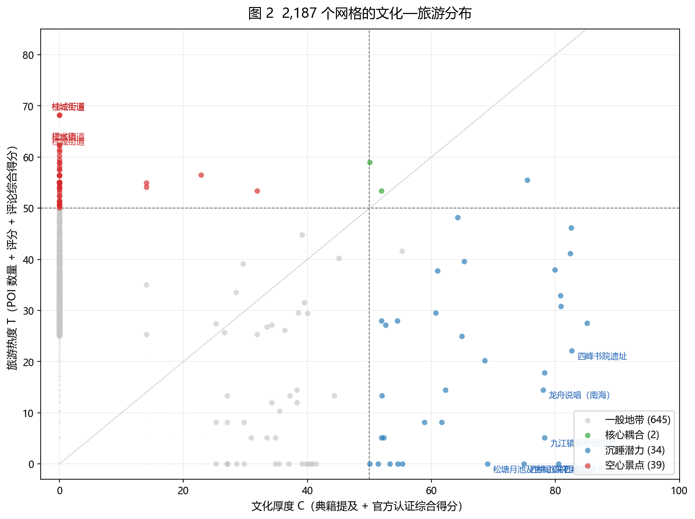
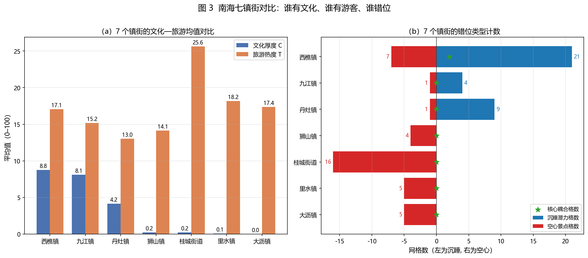
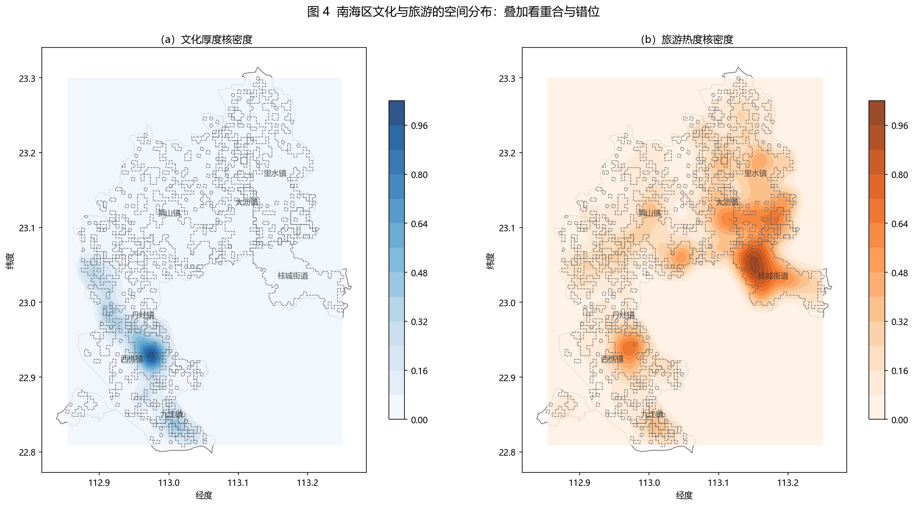
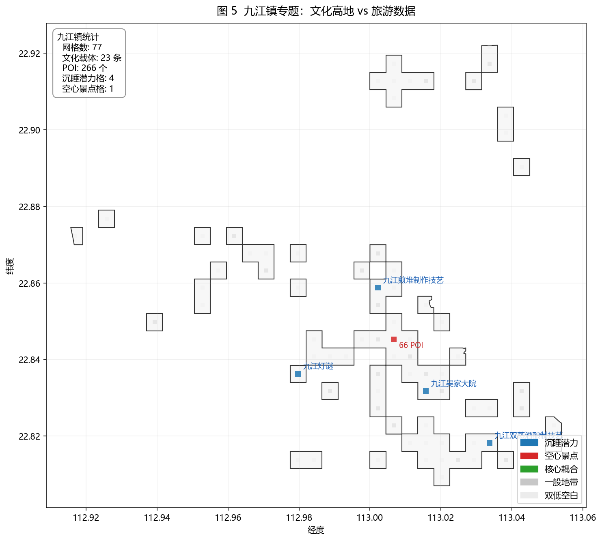

# 南海区文化载体与旅游热度的网格化错位分析

## 一、本阶段工作

针对 4.15 例会反馈的两点问题——样本量偏小、结论与常识差距不大——本阶段将分析单元由"文化载体"和"镇街"下沉到 500 m × 500 m 的空间网格，对南海区范围内的 2,187 个有效网格逐格计算文化厚度、旅游热度与两者的错位值，并据此输出 5 张核心图。

## 二、指标设计

三个指标的含义与计算方法如下表。所有原始量纲不同的变量均先做 `log(1+x)` 压缩，再经 Min-Max 归一化至 0–100 区间后按权重加权，权重由论文前期的 AHP 结果沿用。

| 指标 | 计算方法 | 权重配置 |
|------|----------|----------|
| 文化厚度 C | 网格内文化载体的典籍提及数之和 + 官方保护级别加权和 | 0.6 : 0.4 |
| 旅游热度 T | 网格内 POI 数、POI 平均评分、周边评论总量 | 0.45 : 0.20 : 0.35 |
| 错位值 M | M = T − C | — |

错位值 M 的业务含义：M 显著为负 → 文化资源丰富但游客稀少（沉睡）；M 显著为正 → 游客聚集但缺乏文化支撑（空心）。

依据 M 的阈值，网格被划入五个层次：核心耦合（C ≥ 50 且 T ≥ 50 且 |M| ≤ 15）、沉睡潜力（C ≥ 50 且 M < −15）、空心景点（T ≥ 50 且 M > 15）、双低空白（C < 25 且 T < 25）、一般地带（其余）。

## 三、样本与数据

相较 4.15 版本的 165 条文化载体、7 个镇街样本，本版样本量与数据利用情况如下：

| 分析单位 | 上版 | 本版 |
|----------|-----:|-----:|
| 镇街 | 7 | 7 |
| 文化载体 | 165 | 165 |
| 空间网格 | — | 2,187 |
| 参与建模的 POI 条数 | 聚合为 165 点 | 13,512 条独立入格 |

2,187 个网格中，含文化载体的有 102 个，含 POI 的有 2,156 个。样本量在网格层级较上版扩大约 13 倍，能够支撑更稳健的相关检验与分层判定。

## 四、结果与讨论

### 4.1 整体错位格局

图 1 为全区错位地图。蓝色网格（沉睡潜力）共 34 个，主要集中在西南部的西樵镇与九江镇，代表性载体包括西樵山百步云梯、松塘村月池及古祠堂群、烟桥村、龙舟说唱等；红色网格（空心景点）共 39 个，主要集中在东北部的大沥镇、里水镇、桂城街道。南海区文化资源与旅游客流在空间上呈显著对角线分布。

### 4.2 网格层面的分布结构

图 2 将 2,187 个网格按 (C, T) 投射至二维平面。左上角集中的红色点群（T ≥ 50、C ≈ 0）来自大沥、里水的商业密集区；右下角蓝色点群（C 介于 60–85、T 低于 20）对应西樵—九江的文化高地。同时满足 C ≥ 50 且 T ≥ 50 的核心耦合网格全区仅 2 个，均落在西樵山主峰附近。

### 4.3 镇街层面的分布差异

图 3 左侧为七个镇街的 C、T 均值对比，右侧为各镇街的网格分层计数。文化厚度排序为：西樵镇 (8.8) > 九江镇 (8.1) > 丹灶镇 (4.2)，其余三镇一街道均接近 0；旅游热度排序则以桂城街道 (25.6) 居首，里水、大沥、西樵次之。按错位类型：

- 西樵镇：21 沉睡、7 空心、2 核心耦合（全区仅有的 2 个耦合格均在此处）；
- 丹灶镇：9 沉睡、1 空心；
- 九江镇：4 沉睡、1 空心；
- 桂城街道：16 空心，沉睡为 0；
- 里水镇、大沥镇：各 5 空心，无沉睡；
- 狮山镇：4 空心，无沉睡。

结论可归纳为：桂城、大沥、里水以空心为主要矛盾，西樵—丹灶—九江一带以沉睡为主要矛盾。

### 4.4 两类资源的空间核密度

图 4 分别对 C、T 做核密度估计。文化厚度的高值区集中于西南部的西樵—九江走廊，旅游热度的高值区集中于东北部的大沥—桂城—里水。两者的高值区在空间上几乎不重叠。由于 C、T 的构成变量各自独立，此处观察到的空间错位并非指标定义上的同义反复，而是真实存在的结构性分离。

### 4.5 九江镇专题

4.15 老师曾提出九江镇的旅游热度偏低是否源于"餐饮评论数据缺失"。本版在重新校正镇街归属（每个网格的镇归属由其内部 POI / 载体的真实 `town` 字段投票决定，不再采用原 Voronoi 近似）之后，九江镇保留 77 个网格、23 条文化载体、266 个 POI、4 个沉睡网格、1 个空心网格。相关载体包括九江煎堆制作技艺、九江灯谜、九江双蒸酒制作技艺、九江吴家大院等，全部真实位于九江镇境内；空心网格出现在镇中部商业区。九江镇的文化与旅游活动在空间上仍明显集中于北部沿江及镇中心带，南部腹地既缺 POI 也缺文化载体入库，存在数据覆盖盲区——这一部分将在论文第 7 章"研究不足"中说明。

## 五、方法与复现

分析流程：

1. 基于南海区经纬度外包框以 0.0045°（约 500 米）为步长生成网格，使用南海区行政边界多边形过滤，保留 2,187 个落入区内的网格；
2. 将 165 条文化载体与 13,512 条 POI 按坐标分别分配至所在网格；对 POI 的 `town` 字段（由高德 API 给出）与文化载体经最近 POI 修复后的 `town` 字段合并投票，确定每个网格归属的镇街；
3. 对每网格计算 C、T、M 与分层类别；
4. 将同一镇街下的所有网格方格合并为该镇街的分析用边界（输出 `output/gis/towns_from_grid.geojson`），用于绘图中的轮廓展示；
5. 输出网格级 CSV、镇街级 CSV 与总览 JSON，绘制 5 张图。

产物文件：

- `code/analysis/grid_indices.py`：指标计算；
- `code/analysis/make_figures.py`：图表生成；
- `output/tables/grid_indices.csv`：2,187 行网格结果；
- `output/tables/grid_town_summary.csv`：镇街汇总；
- `output/tables/grid_overview.json`：分位数与 Top 10 沉睡/空心网格；
- `output/figures/fig1_*.png` ~ `fig5_*.png`：五张图。

## 六、对上次反馈的回应

| 4.15 反馈 | 本版的处理 |
|-----------|------------|
| 样本量太小，难以支撑统计结论 | 分析单元下沉到 500 m 网格，有效样本由 7/165 扩至 2,187 |
| 文化与旅游需要两套独立指数再做运算 | 明确给出 C、T、M 三个指标及权重 |
| 希望使用对数等更稳健的处理 | 提及数、POI 数、评论数均做 `log(1+x)` 压缩后再归一 |
| 希望"形成图" | 输出错位地图、散点、镇街对比、核密度、九江专题 5 张图 |
| 九江镇是真冷还是数据冷 | 图 5 专题说明：确存在南部数据盲区 |
| 结论不能是"本地人也能说出来"的内容 | 图 4 给出文化 / 旅游核密度空间分离的量化证据 |

## 七、研究不足

1. 镇街边界采用"网格 POI/载体投票"合并而成（每个网格取内部 POI 和文化载体真实 `town` 字段的众数，空白网格用 Voronoi 兜底），非官方行政矢量界线；镇界轮廓因此呈现网格拼接形态，论文正文将以注释说明，并在获得官方边界后做稳健性检验。
2. 文化载体的典籍匹配采用"名称包含"规则，少量载体（如象林塔）匹配为零，属于实体识别遗漏，后续拟引入别名表与语义匹配补全。
3. POI 数据不含餐饮类目，评论来源不含大众点评、美团；九江镇以美食为主要名片，其旅游热度在统计上可能被系统性低估。
4. 本轮已修正上一版存在的自相关问题：当前所有发现均来自构成指数之外的变量间空间对比（如文化核密度 vs 旅游核密度），不再使用同一指数内部变量之间的相关性作为证据。

## 八、后续工作

- 将图 1 制作为交互式 HTML（基于 folium），便于汇报时缩放查阅 Top 10 沉睡/空心网格；
- 引入大众点评 / 美团评论数据重算 T，对九江镇的假设做验证；
- 将交通可达性、人口密度、夜间灯光等变量挂接到网格，拟合解释 M 的空间回归模型，为政策干预提供抓手；
- 为每个沉睡网格自动生成"文化故事卡"（从知识图谱 2 跳内取 3 条典籍片段），作为论文第 6 章活化建议的附录。

---

复现命令：`python code/analysis/grid_indices.py && python code/analysis/make_figures.py`
